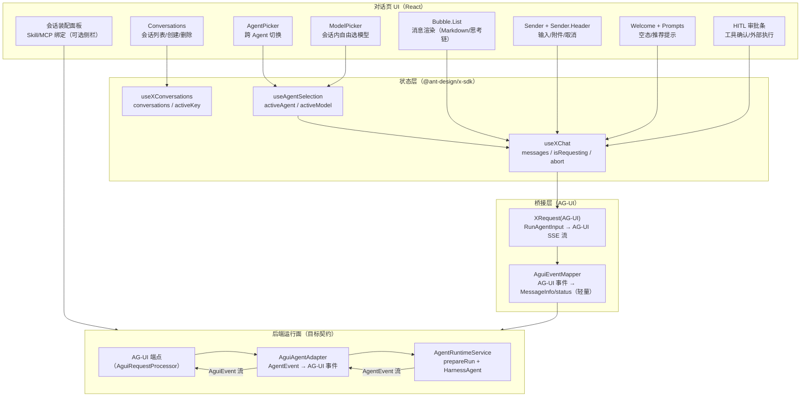
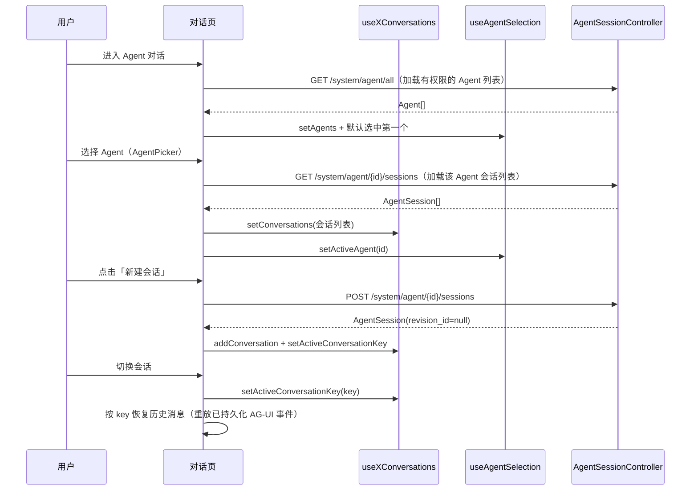
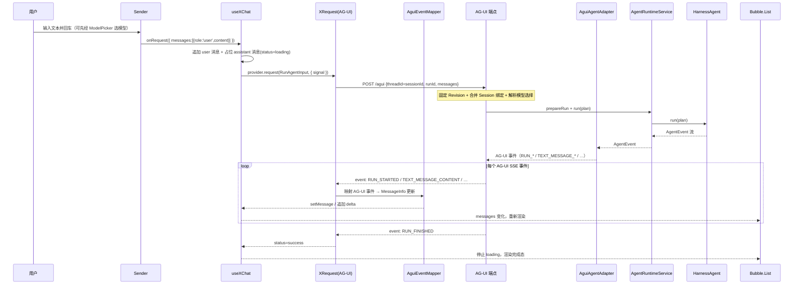
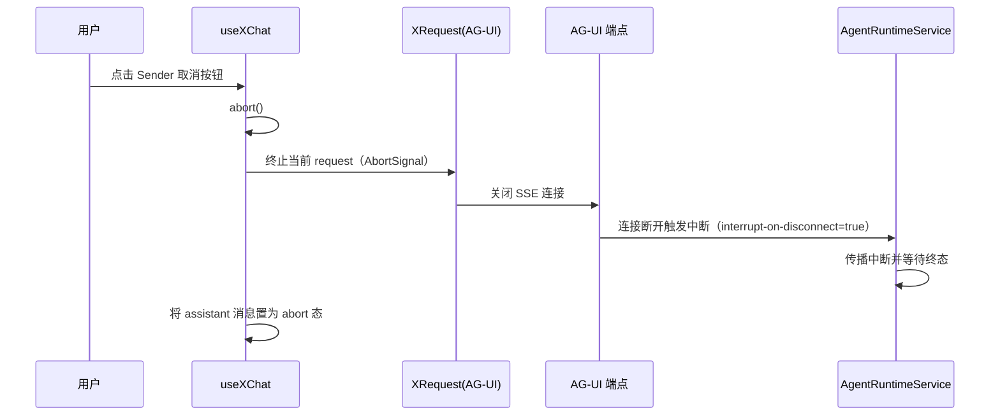
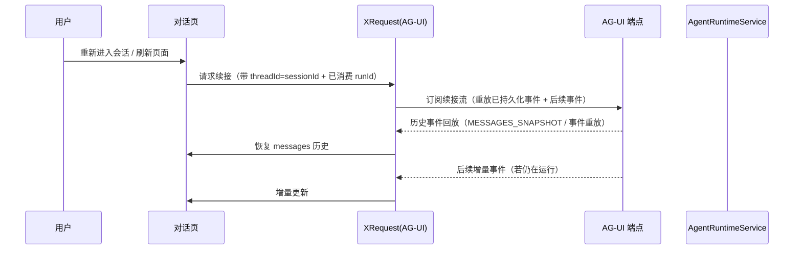
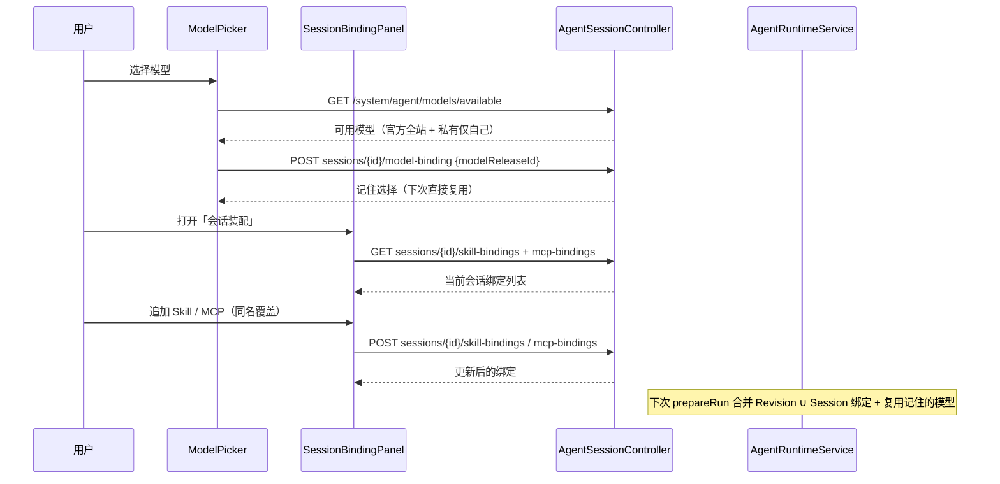
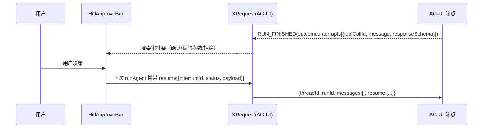

# Agent 对话前端架构

> **状态：** 目标架构（对话运行面与前端尚未落地，本文为实施蓝图）
> **读者：** 实施对话端 UI 的工程师与 agent
> **范围：** Agent 对话的运行面前端——会话管理、流式对话、取消/续接、自由选 Agent/模型、Skill/MCP 会话级装配。
> **协议基线：** [AG-UI（Agent-User Interaction Protocol）](https://github.com/ag-ui-protocol/ag-ui)，后端经 AgentScope `agentscope-extensions-agui` 输出标准 AG-UI 事件流。
> **配套文档：** [`agent-module-architecture.md`](agent-module-architecture.md)（五大模块总体架构）、[`agent-module-table-flows.md`](agent-module-table-flows.md)（表流转）。
> **组件基线：** Ant Design X `2.9.0`，独立式 Playground（<https://x.ant.design/docs/playground/independent-cn>）。

## 1. 定位与边界

本文档只覆盖 **Agent 对话的运行面前端**：把后端通过 SSE 流式输出的 **AG-UI 事件**渲染成一个可交互的对话界面，并管理会话生命周期（创建、切换、删除、续接、工具审批）。

- **控制面**（Agent/模型/Skill/MCP 的管理、发布、绑定）仍走现有 ProTable + Drawer，见 [`agent-module-architecture.md`](agent-module-architecture.md)。
- **运行面**（本次范围）：会话固定 Revision、AG-UI 消息流、SSE 事件、取消/续接、历史回放、自由选 Agent/模型、HITL 工具审批。
- **不覆盖**：Agent/模型/Skill/MCP 的 CRUD 表单、市场列表、Git 导入、审核流——这些是控制面，不在对话 UI 内。

> **协议统一**：运行面的流式输出不再使用平台自定义的 `STARTED / TEXT_DELTA / …` 事件，而是统一为 AG-UI 标准事件（`RUN_*`、`TEXT_MESSAGE_*`、`REASONING_MESSAGE_*`、`TOOL_CALL_*`、`CUSTOM` 等）。后端通过 AgentScope 的 AG-UI 适配器完成 `AgentEvent → AG-UI 事件` 的语义转换，前端只需消费一套开放、标准、可观测的事件模型。

## 2. 组件选型

前端采用 **Ant Design X 独立式 Playground** 作为对话容器，它是官方提供的「独立 WebApp 模式」参考实现：不依赖框架路由，`Conversations + Bubble.List + Sender` 组合即可拼出完整对话界面。

采用独立式而非 `<Playground />` 复合组件的理由：

| 维度             | 独立式（本文采用）                      | `<Playground />` 复合组件  |
| ---------------- | --------------------------------------- | -------------------------- |
| 布局控制         | 完全自建，可嵌入现有 `ContentContainer` | 固定三栏/两栏布局          |
| 与后端协议解耦   | 用 AG-UI 适配器桥接标准事件流           | 默认走 `XRequest` 标准协议 |
| 会话级 Skill/MCP | 侧栏可扩展装配面板                      | 扩展点有限                 |
| 品牌/样式        | 完全可控                                | 受组件默认样式约束         |

核心依赖：

- `@ant-design/x` 与 `@ant-design/x-sdk`：`useXChat`、`useXConversations`、`XProvider`、`Conversations`、`Bubble.List`、`Sender`、`Prompts`、`Welcome`、`ThoughtChain`、`Actions` 等。
- AG-UI 客户端（二选一）：
  - **首选** Ant Design X SDK 内置的 AG-UI 适配（`XRequest` 的 `protocol: 'agui'` 模式），直接消费后端 AG-UI SSE 端点。
  - **退化方案** 官方 `@ag-ui/client`（`HttpAgent`）订阅 SSE 事件，再桥接到 `useXChat` 的消息模型。

> 关键简化：AG-UI 是开放协议，`XRequest` 已内置对 `RUN_*` / `TEXT_MESSAGE_*` / `REASONING_MESSAGE_*` / `TOOL_CALL_*` 的解析，因此**无需自研「自定义 SSE 事件 → 消息模型」的完整翻译器**。桥接层只保留对平台专属事件的轻量处理（token 统计、subagent 事件、HITL 中断、并发冲突）。

## 3. 总体架构



### 3.1 分层职责

| 层         | 组件 / 模块                                                                                 | 职责                                                               |
| ---------- | ------------------------------------------------------------------------------------------- | ------------------------------------------------------------------ |
| UI 表现层  | AgentPicker / ModelPicker / Conversations / Bubble.List / Sender / Welcome / Prompts / HITL | 纯展示与用户交互，不持有业务数据，从 hooks 取状态                  |
| 状态层     | `useXChat` / `useXConversations` / `useAgentSelection`                                      | 会话/消息流/当前 Agent+模型状态机，驱动 UI 更新，处理 abort/reload |
| 桥接层     | `XRequest(AG-UI)` / `AguiEventMapper`                                                       | 构造标准 `RunAgentInput` 并消费 AG-UI 事件流，隔离协议差异         |
| 后端运行面 | AG-UI 端点 / `AguiAgentAdapter` / `AgentRuntimeService`                                     | 目标契约：固定 Revision、幂等、锁、取消、`AgentEvent → AG-UI` 转换 |

## 4. 交互流程

### 4.1 会话生命周期



> 切换 Agent = 切换一套独立的会话集合。`activeAgent` 变化时重新拉取该 Agent 的会话列表并重置 `activeConversationKey`；不同 Agent 的会话、历史、Revision 固定彼此隔离。

### 4.2 自由选 Agent 与自由选模型

对话页顶部提供 **AgentPicker**（跨 Agent 切换）与 **ModelPicker**（会话内选模型），二者正交：

- **AgentPicker**：候选 = 调用者有权限的 Agent（`GET /system/agent/all` 按 RBAC 过滤）。切换 Agent 时重新加载其会话列表，并重置当前会话。
- **ModelPicker**：候选 = 官方已发布模型（全站可用）∪ 调用者自己的私有模型（仅自己可用）。候选列表通过 `GET /system/agent/models/available` 获取。
- **选择语义**：模型为单选，选中后**记住**（写入会话 `agent_session_model_binding`），下次运行直接复用；重新选择则覆盖。未选则回落到 Revision 默认模型。
- **状态与请求契约**：`useAgentSelection` 维护 `activeAgentId` 与 `activeModelReleaseId`。模型选择在 `ModelPicker` 选择时即写入后端会话（`POST sessions/{id}/model-binding`）；发送消息时**不再把 `modelReleaseId` 塞进请求体**——`prepareRun` 按 `threadId`（会话）从 MySQL 解析已记住的选择，前端只构造标准 `RunAgentInput`。

> 这样做的收益：会话级装配（模型/Skill/MCP）的真相完全收敛到服务端，前端请求契约与 AG-UI 标准完全一致，避免把业务参数散落在 `forwardedProps` 里被当作可信任输入。

### 4.3 发送消息（流式）

这是核心交互流程，串起前端状态层 → AG-UI 桥接层 → 后端运行面：



> AG-UI 用 `threadId` 标识会话（对应平台 `sessionId`），用 `runId` 标识单次运行（对应平台 `requestId`）。历史消息、Revision 固定、会话级装配都由后端按 `threadId` 解析，前端只负责发标准 `RunAgentInput`。

### 4.4 取消



> AG-UI 没有专门的 `CANCELLED` 事件。取消语义由两层协同实现：前端 `abort()` 关闭 SSE 连接，后端依赖 AgentScope 的 `interrupt-on-disconnect=true`（默认）在连接关闭/超时/写失败时中断 Agent 运行。若需要「断连但继续运行」，将 `interrupt-on-disconnect` 置 `false`，但断连期间产生的事件不会被回放。

### 4.5 续接（断点恢复 / 历史回放）



> 这里的「续接」指**断点恢复**：重新进入会话时重放平台已持久化的事件历史。它与 AG-UI 的 HITL `resume[]`（工具审批续接，见 §7.2）是两个不同概念，不要混淆。

## 5. 前端模块划分

### 5.1 目录结构（建议）

```
apps/react-admin/src/pages/app/system/agent/conversation/
├── index.tsx                        # 对话页容器（组合左侧会话栏 + 右侧聊天区）
├── AgentConversationPage.tsx        # 独立式布局（对标 independent.tsx）
├── useAgentConversation.ts          # useXChat + useXConversations 装配
├── AguiChatProvider.ts              # XRequest(AG-UI) 构造：RunAgentInput → AG-UI SSE 流
├── AguiEventMapper.ts               # 轻量映射：AG-UI 事件 → MessageInfo/status（平台专属事件）
├── components/
│   ├── AgentPicker.tsx              # 跨 Agent 切换（顶部选择器）
│   ├── ModelPicker.tsx              # 会话内自由选模型
│   ├── ChatSide.tsx                 # Conversations 会话栏
│   ├── ChatList.tsx                 # Bubble.List 消息列表 + Welcome 空态
│   ├── ChatSender.tsx               # Sender + Sender.Header + Prompts
│   ├── ThoughtChainBubble.tsx       # 思考链/工具调用渲染
│   ├── HitlApproveBar.tsx           # HITL 工具审批条（外部执行/确认）
│   └── SessionBindingPanel.tsx      # 会话级 Skill/MCP 装配（可选侧栏）
└── types.ts                         # 前端消息模型与 AG-UI 事件类型
```

### 5.2 组件映射（对标独立式 reference）

| 独立式 reference 片段            | 本方案组件           | 说明                                                        |
| -------------------------------- | -------------------- | ----------------------------------------------------------- |
| 顶部选择器（自建）               | `AgentPicker`        | 跨 Agent 切换，驱动会话集合重载                             |
| 顶部选择器（自建）               | `ModelPicker`        | 会话内选模型，候选来自 `models/available`                   |
| `Conversations`                  | `ChatSide`           | 会话列表，`creation` 触发 `createAgentSessionApi`           |
| `Bubble.List` + `role`           | `ChatList`           | 消息渲染，`role` 里配置 assistant 的 Markdown/思考链/footer |
| `Sender` + `Sender.Header`       | `ChatSender`         | 输入、附件、取消；`loading={isRequesting}`                  |
| `Welcome` + `Prompts`            | `ChatList` 空态      | 空会话时展示欢迎与推荐提示                                  |
| `Think` / `ThoughtChain`         | `ThoughtChainBubble` | 渲染 `REASONING_MESSAGE_*` / `TOOL_CALL_*`                  |
| `Attachments`                    | `ChatSender` 头部    | 附件上传（后续接入，首期可不做）                            |
| `Actions`（copy/retry/feedback） | Bubble footer        | 复制、重试（`onReload`）、反馈                              |
| 自建（HITL）                     | `HitlApproveBar`     | 渲染 `RUN_FINISHED.outcome.interrupts`，回传 `resume[]`     |

### 5.3 状态层装配

```tsx
// 伪代码：useAgentConversation.ts 的核心装配
const { onRequest, messages, isRequesting, abort, onReload, setMessage } =
  useXChat<AgentChatMessage>({
    provider: aguiProviderFor(activeConversationKey), // 每个会话一个 AG-UI provider（含 threadId）
    conversationKey: activeConversationKey,
    requestPlaceholder: () => ({ role: "assistant", content: "" }),
    requestFallback: (_, { error }) => ({
      role: "assistant",
      content: error.name === "AbortError" ? "已取消" : "请求失败",
    }),
  });

const { conversations, activeConversationKey, setActiveConversationKey, addConversation } =
  useXConversations({
    defaultConversations: loadFromApi(),
    defaultActiveConversationKey: firstKey,
  });

// 自由选 Agent + 模型：独立状态，驱动 provider 与请求体
const {
  agents,
  activeAgentId,
  setActiveAgent,
  modelCandidates,
  activeModelReleaseId,
  setActiveModel,
} = useAgentSelection({ conversationKey: activeConversationKey });
```

## 6. AG-UI 协议适配

后端通过 AgentScope `agentscope-extensions-agui`（或 Spring Boot starter `agentscope-agui-spring-boot-starter`）把 `AgentEvent` 流转成 AG-UI 事件流。前端桥接层消费这套标准事件，无需自研自定义协议解析器。

### 6.1 依赖与端点

后端新增（后续落地，当前 `pom.xml` 仅引入 `agentscope-harness`）：

```xml
<dependency>
  <groupId>io.agentscope</groupId>
  <artifactId>agentscope-extensions-agui</artifactId>
  <version>${agentscope.version}</version>
</dependency>
<!-- 或 Spring Boot 应用直接用 starter：agentscope-agui-spring-boot-starter -->
```

Spring Boot 配置（关键项）：

```yaml
agentscope:
  agui:
    path-prefix: /agui # 前端连接的 SSE 端点前缀
    cors-enabled: true
    enable-reasoning: true # 输出 REASONING_MESSAGE_*（思考链）
    emit-tool-call-args: true # 输出 TOOL_CALL_ARGS（参数增量）
    emit-state-events: true # 输出状态事件（可观测）
    emit-token-usage: false # token 用量 CUSTOM 事件，按需开启
    interrupt-on-disconnect: true # 断连即中断（取消语义的关键）
```

> `threadId` 是 AG-UI 的会话标识，本平台将其映射为 `sessionId`；`runId` 映射为单次运行 `requestId`。`AguiAgentAdapter` 会把 `RunAgentInput.threadId` 写入 `RuntimeContext.sessionId`，保证同一 Agent 实例按线程隔离。

### 6.2 事件映射（AgentScope → AG-UI）

后端语义映射（来自 `agentscope-extensions-agui`）：

| AgentScope 事件 / 内容              | AG-UI 事件                                                                        |
| ----------------------------------- | --------------------------------------------------------------------------------- |
| `AgentStartEvent`                   | `RUN_STARTED`                                                                     |
| `AgentEndEvent`                     | `RUN_FINISHED`                                                                    |
| 文本增量                            | `TEXT_MESSAGE_START` / `TEXT_MESSAGE_CONTENT` / `TEXT_MESSAGE_END`                |
| 思考增量（`enableReasoning=true`）  | `REASONING_MESSAGE_START` / `REASONING_MESSAGE_CONTENT` / `REASONING_MESSAGE_END` |
| 工具调用与参数增量                  | `TOOL_CALL_START` / `TOOL_CALL_ARGS` / `TOOL_CALL_END`                            |
| 工具结果                            | `TOOL_CALL_RESULT`                                                                |
| `CustomEvent`                       | `CUSTOM`                                                                          |
| token 用量（`emitTokenUsage=true`） | `CUSTOM`，`name=token_usage`                                                      |
| 未映射 `AgentEvent`                 | `RAW`（含官方 `event` 与 `source` 字段）                                          |

子 Agent（`source != null`）事件默认**不映射**为原生 `RUN_*` / `TEXT_MESSAGE_*` / `TOOL_CALL_*`，而是降级为 `CUSTOM`（`subagent.*` 命名空间），避免污染父运行的生命周期与文本流。

### 6.3 AG-UI 事件 → 前端消息模型映射

| AG-UI 事件                     | 前端动作（`AguiEventMapper`）                       | 消息状态    |
| ------------------------------ | --------------------------------------------------- | ----------- |
| `RUN_STARTED`                  | 建立 assistant 消息骨架，进入流式态                 | `loading`   |
| `REASONING_MESSAGE_*`          | 追加思考内容到 `thinking` 字段（渲染 ThoughtChain） | `updating`  |
| `TOOL_CALL_START`              | 插入工具调用节点（toolName）                        | `updating`  |
| `TOOL_CALL_ARGS`               | 追加工具参数增量                                    | `updating`  |
| `TOOL_CALL_END`                | 工具调用结束                                        | `updating`  |
| `TOOL_CALL_RESULT`             | 写入工具结果摘要                                    | `updating`  |
| `TEXT_MESSAGE_CONTENT`         | 追加正文 `content`（Markdown 增量）                 | `updating`  |
| `RUN_FINISHED`（无 interrupt） | 置成功，固定最终内容                                | `success`   |
| `RUN_ERROR`                    | 置失败，回填错误信息                                | `error`     |
| `CUSTOM`（`token_usage`）      | 累计 token 用量（展示或埋点）                       | —           |
| `CUSTOM`（`subagent.*`）       | 子 Agent 生命周期/文本/工具事件（隔离展示或折叠）   | —           |
| `RUN_FINISHED`（含 interrupt） | 触发 HITL 审批条，等待 `resume[]`（见 §7.2）        | `interrupt` |

> 并发冲突（原自定义 `CONFLICT` 终态）在 AG-UI 下无直接对应事件。处理方式：后端 `prepareRun` 检测到同会话并发时，在请求阶段直接返回 HTTP `409`，或在 SSE 流内先发 `RUN_ERROR`（`code=conflict`）再关闭，前端据此提示「同会话并发冲突，可选续接」。

### 6.4 Provider 桥接（关键）

```ts
// 伪代码：AguiChatProvider —— 用 Ant Design X SDK 的 AG-UI 适配消费后端事件流
function aguiProviderFor(threadId: string) {
  return new XRequest({
    baseURL: "/api/system/agent", // 或 AG-UI 端点前缀 /agui
    protocol: "agui", // 关键：声明 AG-UI 协议，XRequest 内置解析器
    // 首期只用文本；后续多模态/工具由 RunAgentInput 承载
  }).create({
    request: (params, { signal }) => ({
      method: "POST",
      url: `/sessions/${threadId}/events`,
      data: {
        threadId, // 会话标识（= sessionId）
        runId: params.runId, // 单次运行标识（= requestId）
        messages: params.messages, // AG-UI 标准消息
        // 会话级装配（模型/Skill/MCP）由后端 prepareRun 按 threadId 解析，前端不重复传
      },
      signal,
    }),
  });
}
```

> 若 Ant Design X SDK 当前版本未内置 AG-UI 协议，退化方案是用官方 `@ag-ui/client`（`HttpAgent`）订阅 SSE 事件，再在 `AguiEventMapper` 里把事件喂给 `useXChat` 的消息模型。无论哪种实现，`AguiEventMapper` 都只处理平台专属事件（`token_usage`、`subagent.*`、HITL、并发冲突），不再承担自定义事件的全量翻译。

## 7. 会话级模型/Skill/MCP 装配与 HITL

### 7.1 会话级装配（对话内）

运行面允许用户在**自己的会话里**自由选模型（记住选择）、临时追加/覆盖 Skill 与 MCP，不改 Agent 定义（见 `agent-module-architecture.md` §5.2）。模型选择由 `ModelPicker` 承接，Skill/MCP 由侧栏 `SessionBindingPanel` 承接：



- 模型选择指向**不可变 Release**（`model_release_id`），记住后下次复用；Skill/MCP 指向 `skill_release_id` / `mcp_release_id`。
- 模型密钥无需补配（Release 已冻结）；MCP 在 Session 绑定时补配密钥并冻结到 `agent_session_mcp_binding.encrypted_secret`。
- 变更**下次运行立即生效**，不要求会话尚未首启。
- **请求契约**：以上装配的真相在服务端（MySQL），发送消息走 AG-UI 标准 `RunAgentInput`，前端不把装配信息放进 `forwardedProps` 当作可信输入。

### 7.2 HITL 工具审批（中断 / 续接）

当运行暂停等待工具决策时，后端在 `RUN_FINISHED` 里携带官方的 `outcome.interrupts[]`（`reason: "tool_call"`），前端渲染审批条；用户处理后通过下一次 `RunAgentInput.resume[]` 续接。



- **审批语义**：权限确认类中断，`payload.approved` 必须为布尔 `true` 才批准；缺失、非布尔或 `false` 一律视为拒绝。`payload.editedArgs` 为**整参替换**（非部分合并），后端据此重建工具入参。
- **状态值**：`resume[].status` 支持 `resolved` / `cancelled`；拒绝工具时优先用 `resolved` + `payload.approved=false` 表达业务决策，`cancelled` 仅用于取消中断本身。
- **前端无需回传** `metadata`，只发 `interruptId` / `status` / `payload`；服务端校验 `resume[]` 覆盖全部未决中断。

## 8. 安全与边界

- **密钥不落前端明文**：Session MCP 绑定的 `plainSecret` 只在提交瞬间由前端加密/脱敏传输，前端不缓存明文，也不回显密文（仅 `hasSecret` 标记）。模型密钥不在前端配置（官方托管、私有在模型管理页配置），对话侧只做选择，不涉及密钥。
- **取消必须停止执行**：前端 `abort()` 关闭 SSE 后，后端依赖 `interrupt-on-disconnect=true` 中断 Agent 运行并等待终态；前端只负责「关闭连接 + 呈现 abort 态」，不承担执行层面的取消保证。
- **断连重连 ≠ 续接授权**：网络抖动下的自动重连只用于恢复连接；真正的历史恢复走续接流，且需通过会话所有权校验。`forwardedProps` 来自客户端请求体，只适合 UI 上下文，**不得当作可信身份来源**——服务端用户身份一律来自鉴权或服务端 resolver。
- **SSE 事件内容不入日志**：`TEXT_MESSAGE_CONTENT` 正文、`REASONING_MESSAGE_*` 思考内容、工具参数摘要均不得进入前端日志上报。
- **Markdown 渲染安全**：assistant 输出经 `XMarkdown` 渲染，需保持默认的 XSS 防护，不注入 `dangerouslySetInnerHTML` 绕过。
- **子 Agent 事件隔离**：`subagent.*` 的 `CUSTOM` 事件默认不混入主文本流，前端按命名空间隔离/折叠展示，避免污染主运行生命周期。

## 9. 非目标

- 不做 `<Playground />` 复合组件的一体化方案（布局与协议不可控）。
- 不把会话级模型/Skill/MCP 装配面板做成独立的「市场浏览器」，仅提供选择与绑定。
- 不实现附件上传、语音输入、多模态消息——首期仅文本对话（AG-UI 的多模态与文档类型支持留待后续）。
- 不在前端缓存/持久化消息明文，历史恢复一律走后端续接流。
- 不复制控制面的 Agent/模型/Skill/MCP CRUD 到对话页。
- 不实现前端工具注入的 `ToolMergeMode` 全量切换——首期工具集完全由服务端 `prepareRun` 决定，`RunAgentInput.tools` 不向前端开放。
