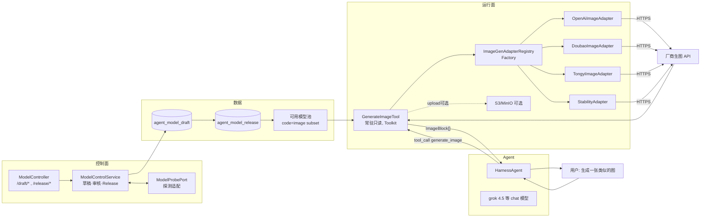
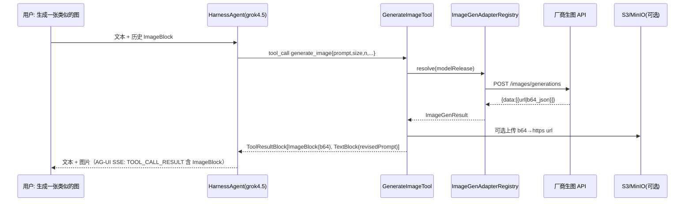

# Agent 生图架构（模型管理配置 + 适配器）

> **状态：** 目标架构（仅文档，不动代码；落地前评审）
> **读者：** 模型管理 / Agent 运行面 / 前端对话实现者
> **范围：** 模型管理内生图模型配置、不可变 Release、可用池、运行面 `generate_image` 工具与多厂商适配器
> **基线：** `docs/agent-module-architecture.md` §6 / `agent-module-table-flows.md` §5 / `backend/db/schema.sql` + `V3__agent_schema.sql` / `V4__agent_schema_seed.sql` / `ViewImageTool` / `AgentHarnessFactory`
> **依赖：** `backend/java-admin` 4 模块分层、共享 `OkHttpClient`（ADR 0005）、AgentScope `2.0.1`（`HarnessAgent`/`Toolkit`/`ImageBlock`）

## 1. 定位与非目标

### 1.1 一句话

生图不另起新领域，复用模型管理现有 Draft→Release→可用池链路，把生图模型当成 `code=image` 的一类模型；运行时以常驻只读工具 `generate_image` 对外，工具内部经适配器屏蔽各厂商生图 API 差异。

### 1.2 非目标

- 不为生图新增“绑定才能用”体系，不新增 `agent_revision_image_binding`；模型与对话的关系保持 §5.2.1 “自由选模型”正交，首期生图模型按可用池解析，不与 Agent Revision 强绑定。
- 不在前端直调生图接口，不把用户 `image_url` 当可信模型输入直接透传。
- 不在会话 MySQL 落运行态（生成中的任务、前端轮询），排队/异步仅在需要时走 Redis。
- 不做视频/音频生成，仅预留扩展位。

## 2. 现状与约束

- 模型已分 `scope=OFFICIAL/PRIVATE`、`provider=openai-compatible|anthropic`、`code`（`video`/`image` 等标识特殊功能）、`capabilities`/`parameter_guardrails`/`encrypted_secret`；Release 冻结后进入可用池 `OFFICIAL 全站 + PRIVATE 仅所有者`。
- `agent_session.model_release_id` 记住的是对话模型（chat）；`ModelProbeGateway` 探测仅覆盖 `GET {baseUrl}/models`。
- `ViewImageTool` 已是常驻只读工具，证明 `ImageBlock(Base64Source)` → `OpenAIMessageConverter → OpenAI image_url(data:;base64)` 链路在 `grok 4.5 (openai-compatible)` 下可视。

## 3. 总体架构



关键原则：工具对模型隐藏适配细节，统一 `ImageGenRequest/Result`；厂商差异只在 `infra/imagegen/*Adapter` 内。

## 4. 数据模型

### 4.1 复用为主，最小增量

复用 `agent_model_draft` / `agent_model_release` 现有字段，不新增生图表。

| 字段                             | 生图语义                                                                                                                            |
| -------------------------------- | ----------------------------------------------------------------------------------------------------------------------------------- |
| `code`                           | `image` 标识生图模型，普通对话为空；列表页按 `code` 过滤生图池                                                                      |
| `provider`                       | `openai-compatible` 细分厂商（openai/doubao/tongyi/stability）；或后续扩展 `tongyi-compatible`/`stability-compatible`，由适配器映射 |
| `base_url`                       | 厂商网关根（`https://api.openai.com/v1` / `https://ark.cn-beijing.volces.com/api/v3` / `https://dashscope.aliyuncs.com`）           |
| `model_name`                     | 远端生图模型标识（如 `dall-e-3` / `doubao-seedream-3.0` / `wanx-v1`）                                                               |
| `capabilities`                   | 叠加 `{"image_generation":true, "sizes":["1024x1024","1024x1792"]}`，旧对话模型该键缺省                                             |
| `parameter_guardrails`           | 生图参数护栏：`size`/`n`/`quality`/`style`/`seed` 范围与默认                                                                        |
| `encrypted_secret`               | 冻结 API Key，明文仅内存                                                                                                            |
| `endpoint_path`（新增，见 §4.2） | 覆盖默认生图路径，便于同 `base_url` 多端点                                                                                          |

可用池定义不变：`scope=OFFICIAL PUBLISHED` 全站 + `PRIVATE PUBLISHED` 仅所有者；前端“生图可用池”= 可用池 ∩ `code=image` ∩ `capabilities.image_generation=true`。

### 4.2 可选新增列（Flyway V8 预留，未执行）

```sql
-- V8__agent_image_generation.sql（草案，不执行）
ALTER TABLE agent_model_draft
  ADD COLUMN endpoint_path VARCHAR(255) NOT NULL DEFAULT '' COMMENT '生图端点覆盖，为空则按 provider 映射默认；对话模型忽略',
  ADD COLUMN extra_config JSON DEFAULT NULL COMMENT '生图扩展：default_size/n/quality/style 等';
ALTER TABLE agent_model_release
  ADD COLUMN endpoint_path VARCHAR(255) NOT NULL DEFAULT '' COMMENT '冻结',
  ADD COLUMN extra_config JSON DEFAULT NULL COMMENT '冻结';
```

不新增列亦可：`endpoint_path` 约定为 provider 默认（`openai:/v1/images/generations`、`doubao:/api/v3/images/generations`、`tongyi:/api/v1/services/aigc/text2image/generation`），`extra_config` 复用 `parameter_guardrails`。

### 4.3 会话是否需记生图模型

首期不在 `agent_session` 加 `image_model_release_id`。`GenerateImageTool` 解析优先级：

1. 入参 `model_name`/`model_release_id`（用户显式“用 XX 模型生成”）
2. 会话最近一次生图所用模型（Redis `agent:runtime:image-model:{sessionId}`，TTL 随会话）
3. 系统默认生图模型（配置 `app.image.default-model-release-id`）
4. 可用池首个 `OFFICIAL image` Release

二期若需“会话记住生图模型”，再加 `agent_session.image_model_release_id` 列并复用 `§5.2.1` 记住语义。

## 5. 适配器设计

### 5.1 端口与统一模型

`java-admin-service` 定义端口，`java-admin-infra` 实现适配：

```java
// service/port/ImageGenerationPort.java
public interface ImageGenerationPort {
  ImageGenResult generate(ImageGenCommand cmd); // 同步
  ProbeResult probe(ProbeCommand cmd);          // 复用模型探测语义，失败即拒绝发布
  record ImageGenCommand(
    Long modelReleaseId, String provider, String baseUrl, String endpointPath,
    String modelName, String plainSecret,
    String prompt, String negativePrompt, String size, Integer n,
    String quality, String style, Long seed, Map<String,Object> extra) {}
  record ImageGenResult(
    List<ImageAsset> images, String revisedPrompt, Map<String,Object> raw) {}
  record ImageAsset(String url, String b64Json, String mimeType, Integer width, Integer height) {}
}
```

`ImageBlock` 仅在工具层组装，不泄漏到端口。

### 5.2 适配器分层

```
port/ImageGenerationPort
  └─ infra/imagegen/ImageGenAdapterRegistry (Factory + 缓存)
       ├─ OpenAiImageAdapter        POST {baseUrl}{/v1/images/generations} Bearer
       ├─ DoubaoImageAdapter        POST {baseUrl}{/api/v3/images/generations} Bearer/Ark 特有头
       ├─ TongyiImageAdapter        POST {baseUrl}{/api/v1/services/aigc/text2image/generation} Bearer + task 轮询
       └─ StabilityImageAdapter     POST multipart/form-data + Accept
```

每个适配器职责：

- 选端点：`endpointPath 非空 ? endpointPath : providerDefault`
- 组请求头：`Authorization: Bearer {plainSecret}` / `x-api-key` / `X-DashScope-Async` 等厂商差异在此收敛
- 映请求体：`prompt/size/n/quality/style/seed` 按厂商字段映射（openai `size:"1024x1024"`、tongyi `parameters.size` 等）
- 解响应：抽 `url`/`b64_json`/`base64` 统一为 `ImageAsset`；`url` 需二次校验仅 `https` 且非内网
- 错语义：`4xx→PARAM_INVALID（可重试提示）`、`429→限流`、`5xx→依赖错误`，统一抛 `BizException` 由工具转 `ToolResultBlock.error`

### 5.3 选择策略

```java
ImageGenerationPort adapter = registry.forRelease(release);
// 伪：switch (provider + code) 或 release.extra_config.adapter
// openai-compatible + code=image + baseUrl 含 dashscope → TongyiImageAdapter
// openai-compatible + baseUrl 含 ark/volces → DoubaoImageAdapter
// 显式 extra_config.adapter 优先于推断
```

新增厂商仅新增 `*Adapter` + 注册一行，不改端口与工具。

### 5.4 共享约束

- 仅 `https`，`baseUrl` 校验复用 `ModelControlService.requireHttpsUrl`；出站走共享 `OkHttpClient`（ADR 0005），`callTimeout 30s`（生图慢于看图），图片下载复用 `MAX_IMAGE_BYTES=8MB` 同款阈值，厂商回包超限直接 `error`。
- 密钥仅内存，适配器内解密 `encrypted_secret` 后注入请求头，不落日志/审计。
- 同步首期：工具内阻塞调用适配器；异步任务式厂商（通义异步）由适配器内部轮询封装，对外仍同步（轮询上限 60s，指数退避）。

## 6. 控制面

### 6.1 模型管理复用

创建/更新生图模型与对话模型同接口 `POST /api/system/model/draft`，仅前端在“新建生图模型”表单中：

- `scope` 仍 `OFFICIAL/PRIVATE`，`code=image` 固定，`provider` 下拉（openai-compatible 首期，预留 tongyi/stability）
- `capabilities` 默认 `{"image_generation":true}`，`parameter_guardrails` 按生图字段展示（size 枚举、n 1..4、seed 可空）
- 列表页新增 `code=image` 过滤与“生图模型” Tab，`available?code=image` 返回生图可用池

校验：`baseUrl` 必须 `https`；`modelName` 必填；`code=image` 时 `capabilities.image_generation` 必须 `true`，否则拒绝。

### 6.2 探测

- `POST /api/system/model/draft/{id}/verify` 与 `POST /api/system/model/probe` 复用，`code=image` 时 `ModelProbeGateway` 按适配器分支探测：
  - openai/doubao：`GET {baseUrl}/models` 含 `modelName` 或一次最小 `1x1` 生成探测（按配置选其一，超 `5s` 即失败）
  - 通义：`GET {baseUrl}/api/v1/models` 或等价
- `approve` 发布仍先探测再冻结 `agent_model_release`，与对话模型同事务。

### 6.3 权限与可见性

与 §6.4 完全一致：`OFFICIAL image` 全站可选，`PRIVATE image` 仅所有者可见；`available` 接口按调用者过滤，审计不记明文。

## 7. 运行面

### 7.1 工具形态

```java
// infra/agent/runtime/GenerateImageTool.java（草案）
@Component @RequiredArgsConstructor
public class GenerateImageTool implements AgentTool {
  public String getName() { return "generate_image"; }
  public String getDescription() {
    return "按提示词生成图片。用户说“生成一张类似的图/把这只猫画成...”时必须调用；返回多模态 ImageBlock 供模型与前端直接展示。";
  }
  public Map<String,Object> getParameters() {
    // prompt(required), size(enum 1024x1024/1024x1792/1792x1024), n(1..4, default1),
    // quality(standard/hd), style(vivid/natural), seed(long), negativePrompt, model_release_id/model_name(optional)
  }
  public boolean isReadOnly() { return false; } // 计费/配额外部可视为写
  public Mono<ToolResultBlock> callAsync(ToolCallParam p) { /* 选模型→调适配器→组 ImageBlock[] */ }
}
```

注册与 `view_image` 对称：`AgentHarnessFactory` 常驻 `toolkit.registerTool(generateImageTool)`，不受 `permission_policy.allowedTools` 门控；权限上下文同样自动放行（`buildPermissionContext` 枚举 `toolkit` 已装配工具）。

### 7.2 调用链



- 单次 `n` 限 `1..4`，默认 `1`；`size` 枚举按 `parameter_guardrails` 护栏校验，越界直接 `ToolResultBlock.error` 不触厂商。
- 厂商返回 `url` 时工具二次下载转 `Base64Source`（复用 `ViewImageTool` 同款 `https+内网拒绝+8MB` 校验），保证前端与 `OpenAIMessageConverter` 统一以 `data:;base64` 渲染，避免前端跨域。
- 结果同时含 `TextBlock`（`revised_prompt`/`seed`/`model`），便于审计与复现。

### 7.3 系统提示词引导

在 `AgentHarnessFactory` 的 `sysPrompt` 追加（或由 Agent 定义自行维护）：

> 当用户发送图片链接并随后要求“生成类似/改图”时，先用 `view_image` 看图，再用 `generate_image` 生成；不要自称不能生成。

## 8. 前端渲染

- 维持 `docs/agent-conversation-architecture.md` §6 的 AG-UI 映射：工具结果中的 `ImageBlock` 经 `TOOL_CALL_RESULT` 透传，前端 `ChatList` 的 `Bubble` 按 `role` 渲染 `Markdown + Image`。
- 复用 `ViewImageTool` 的展示组件：`Bubble.List` 对 `ImageBlock` 以 `<Image>` 预览，`n>1` 时宫格布局；`revisedPrompt` 折叠在图片下方。
- 会话历史回放（`eventHistoryStore`）已持久化 `ToolResultBlock` 含 `ImageBlock` 的 `data:;base64`，重进会话直接回放，无需二次拉取。

## 9. 安全与成本

- 仅 `https` 生图网关，`InetAddress.getAllByName` 拒绝回环/私网/链路本地（与 `ViewImageTool` / `GitSkillSourceService` 同款红线），重定向后二次校验。
- `prompt` 长度 `1..4000` 字符，超长截断或拒绝；`negativePrompt` 可选，特殊字符不过滤但入审计时脱敏。
- 速率：按用户 `burst 5/min`（Redis 计数器，键 `image:gen:{userId}`），超限 `429` 回 `ToolResultBlock.error("生图繁忙，请稍后重试")`。
- 成本：Release 可选 `metadata.costPerImage` 供计费侧读取，工具侧仅记录 `model_release_id/prompt/size/n/cost` 到操作日志，不记 `plainSecret`。

## 10. 故障与回退

| 场景                                | 处理                                                                                                            |
| ----------------------------------- | --------------------------------------------------------------------------------------------------------------- |
| 生图模型未配置/无可用 `code=image`  | `generate_image` 直接 `error("暂未配置生图模型，请在模型管理新建 code=image 的模型")`                           |
| 厂商 `4xx`（鉴权/参数）             | 透出可读错误，不重试                                                                                            |
| 厂商 `429/5xx`/超时                 | 一次指数退避重试，重试仍败则 `error("生图服务暂不可用")`                                                        |
| 返回非 `image/*` 或超 `8MB`         | 视为失败，同看图校验                                                                                            |
| `grok 4.5` 未调用工具而自称不能生成 | 依赖系统提示词 + 工具描述中的“必须调用”约束，前端可对含“生成/画一张”关键词的未工具调用追加 `HintBlock` 引导重试 |

## 11. 迁移与落地步骤（不动代码的文档阶段）

1. 评审本文档，冻结 `code=image` 约定与适配器接口。
2. 在模型管理页手工创建首个生图模型（`OFFICIAL`/`PRIVATE` 均可，`code=image`，`provider=openai-compatible`，指向 OpenAI 或兼容网关），验证 `verify` 链路。
3. 代码阶段再按 §5/§7 实现端口、适配器、工具与工厂注册，并补 `V8__agent_image_generation.sql`（如需 `endpoint_path/extra_config`）。

## 12. 后续演进

- 异步生图：对通义等长任务，适配器内 `createTask→poll`，运行面可改为 `ToolSuspendException` + `HITL resume` 或 Redis 任务键 `image:task:{taskId}` 供前端订阅。
- 参考图生图：`generate_image` 扩展 `reference_image_url`（复用 `view_image` 的下载与校验），适配器按厂商 `image-to-image` 字段映射。
- 视频生成：复用同一适配器框架，`code=video`，`VideoBlock(Base64Source|URLSource)`，工具名 `generate_video`。

## 13. 参考

- `docs/agent-module-architecture.md`、`docs/agent-module-table-flows.md`、`docs/agent-conversation-architecture.md`
- `backend/db/schema.sql`、`V3__agent_schema.sql`、`V4__agent_schema_seed.sql`
- `backend/java-admin/java-admin-infra/src/main/java/com/wshake/infra/agent/runtime/ViewImageTool.java`
- `backend/java-admin/java-admin-infra/src/main/java/com/wshake/infra/agent/runtime/AgentHarnessFactory.java`
- `backend/java-admin/java-admin-service/src/main/java/com/wshake/service/model/ModelControlService.java`
- ADR 0005 `docs/adr/0005-okhttp-outbound-client.md`
