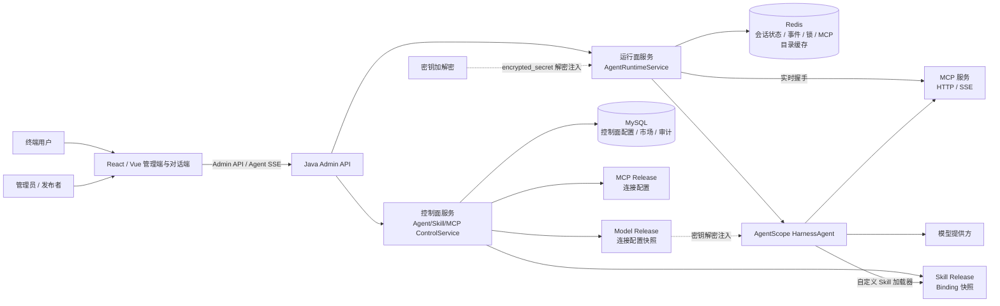
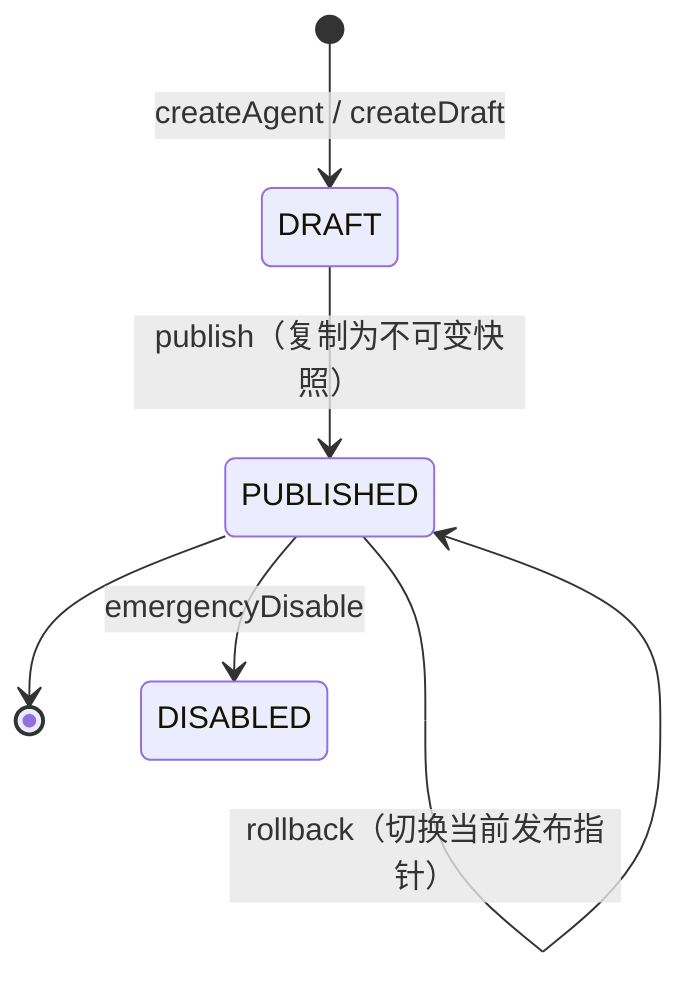
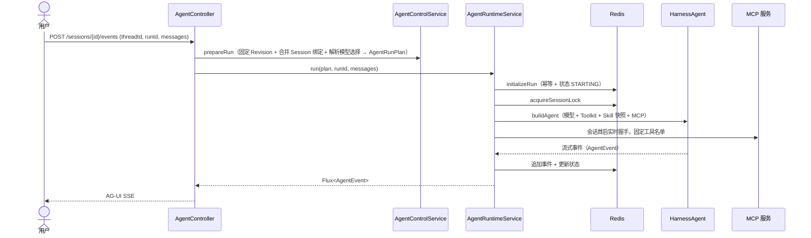
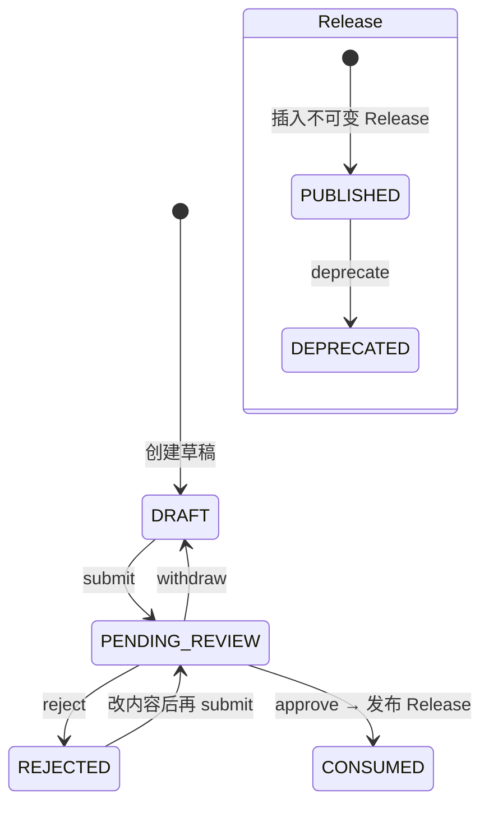
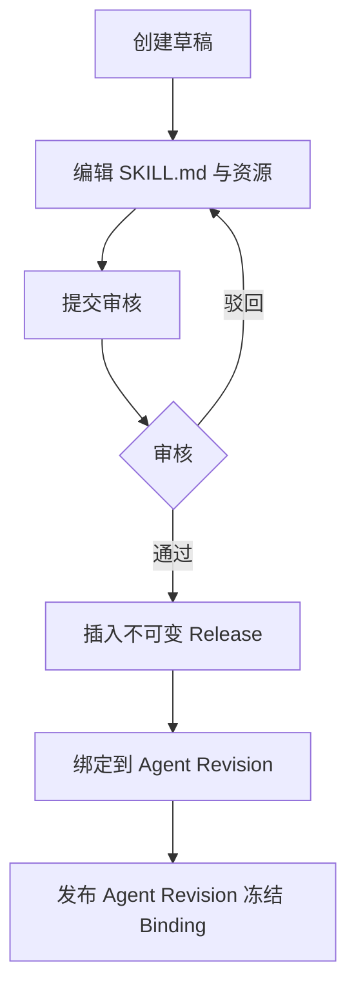
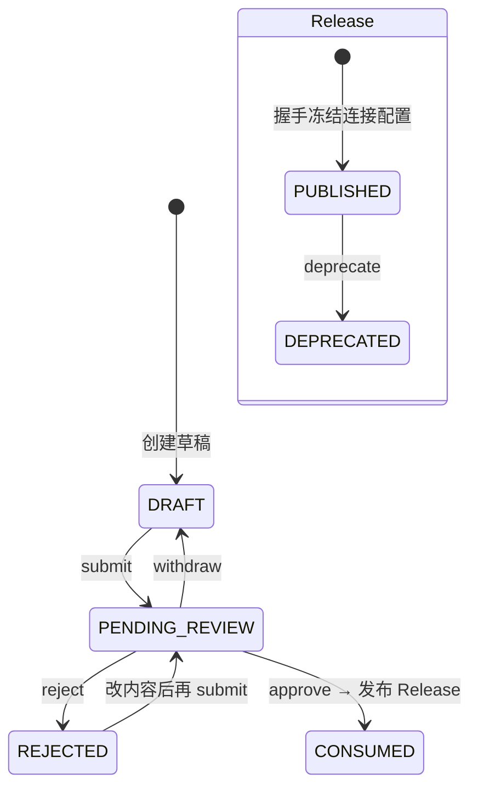
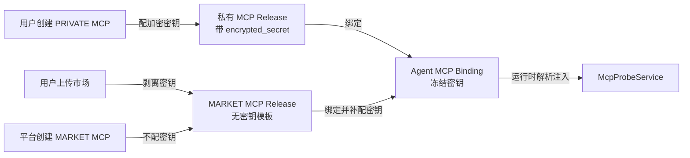
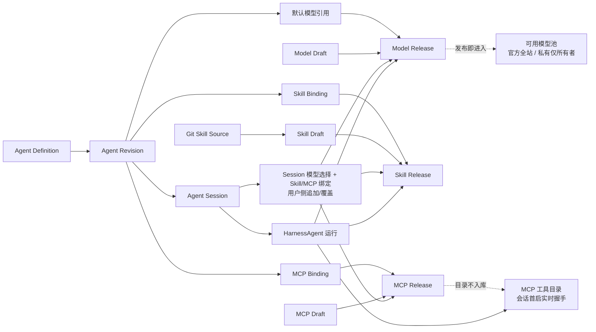
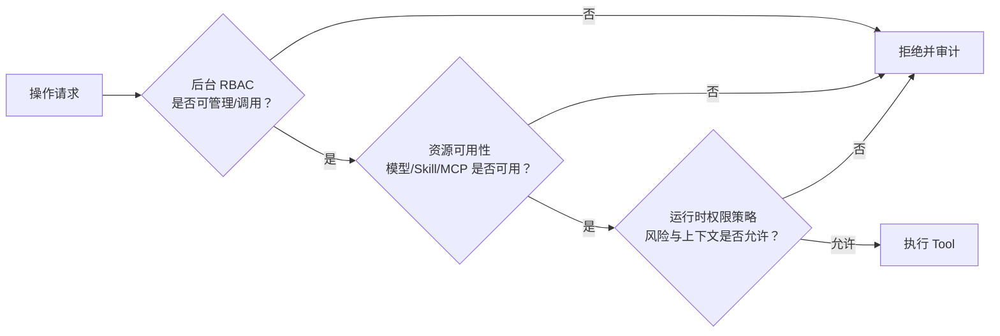

# AgentScope Agent 平台系统架构

> **状态：** 目标架构（已按落地代码校准）
> **读者：** 实施平台的工程师与 agent
> **范围：** 五大模块——Agent 管理、Agent 对话、模型管理、Skill 管理/市场、MCP 管理/市场。
> **数据/流转关联图：** 见 [`docs/agent-module-table-flows.md`](agent-module-table-flows.md)。
> **设计基线：** `CONTEXT.md`、`backend/db/docs/db-conventions.md`、`docs/adr/`、Flyway `V3__agent_schema.sql` 与 `V4__agent_schema_seed.sql`、AgentScope Java `2.0.1`。

## 1. 定位与边界

在现有 Trellis Admin 之上建设可运营的 Agent 平台。系统由**控制面**与**运行面**两个平面组成，并划分为五个对等模块：

| 模块            | 平面            | 职责                                                                              |
| --------------- | --------------- | --------------------------------------------------------------------------------- |
| Agent 管理      | 控制面          | Agent 定义、草稿/发布 Revision、回滚、紧急禁用                                    |
| Agent 对话      | 运行面          | 会话固定 Revision、自由选 Agent/模型、SSE 流式事件、取消、续接、历史              |
| 模型管理        | 控制面 + 运行面 | 官方模型审核发布、用户私有模型、不可变 Release、可用性护栏、Revision/Session 选择 |
| Skill 管理/市场 | 控制面 + 运行面 | Skill 草稿、审核发布、不可变 Release、市场、Git 受控导入、Revision Binding        |
| MCP 管理/市场   | 控制面 + 运行面 | MCP 草稿、握手验证、审核发布、连接配置 Release、市场、Revision Binding            |

**控制面**负责“哪些资源可用、由谁使用、以什么版本组合”，只处理可审计的配置与生命周期。
**运行面**负责把固定的 Agent Revision 解析为一次可恢复、可中断、可审计的 `HarnessAgent` 调用，只消费已固定的版本与 Binding，不重新计算“最新状态”。

### 1.1 非目标

- 不允许用户上传 JAR、指定类名、扫描任意 classpath 或执行任意系统命令来创建 Java Tool。
- 不将市场可见的 Skill/MCP 自动绑定到全部 Agent。
- 不把 Harness 默认的工作区同名覆盖当作授权模型。
- **用户不发布模型**：模型没有用户发布链路，官方模型由管理员审核发布后全站可用，用户只能创建私有模型（仅自己可用）。
- 当前支持 HTTP/SSE MCP；受控 STDIO 是后续扩展。
- 自学习闭环（`propose_skill` / `skill_manage` / `Curator` / `autoPromote`）非首期；agent 不得直写市场表。

## 2. 设计原则与不可变量

1. **发布即固定输入**：每次发布生成不可变的 Agent Revision、Skill Release、MCP Release。运行只解析已发布的具体版本。MCP 的“输入固定”指固定连接配置与可用性护栏，不冻结远端工具目录内容。
2. **控制状态与运行状态分离**：MySQL 记录控制面配置与会话 Revision 绑定；Redis 记录会话运行状态、MCP 目录缓存、事件流、执行锁与幂等记录。控制面不复制 Redis 状态。
3. **两层权限同时通过**：后台 RBAC 决定操作者能否管理/调用资源；运行时策略决定模型本次能否调用具体 Tool。任一层拒绝均不能执行。
4. **未知即拒绝**：MCP 会话首启握手失败、目录为空、绑定引用缺失、schema 非法或版本不可解析时，会话开启必须失败，不能降级放行。
5. **密钥不进入业务数据面**：数据库仅保存配置与加密后的密钥密文（`encrypted_secret`）；API Key、OAuth Token 明文不得进入数据库、日志、审计或模型上下文。
6. **取消必须停止执行**：取消不仅关闭 SSE，还通过 Redis Pub/Sub 向 Agent 传播中断并等待终态。
7. **会话固定 Revision**：会话首次运行时绑定当前发布 Revision；发布和回滚只影响后续新会话。
8. **Skill 经 Binding 快照接入**：运行面通过自定义加载器读取 Binding 冻结的 Release 快照接入 Skill，不依赖 AgentScope `MysqlSkillRepository`；控制面 Binding 决定本次可见集合与覆盖关系。
9. **模型经 Release 快照接入**：运行面只按冻结的 Model Release 快照（provider 协议、baseUrl、模型名、参数护栏）构建模型客户端，不引用最新 Release；对话时可自由选模型且选择被记住，可选集受调用者可用模型约束。

## 3. 系统上下文



### 3.1 Java 后端分层

现有 Maven reactor 由 `java-admin-common`、`java-admin-service`、`java-admin-infra`、`java-admin-api` 组成。

| 层                   | 目标职责                                                                                                                                                                      |
| -------------------- | ----------------------------------------------------------------------------------------------------------------------------------------------------------------------------- |
| `java-admin-api`     | Agent/模型/Skill/MCP 四个 Controller、DTO/VO、SSE 边界、HTTP 鉴权                                                                                                             |
| `java-admin-service` | `AgentControlService`、`ModelControlService`、`SkillControlService`、`McpControlService`、`GitSkillSourceService` 领域编排；entity 与 repository；Binder 装配                 |
| `java-admin-infra`   | `AgentRuntimeService`、`ModelClientFactory`、`ModelProbeService`、`McpProbeService`、自定义 Skill 加载器、`McpSnapshotAssembler`、`McpSessionCatalogCache`、Redis、模型客户端 |
| `java-admin-common`  | 错误码、时间、结果类型、`RequestContext`、`StatusFlags`                                                                                                                       |

## 4. 模块一：Agent 管理

### 4.1 核心概念

- **Agent Definition**：面向运营的稳定标识，承载名称、归属、启停、当前发布 Revision 指针。
- **Agent Revision**：可编辑 `DRAFT` 或不可变 `PUBLISHED` 快照。快照固定 `system_prompt`、`model_config`、`permission_policy`、`memory_policy`、`compression_policy`，以及全部模型/Skill/MCP Binding。

### 4.2 状态机



- `publish` 不修改原草稿，而是 `copyAsPublished` 生成新 `PUBLISHED` 行，并更新 Definition 的 `current_published_revision_id`。
- `rollback` 只把 `current_published_revision_id` 指向某个已启用 `PUBLISHED` Revision。
- `emergencyDisable` 把 Definition 置 `is_enabled=0`，只阻止新会话/首次运行；已固定会话由后续策略决定。

### 4.3 关键约束

- 草稿只能更新/发布，已发布 Revision 不可修改，改组合只能开新草稿再发布。
- `model_config` 只保留默认模型引用与可选参数覆盖（`default_model_release_id` + `parameters`），模型连接配置本身不内嵌在 Revision 里，统一从选定的 Model Release 快照解析；`memory_policy` / `compression_policy` 首期非空即拒绝运行（见运行面校验）。

## 5. 模块二：Agent 对话

### 5.1 会话与 Revision 固定

- `POST /api/agent/{id}/sessions` 创建 `ACTIVE` 会话，此时 `agent_revision_id` 为空。
- 首次运行 `prepareRun` 在同一事务中调用 `bindSessionRevision`：若未绑定，读取 Definition 当前发布 Revision 并写入会话（`bindRevisionIfUnbound` 保证并发安全）。
- 后续运行只使用会话已绑定的 Revision，不再读最新发布指针。

### 5.2 会话级模型/Skill/MCP 装配（用户侧）

Agent Revision 绑定是「发布者预置」的默认装配；用户在自己的会话里可以**临时追加或覆盖** Skill、MCP，并**自由选择模型**，不改动 Agent 定义，也不污染其他会话。

- **合并语义**：Skill/MCP 最终装配集 = Agent Revision 绑定 ∪ Session 绑定，同名（Skill 按 `name`，MCP 按 `name`）由 Session 覆盖 Revision。模型为**单选**：会话记住用户选择的模型，未选则回落到 Revision 默认模型。
- **模型记住选择**：用户选的模型写入会话，**下次直接复用**，无需每次重选；模型选择独立于 Skill/MCP 的追加/覆盖。
- **随时可改**：Session 绑定与模型选择在会话生命周期内可增删，**下次运行立即生效**，不要求会话尚未首启。
- **绑定对象**：Skill/MCP 指向不可变 Release（`skill_release_id` / `mcp_release_id`），模型指向不可变 Model Release（`model_release_id`），均不指向最新版。
- **权限**：模型/Skill/MCP 的可选范围 = 调用者可用集（官方资产全站可用，私有资产仅所有者可用）；MCP 密钥在 Session 绑定时补配并冻结，模型密钥无需补配（Release 已自带或官方托管）。
- **运行面装配**：`prepareRun` 解析 Revision 默认模型 + Session 模型选择 + Session Skill/MCP 绑定，生成合并后的模型选择与快照集进入 `AgentRuntimeService`。

### 5.2.1 自由选 Agent 与自由选模型

对话运行面支持**跨 Agent 会话**与**会话内自由选模型**，二者正交：

- **自由选 Agent**：对话页可从调用者有权限的 Agent 列表切换目标 Agent。每次切换对应一个独立 `agent_session`（会话与 Agent Definition 绑定），历史、Revision 固定、Skill/MCP 装配彼此隔离。
- **自由选模型**：同一会话内，用户可从「可用模型候选」中选择模型；候选集 = 官方已发布模型（全站可用）∪ 调用者自己的私有模型（仅自己可用）。选择被**记住**，下次运行直接复用。
- **默认回落**：会话未显式选模型时，回落到 Revision `model_config` 指定的默认 Model Release；若 Revision 未配置默认模型，则拒绝首启（见运行面校验）。

### 5.3 运行流程



### 5.4 幂等、锁与取消

- **幂等**：`initializeRun` 用 Lua 原子写入 `consumed`/`owner`/`state` 三个 key。同一 `requestId` 重试命中 `consumed` 后走 `recoverState`，不重复执行副作用。
- **会话锁**：`agent:runtime:lock:{sessionId}` 用 Redisson `RLock`（`tryLockAsync`，ownerId 语义）串行化同会话并发推进。
- **取消**：`cancel` 把状态 `RUNNING/STARTING → CANCELLING`，向 `agent:runtime:request:...:cancel` 发布信号；运行侧监听该 topic 并调用 `agent.getDelegate().interrupt(context)`，等待终态。
- **续接**：`resume` 重放已持久化事件并订阅后续事件；后台订阅独立于 SSE 客户端，断连不等同取消。

### 5.5 事件类型

运行面通过 AgentScope `agentscope-extensions-agui` 将内部 `AgentEvent` 流转为 AG-UI 标准事件（`RUN_STARTED` / `RUN_FINISHED` / `RUN_ERROR` / `TEXT_MESSAGE_*` / `REASONING_MESSAGE_*` / `TOOL_CALL_*` / `CUSTOM`），终态为 `RUN_FINISHED` / `RUN_ERROR`。前端消费 AG-UI 事件，详见 [`agent-conversation-architecture.md`](agent-conversation-architecture.md)。

### 5.6 运行面安全开关

`AgentRuntimeService.buildAgent` 显式禁用：文件系统工具、shell、memory tools/hooks、workspace context、`@path` 展开、subagents、dynamic skills、默认 workspace skills。平台仅按 `permission_policy.allowedTools` 允许受信 Java Tool（当前为 `get_platform_time`）。

## 6. 模块三：模型管理

模型是 Agent 运行时调用大模型所需的连接配置与参数护栏。与 Skill/MCP 不同，**模型没有市场、也没有用户发布链路**，只有两类来源：

- **官方模型**：管理员创建、审核、发布，发布后**全站可用**（任何登录用户都可选）。
- **用户私有模型**：用户自行创建，仅自己可见、自己可用，**不发布**、不进市场。

发布后的 Model Release **直接可用**，不要求绑定到 Agent，也不要求补配密钥：官方模型的密钥由平台托管，私有模型的密钥随 Release 冻结，用户选择即用。

### 6.1 核心概念

- **Model Draft**：连接配置草稿（`provider`、`base_url`、`model_name`、`encrypted_secret`、`capabilities`、`parameter_guardrails`、`scope`）。`scope` 取值 `OFFICIAL` / `PRIVATE`。
- **Model Release**：审核通过时冻结的连接配置副本；**模型能力不落库**。发布后直接进入「可用模型池」，官方模型全站可用，私有模型仅所有者可用。
- **模型选择**：对话时模型为单选，由 Revision 默认模型 + Session 记住的选择共同决定（见 §5.2.1）。

### 6.2 模型配置形态

`agent_revision.model_config` 只保留默认模型引用与可选参数覆盖，不再内嵌连接配置：

```jsonc
// agent_revision.model_config（快照）
{
  "default_model_release_id": 1001, // 默认 Model Release 指针，可为空（此时会话必须显式选模型）
  "parameters": {
    // 可选参数覆盖；其余取 Release.parameter_guardrails
    "temperature": 0.7,
    "max_tokens": 4096,
  },
}
```

`agent_model_draft` / `agent_model_release` 承载的连接配置字段：

| 字段                   | 含义                                                                                            |
| ---------------------- | ----------------------------------------------------------------------------------------------- |
| `scope`                | `OFFICIAL`（官方，管理员）/ `PRIVATE`（用户私有）                                               |
| `code`                 | 模型功能码，用于标识特殊功能（如 `video` 视频模型、`image` 图片模型），普通文本模型为空或默认码 |
| `provider`             | 协议类型：`openai-compatible` / `anthropic` / 其他受信 provider                                 |
| `base_url`             | 连接地址（HTTPS）                                                                               |
| `model_name`           | 远端模型标识                                                                                    |
| `capabilities`         | JSON：`text` / `thinking` / `tool_use` / `vision` / `json_mode`                                 |
| `parameter_guardrails` | JSON：temperature/top_p/max_tokens 等参数的允许范围与默认值                                     |
| `encrypted_secret`     | 加密 API Key 密文（官方模型由平台托管；私有模型随 Release 冻结）                                |

### 6.3 状态机


- `verify`：`ModelProbeService.probe` 用草稿连接配置发起最小探测（如 `GET /models` 或一次空调用），返回可用性结论与能力探测摘要，不改变状态。
- `approve`：再次探测冻结连接配置，插入不可变 `agent_model_release`（连接配置副本），草稿置 `CONSUMED`。
- **发布即可用**：`approve` 后 Release 立即进入可用模型池，无需绑定到任何 Agent 才能被用户选择。
- `provider` 取值首期为 `openai-compatible` / `anthropic`（小写，可扩展）。

### 6.4 可用模型池与可见性

模型与 Skill/MCP 的关键区别：**模型不设市场列表、不设「绑定才能用」的门槛，发布即进入可用池**。

| 模型来源 | 谁创建   | 谁可用       | 发布动作             | 密钥来源                        |
| -------- | -------- | ------------ | -------------------- | ------------------------------- |
| 官方模型 | 管理员   | 全站登录用户 | 管理员审核发布       | 平台托管（Release 冻结）        |
| 用户私有 | 用户自己 | 仅该用户     | 无需发布（私有即用） | 用户创建时配好，随 Release 冻结 |

- **可用模型候选**（对话选模型时）= 官方 `PUBLISHED` 模型 ∪ 调用者自己的 `PRIVATE` 模型（含 `PUBLISHED`）。
- **官方模型下架** = 管理员 `deprecate` 对应 Release，退出可用池；已运行会话已固定的快照不受影响，但新选择不可再选。
- **私有模型删除/弃用** = 用户对自己的私有 Release 置 `DEPRECATED`，退出自己的可用池。
- 用户私有模型**不进入**官方可用池，官方模型**不被**用户修改或重新发布。

### 6.5 密钥归属

- **官方模型**：密钥由平台管理员在发布时配置并加密冻结到 `agent_model_release.encrypted_secret`，全站用户直接使用，无需各自补配密钥。
- **私有模型**：密钥由所有者在创建时配置并加密冻结，仅自己可用，不泄漏给其他用户。
- **运行时解密注入**：`ModelClientFactory` 按选定的 `model_release_id` 解析冻结快照，解密注入密钥后构建模型客户端；明文不进 MySQL、日志、审计或模型上下文。

### 6.6 运行面装配

- 模型选择是「Release 指针」，不携带连接配置与密钥；`ModelClientFactory` 按最终选定的 `model_release_id` 解析冻结快照。
- 参数合并：`Release.parameter_guardrails` 为基座，`Revision.model_config.parameters` 按层级覆盖，越界参数被护栏拒绝。
- 能力不匹配（如会话声明 `tool_use` 但模型 `capabilities` 不含 `tool_use`）→ 拒绝首启。
- **记住选择**：会话记住用户选的 `model_release_id`，下次运行直接复用；用户重新选择则覆盖。

## 7. 模块四：Skill 管理/市场

Skill 是指令和资料包，不是可直接执行的 Tool。运行面通过自定义加载器读取 Binding 冻结的 Release 快照接入 Skill，不依赖 AgentScope `MysqlSkillRepository`。

### 7.1 包形态

```
<code-reviewer>/
├── SKILL.md           # 必需：YAML frontmatter（name + description）+ 指令
├── references/        # 可选
└── scripts/           # 可选；相对路径，禁止绝对路径
```

- `SKILL.md` 全文 → `skill_content`；`name` → `name`；`description` → `description`。
- 资源文件一行一个：`resource_path` 为相对路径，禁止 `..`、绝对路径、反斜杠。
- `content_hash`：对 `SKILL.md` 与全部资源按 `resource_path` 字典序拼接后的规范化字节做 SHA-256（hex）。

### 7.2 状态机



- 同一所有者、同一 `name`、同一 `visibility` 最多一份活跃草稿（唯一键加入 `visibility`）。
- `approve`：插入不可变 `agent_skill_release`（`version` 从 1 递增），草稿置 `CONSUMED`。`visibility` 只决定该 Release 是否进入市场列表，不额外写市场行。

### 7.3 市场列表（与 MCP 同构）

Skill 不设独立的市场行，市场列表直接由 Release 派生，与 MCP 完全一致：

- **市场列表** = `visibility=MARKET` 且 `status=PUBLISHED` 的 Release，按 `name` 取 `version` 最大的一条。
- **下架** = 把该 `name` 的已发布 MARKET Release 置 `DEPRECATED`，退出市场可见集；已固定 Revision/会话不受影响。
- **弃用** = 单个 Release 置 `DEPRECATED`，不可再被新 Binding 选用，旧 Binding 仍指向快照。
- 市场不存「当前行」这一层冗余，历史版本、同名覆盖、回滚全部以 `agent_skill_release` 为唯一真相。

### 7.4 生命周期链路



### 7.5 Git 受控导入

Git 不是运行时授权来源。控制面把 Git 包解析为现有 Skill 草稿，发布后仍由不可变 Release 和 Revision Binding 装配运行。

- **两类来源**：`MARKET` 来源仅管理员创建，导入为 `MARKET` 草稿；`PRIVATE` 来源归当前用户，强制 `PRIVATE`。
- **来源配置**：HTTPS `url`（禁止 SSH、本地路径、URL 内 user-info）、`ref`、`subdirectory`、加密密钥密文 `encrypted_secret`、最近成功 `commit_sha`、同步状态与错误摘要。
- **同步语义**：`preview` 解析 `ref` 为精确 `commit_sha` 并扫描包（不写草稿）；`sync` 要求 `expectedCommitSha` 等于服务器重新解析的 HEAD，逐包创建/更新草稿，按 `content_hash` 幂等。
- **同步结果**：`CREATED` / `UPDATED` / `UNCHANGED` / `CONFLICT` / `FAILED`。单个包失败不影响同次其他合法包。
- **安全**：仅 HTTPS + 允许主机/端口；拒绝回环、私网、链路本地、保留地址；超时/大小/文件数/解包大小均受类型化配置限制。

### 7.6 同名覆盖

同一 Revision 内 `skill_name` 唯一。若市场 vs 私有同名，必须且只能一条 Binding `override_winner=1`，否则拒绝发布。运行面不采用 Harness 默认工作区优先级作授权。

## 8. 模块五：MCP 管理/市场

MCP 服务以草稿、验证、审核、发布、绑定的链路进入控制面。

### 8.1 核心概念

- **MCP Draft**：连接配置草稿（`transport`、`url`、`headers_json`、`encrypted_secret`、`connect_timeout_ms`、`visibility`）。私有草稿可带加密密钥，市场草稿应无密钥。
- **MCP Release**：审核通过时握手冻结的连接配置副本；**工具目录不落库**。`MARKET` Release 无密钥，`PRIVATE` Release 自带密钥。
- **工具目录**：会话首次开启前经握手实时获取并固定，缓存于 Redis（`McpSessionCatalogCache`）。

### 8.2 状态机



- `verify`：握手验证草稿连接并返回工具目录（`McpProbeGateway.probe`），不改变状态。
- `approve`：再次握手冻结目录，插入不可变 `agent_mcp_release`（连接配置副本），草稿置 `CONSUMED`。
- `transport` 取值：`sse` / `http`（小写）。

### 8.3 密钥归属与可见性模型

MCP 的密钥「在哪里配」由可见性与发布动作共同决定，核心规则：**市场 MCP 永远是无密钥的连接模板，密钥只落在私有 MCP 与 Agent 绑定上。**

| 场景                    | 可见性    | 是否带密钥 | 密钥落点                                  |
| ----------------------- | --------- | ---------- | ----------------------------------------- |
| 平台/管理员上架市场 MCP | `MARKET`  | 否         | 无，仅连接模板（transport/url/headers）   |
| 用户上传到市场的 MCP    | `MARKET`  | 否         | 发布到市场时**剥离密钥**，市场列表不携带  |
| 用户自己的 MCP          | `PRIVATE` | 是         | 创建时配好密钥，随私有 Release 保存       |
| Agent 发布时绑定 MCP    | 任意      | 是（补配） | 密钥配到 Agent Revision 的 MCP Binding 上 |

密钥流转规则：

1. **私有 MCP 自带密钥**：用户创建 `PRIVATE` MCP 草稿时填写加密密钥，审核发布后随私有 Release 冻结。
2. **市场 MCP 无密钥**：无论是平台创建还是用户上传，进入市场的 MCP Release `encrypted_secret` 必须为空。用户把私有 MCP 发布到市场时，密钥在发布动作中被剥离，市场可见的只是连接模板，用户私有密钥不泄漏进市场。
3. **Agent 发布时补配密钥**：市场 MCP 没有密钥，绑定到某个 Agent 时必须在该 Agent 的发布流程里补配加密密钥；私有 MCP 绑定到 Agent 时可直接沿用其自带密钥（也可在 Agent 层覆盖）。密钥冻结到 Agent Revision 的 MCP Binding，成为该 Agent 运行时的实际凭据。
4. **运行时解密注入**：`McpProbeService` 按 Binding 冻结的加密密钥解密后注入请求头，明文不进入 MySQL、日志、审计或模型上下文。



### 8.4 连接隔离

- `encrypted_secret` 只保存加密后的密钥密文；解密只发生在 `McpProbeService` 实现侧，明文不进入数据库、日志或模型上下文。
- 连接按用户、凭据版本、MCP 发布版本隔离；配置或凭据版本改变后必须重建连接。

### 8.5 运行面装配

- Binding 只是「Release 指针 + server 名」，不携带工具白名单。
- 会话首启时 `McpSessionCatalogCache.getOrLoad` 按「会话 + 固定 Revision」原子 get-or-create 目录，Lua 保证多副本并发只写一份。
- `McpSnapshotAssembler` 把连接配置 + 固定工具名单装配为 `ToolsConfig`（`enableTools`），server 之后新增工具不会泄漏进该会话。
- 握手失败或空目录 → 拒绝首启；注册后做 `verifyMcpToolsRegistered` 终检，补 SDK 单 server 失败仅告警的缺口。

## 9. 跨模块关系



- Agent Revision 是默认装配的根；Session 在其上追加/覆盖 Skill/MCP，模型为单选且**记住选择**。
- **模型发布即用**：Model Release 进入可用模型池即可被选择，无需绑定到 Revision/Session 才能用；官方模型全站可用，私有模型仅所有者可用。
- Skill/MCP 进入运行必须显式绑定到某个 Revision 或某个 Session；模型只需被用户选择即可用。
- 运行面只读 Binding 快照（Skill）、连接配置 + 首启目录（MCP）、冻结连接配置（模型），绝不动态读最新 Release。

## 10. 数据模型概览

完整表结构与流转见 [`docs/agent-module-table-flows.md`](agent-module-table-flows.md)。

| 实体                     | 表                                                     | 关键点                                                    |
| ------------------------ | ------------------------------------------------------ | --------------------------------------------------------- |
| Agent Definition         | `agent_definition`                                     | 名称唯一（软删感知），当前发布 Revision 指针              |
| Agent Revision           | `agent_revision`                                       | `DRAFT`/`PUBLISHED`，`source_draft_revision_id` 关联草稿  |
| Agent Session            | `agent_session`                                        | 固定 `agent_revision_id`，不存运行状态                    |
| 模型草稿                 | `agent_model_draft`                                    | 连接配置草稿；`scope` = OFFICIAL / PRIVATE                |
| 模型 Release             | `agent_model_release`                                  | 连接配置副本，能力不入库；发布即进入可用模型池            |
| 模型默认引用（Revision） | `agent_revision` 内 `model_config`                     | 默认 `model_release_id` 指针，可为空                      |
| 模型选择（Session）      | `agent_session_model_binding`                          | Session 记住用户选的 `model_release_id`，下次复用         |
| Skill 草稿               | `agent_skill_draft` / `agent_skill_draft_resource`     | 所有者+name+visibility 唯一                               |
| Skill Release            | `agent_skill_release` / `agent_skill_release_resource` | 不可变快照，`version` 递增                                |
| Skill 绑定（Revision）   | `agent_revision_skill_binding`                         | Revision 内 `skill_name` 唯一，`override_winner` 处理同名 |
| Skill 绑定（Session）    | `agent_session_skill_binding`                          | Session 内 `skill_name` 唯一，同名覆盖 Revision           |
| Git 来源                 | `agent_skill_git_source` / `agent_skill_git_sync`      | 受控导入，幂等同步                                        |
| MCP 草稿                 | `agent_mcp_draft`                                      | 连接配置草稿；私有可带密钥，市场应无密钥                  |
| MCP Release              | `agent_mcp_release`                                    | 连接配置副本，目录不入库；MARKET 无密钥，PRIVATE 带密钥   |
| MCP 绑定（Revision）     | `agent_revision_mcp_binding`                           | Revision 内 `mcp_name` 唯一；Agent 发布时补配密钥         |
| MCP 绑定（Session）      | `agent_session_mcp_binding`                            | Session 内 `mcp_name` 唯一，同名覆盖 Revision；补配密钥   |

物理设计遵守 `db-conventions.md`：InnoDB、`utf8mb4_unicode_ci`、`BIGINT UNSIGNED` 主键、`snake_case`、枚举 `VARCHAR(32)`、软删 `deleted_at`、审计字段。

## 11. 权限与安全模型



- **后台 RBAC**：复用 `sys_api` / `sys_role_api` / Casbin。模型/Skill/MCP 权限码见 `V4__agent_schema_seed.sql`（如 `model:draft:*`、`skill:draft:*`、`mcp:draft:*`）。
- **资源可用性**：模型按 `scope` 与所有权判定——官方模型全站可用，私有模型仅所有者可用；Skill/MCP 按「市场可见 + 已绑定」判定。模型无「绑定门槛」，发布即用。
- **运行时权限**：`permission_policy.allowedTools` 白名单；首期只放行受信 Java Tool。
- **Tool 自身授权**：每个 Tool 继续执行输入校验与业务权限检查，全局策略只追加限制。
- **审计与脱敏**：记录操作主体、资源版本、会话、`requestId`、许可决策；严禁记录 secret 明文、完整敏感提示词或未脱敏工具参数。

## 12. 故障处理

| 场景                                         | 预期处理                                     |
| -------------------------------------------- | -------------------------------------------- |
| Revision/Release/Binding 不存在或被禁用      | 拒绝新执行，返回可定位错误，不回退最新版本   |
| 市场最新 Release 与 Binding 快照 hash 不一致 | 继续使用 Binding 快照，不改用最新 Release    |
| 模型探测失败/能力不匹配/无默认模型           | 拒绝发布或拒绝首启，不降级到任意模型         |
| 用户选了无权限的模型（私有他人模型）         | 拒绝运行，返回不可用模型错误                 |
| 模型参数越界护栏                             | 拒绝运行，返回越界字段与允许范围             |
| Skill `name` 冲突且 Binding 未声明覆盖       | 拒绝发布                                     |
| MCP 会话首启握手失败/目录为空                | 拒绝首启，不调用未知工具                     |
| 相同 `requestId` 重试                        | 幂等返回既有状态，不重复执行副作用           |
| 同会话并发请求                               | Redis 锁串行化，返回冲突语义                 |
| 用户取消                                     | 传播中断并等待终态，不静默继续               |
| Redis 不可用                                 | 拒绝启动或恢复需一致性的执行，不降级单机内存 |
| Git 目标解析到私网/保留地址                  | 拒绝请求并审计脱敏 URL                       |

## 13. 参考依据

- `CONTEXT.md`：Admin API、RBAC、Casbin、软删、平台时钟。
- `backend/db/docs/db-conventions.md`：数据库约定。
- `docs/adr/`：HTTP DTO/VO、mapstruct-plus、类型化配置、共享 OkHttpClient、平台时区、Temporal 边界。
- Flyway：`V3__agent_schema.sql`、`V4__agent_schema_seed.sql`。
- AgentScope Java `2.0.1`：Harness、Skill、MCP、Tool、Permission System、上生产。
- 落地代码：`AgentController`、`AgentSkillController`、`McpController`、`AgentControlService`、`SkillControlService`、`McpControlService`、`GitSkillSourceService`、`AgentRuntimeService`、`McpProbeService`、自定义 Skill 加载器、`McpSessionCatalogCache`。
