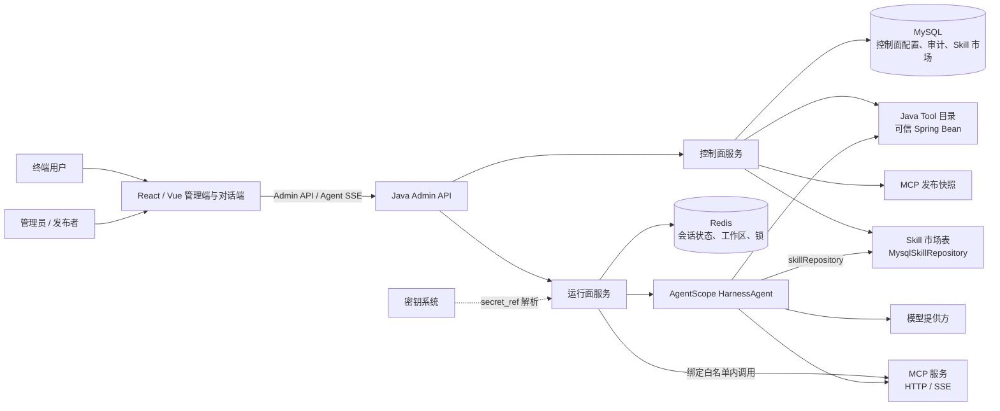
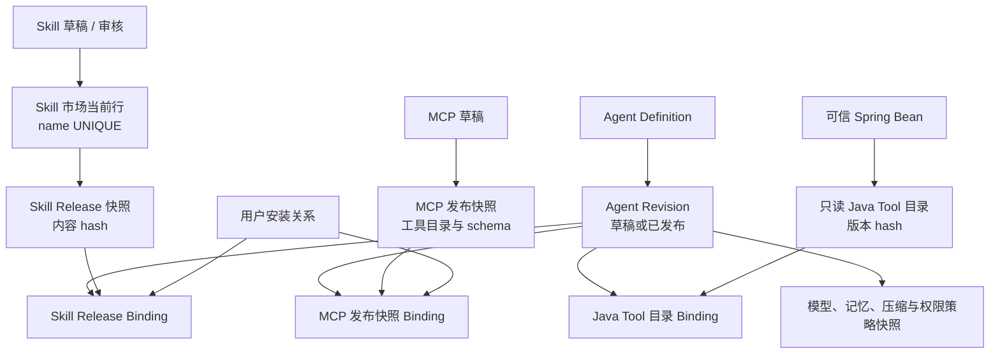
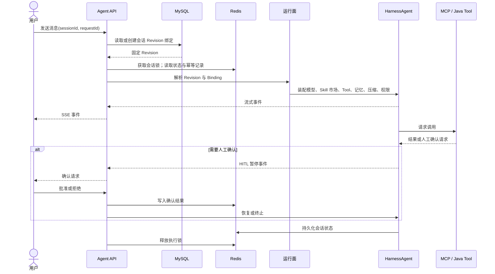
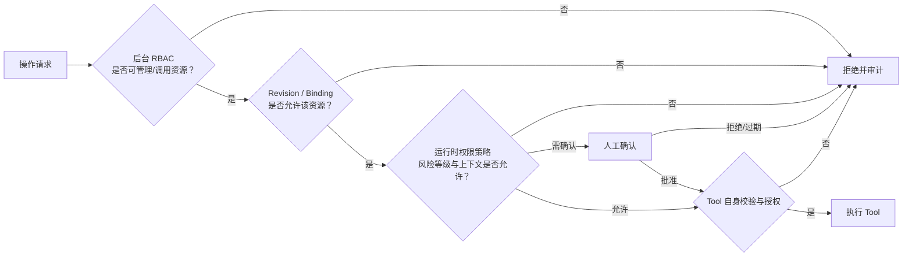

# AgentScope Agent 平台系统架构

> **状态：目标架构（未落地）**
> **读者：** 实施平台的工程师与 agent
> **范围：** Agent 平台的模块、数据与运行时边界；不修改或替代当前 Java 代码、既有数据库脚本及 AgentScope SDK 原字段。Skill 表结构与流程见 [`docs/agent-module-skill.md`](agent-module-skill.md)。
> **设计基线：** `docs/agent-module.md`、`docs/agent-module-skill.md`、`CONTEXT.md`、`backend/db/docs/db-conventions.md`、`docs/adr/` 与项目声明的 AgentScope Java `2.0.1`。

## 1. 目标与边界

本平台在现有 Trellis Admin 基础上建设可运营的 Agent 后台：管理员、发布者和终端用户可管理 Agent、Skill、MCP 服务与受信任 Java Tool，并以可控、可复现和安全的方式运行对话式 Agent。

架构分为两个平面：

- **控制面**：资产市场、个人资产、审核发布、Agent 定义与不可变版本、安装关系、绑定关系、管理权限与装配策略。
- **运行面**：按固定的 Agent Revision 解析 Skill、MCP、Java Tool、记忆和上下文压缩策略，将其装配为一次可执行的 `HarnessAgent` 调用；承载会话、流式事件、取消、人工确认和执行锁。Skill 必须经 Harness **技能市场**入口 `skillRepository(...)` 接入，默认后端为 MySQL。

本文描述**目标能力**，不表示当前 Trellis Admin 已具备这些能力。现有 Admin API、鉴权、角色、菜单、API Resource、审计与任务能力仍按 `CONTEXT.md` 和既有 ADR 演进；Agent 平台接入时必须遵守其既有约定。

### 1.1 非目标

- 除 [`docs/agent-module-skill.md`](agent-module-skill.md) 已决策的 Skill 表外，不定义尚未决策的物理表字段、索引或具体接口 JSON 字段。
- 不允许用户上传 JAR、指定类名、扫描任意 classpath 或执行任意系统命令来创建 Java Tool。
- 不将已安装的 Skill 或 MCP 自动绑定到全部 Agent。
- 不把 Harness 默认的工作区同名覆盖当作授权模型；私有 Skill 不得静默覆盖市场 Skill。
- 不将当前 Temporal 调度能力设为对话运行的前置依赖；任务调度仍遵循 ADR-0006。
- 当前支持 HTTP/SSE MCP；受控 STDIO MCP 是后续扩展，不得绕过本文的发布快照与隔离约束。
- 自学习闭环（`propose_skill` / `skill_manage` / Curator / `autoPromote`）不是首期能力；启用前必须走控制面审核，禁止 agent 直接写回市场表。

## 2. 设计原则与不可变量

1. **发布即固定输入**：每次发布生成不可变的 Agent Revision、Skill Release 或 MCP 发布快照；运行只解析已发布的具体版本，不能以“最新版本”替换历史行为。
2. **控制状态与运行状态分离**：MySQL 记录可审计的控制面配置和会话与 Revision 的绑定；Redis 记录会话 Agent 状态、共享工作区 KV 与分布式执行锁。控制面不得复制 Redis 的 Agent 运行状态。
3. **两层权限同时通过**：后台 RBAC 决定操作者能否管理资源；运行时策略决定模型本次能否调用具体 Tool。任一层拒绝均不能执行。
4. **未知即拒绝**：MCP 工具目录漂移、Java Tool 目录 hash 漂移、绑定引用缺失、schema 非法或版本不可解析时，运行或发布必须失败，不能降级为自动放行。
5. **密钥不进入业务数据面**：数据库仅保存配置与 `secret_ref`；API Key、OAuth Token 等明文不得进入数据库、日志、审计事件或模型上下文。
6. **取消必须停止执行**：用户取消不仅关闭 SSE/HTTP 连接，还必须传递取消信号并等待 Agent 与全部已启动 Tool 停止；不支持受控取消的 Tool 不得绑定到可取消的对话运行路径。
7. **会话固定 Revision**：会话首次启动时解析 Revision 并固定；发布和回滚只影响后续新会话。紧急禁用对既有会话的处理必须由明确策略决定，且不得通过静默切换 Revision 实现。
8. **Skill 经技能市场接入**：运行面只通过 `HarnessAgent.skillRepository(...)`（及为执行脚本而物化的工作区文件）装 Skill。平台默认市场后端是 `MysqlSkillRepository`；控制面 Binding 决定本次可见集合与覆盖关系，不能让市场表的“当前行”或 Harness 工作区默认优先级改写已绑定的 Release。

## 3. 系统上下文



### 3.1 客户端与 HTTP 边界

- 管理端延续现有双前端：React Admin 与 Vue Vben Admin。路由可沿用动态菜单与鉴权边界；资源管理、审核和 Agent 配置均通过 Admin API 暴露。
- 对话端使用流式 SSE 接收 Agent 事件。请求必须携带会话标识和 `requestId`；取消与 HITL 恢复使用独立的、强类型化 Admin API 操作。
- Controller 遵循 ADR-0001：请求使用专用 DTO，响应使用专用 VO，统一包裹为既有 `code` / `msg` / `data` 契约；分页结果保持 `{ items, total }`。不得用 `Map` 或动态 JSON 拼接稳定业务契约。

### 3.2 Java 后端分层

现有 Maven reactor 由 `java-admin-common`、`java-admin-service`、`java-admin-infra`、`java-admin-api` 组成。目标实现按以下职责进入对应层：

| 层                   | 目标职责                                                                                                                        |
| -------------------- | ------------------------------------------------------------------------------------------------------------------------------- |
| `java-admin-api`     | Agent 管理、市场、审核、会话和 SSE 控制器；DTO/VO；HTTP 鉴权边界。                                                              |
| `java-admin-service` | Agent、Revision、Release、Binding、安装、会话绑定与权限策略的领域编排；控制面实体与 repository；Skill 市场表的扩展字段读写。    |
| `java-admin-infra`   | AgentScope、`MysqlSkillRepository`、Redis、MCP 连接、密钥引用解析、共享 OkHttpClient、可信 Java Tool 目录和外部模型客户端适配。 |
| `java-admin-common`  | 通用错误码、时间、结果类型及跨层无业务依赖的基础设施。                                                                          |

字段一一对应的 Request→Command、Entity→View、View→VO 转换遵循 ADR-0002 的 mapstruct-plus 约定。Agent、Redis、MCP、Skill 市场和模型的可配置项用 `@ConfigurationProperties` 聚合，遵循 ADR-0003。

## 4. 控制面

控制面负责“哪些资源可用、由谁使用、以什么版本组合”的事实来源。它只处理可审计的配置与生命周期，不承载单次 Agent 执行状态。



### 4.1 Agent Definition 与 Agent Revision

- **Agent Definition** 是面向运营的稳定标识，承载名称、归属、状态和当前发布 Revision 的指针。
- **Agent Revision** 是可编辑草稿或不可变已发布快照。发布快照至少固定系统提示词、模型配置、权限策略、记忆策略、上下文压缩策略，以及所有 Skill、MCP、Java Tool Binding。
- 发布新 Revision、回滚当前发布指针和紧急禁用是不同操作：回滚只影响后续新会话；紧急禁用拒绝新的运行入口；历史会话是否允许继续必须由明确策略决定，不能隐式切换 Revision。
- 发布前必须验证每个 Binding 的目标版本、内容/hash、工具 schema 和权限策略均完整且未漂移。

### 4.2 Skill：包、市场与生命周期

Skill 的表、状态机与端到端流程以 [`docs/agent-module-skill.md`](agent-module-skill.md) 为准。本节只固定与控制面/运行面的接缝。

Skill 是指令和资料包，不是可直接执行的 Tool。包形态对齐 [Harness Skill](https://java.agentscope.io/v2/zh/docs/harness/skill.html)：

```
<code-reviewer>/
├── SKILL.md           # 必需：YAML frontmatter（name + description）+ 给 agent 的指令
├── references/        # 可选：长篇参考，agent 按需读取
└── scripts/           # 可选：经 shell 调用的受控脚本
```

`SKILL.md` 写入市场表的 `skill_content`；`references/` 与 `scripts/` 等附属文件写入资源表，`resource_path` 为相对 `SKILL.md` 的路径（如 `references/style-guide.md`），禁止硬编码绝对路径。

Harness 从两类来源装 Skill，二者可同时存在：

| 来源         | Harness 入口                                                             | 本平台用法                                                                                                                                                                   |
| ------------ | ------------------------------------------------------------------------ | ---------------------------------------------------------------------------------------------------------------------------------------------------------------------------- |
| **技能市场** | `skillRepository(...)`：Git / Nacos / **MySQL** / classpath / 自定义后端 | **默认且必须**：MySQL `MysqlSkillRepository`。Git 仓库是受控的**导入来源**，同步后仍须走草稿、审核、Release 与显式 Binding；Nacos / classpath 同理，不得绕过这些控制面约束。 |
| **工作区**   | `workspace/skills/`、`<userId>/skills/`                                  | 只作为已绑定 Release 的执行物化（脚本 `<files-root>`、沙箱投影），不是授权来源。                                                                                             |

#### 4.2.1 控制面生命周期

- Skill 支持私有资产与市场资产，以及草稿、提交审核、发布、下架、弃用、安装。
- 发布生成不可变 Skill Release 和内容 hash；任何修改都必须产生新 Release。
- 用户安装只表示拥有使用资格。要进入 Agent 运行，必须显式绑定到一个 Agent Revision。
- 同名覆盖必须在 Revision Binding 中明示。私有 Skill 不得静默覆盖市场 Skill。
- 已发布 Revision 引用具体 Release；市场随后更新当前行不会改变旧 Revision 的行为。

#### 4.2.1.1 Git Skill 受控导入

Git 不是运行时授权来源，也不是 `HarnessAgent` 的长期附加仓库。控制面把 Git 包解析为现有 Skill 草稿；发布后仍只由不可变 Release 和 Revision Binding 装配运行。该模块的外部接口只接受来源配置与同步命令，拉取、约束校验、目录扫描、内容 hash、去重、草稿写入与审计均封装在模块内。

- **两类来源**：平台来源仅由管理员创建，可导入为 `MARKET` 草稿；用户来源归当前用户所有，强制导入为 `PRIVATE` 草稿。普通用户不能通过 Git 直接写市场，也不额外获得他人私有包。
- **来源配置**：逻辑记录包含 HTTPS `url`、可选 `ref`、可选仓库子目录、`secret_ref`、最近成功的 `commit_sha`、同步状态与错误摘要。禁止 URL user-info、SSH、本地路径和子模块；凭据只经 `secret_ref` 解析，绝不写入 URL、草稿、Release、日志或返回体。
- **同步语义**：先将 `ref` 解析为精确 `commit_sha`，再从子目录扫描标准 `<skill>/SKILL.md` 包并返回预览。确认导入后，每个合法包走现有 `createDraft` 校验；来源、commit、包相对路径与 `content_hash` 相同则幂等返回已有草稿，不创建新版本。Git 获取或安全校验失败时不创建任何草稿；单个包非法只报告该包失败，不污染同次其他合法包。
- **资源限制**：仅允许 HTTPS 与配置的允许主机/端口；连接和每次同步总超时、重定向次数、响应/仓库大小、文件数、单文件大小和总解包内容大小均由类型化配置限制。每次 DNS 解析和重定向后都拒绝回环、私网、链路本地、保留地址与非允许端口，防止 SSRF。
- **并发与可审计性**：同一来源的同步以来源记录串行；审计记录操作者、来源 id、脱敏 URL、请求 ref、解析 commit、包路径、结果数量和失败摘要。`commit_sha` 是 Release 来源元数据，不是运行时选择“最新 Git 内容”的指针。
- **生命周期不变**：同步只产生可编辑 `DRAFT`；平台导入仍提交审核后才发布 MARKET，用户导入按 PRIVATE 的既有发布策略处理。后续 Git 更新绝不修改 Release、市场当前行以外的历史或任何已发布 Revision / 会话。

#### 4.2.2 市场表与 SDK 契约

平台侧统一管理 Skill 时，官方入口是 `MysqlSkillRepository`。SDK 默认表为 `agentscope_skills` / `agentscope_skill_resources`。本平台表名改为与现有 `agent_*` 同族，**原字段名、类型与含义保持不变**，允许追加平台字段。

| SDK 默认表名                 | 平台表名               | builder                                                                                          |
| ---------------------------- | ---------------------- | ------------------------------------------------------------------------------------------------ |
| `agentscope_skills`          | `agent_skill`          | `skillsTableName("agent_skill")`                                                                 |
| `agentscope_skill_resources` | `agent_skill_resource` | 以 2.0.1 实际 API 为准；若无独立配置项，资源表名必须服从 SDK 派生规则，不得改成 SDK 读不到的名字 |

`createIfNotExist` 必须为 `false`：表结构由 Flyway 维护，禁止运行时建表。运行面 `writeable(false)`：市场行只由控制面 Admin API 写入，agent 不得直写。

SDK 原字段（不可删除、不可改名、不可改语义；类型保持兼容）：

```sql
CREATE TABLE agent_skill (
    id BIGINT NOT NULL AUTO_INCREMENT PRIMARY KEY,
    name VARCHAR(255) NOT NULL UNIQUE,
    description TEXT NOT NULL,
    skill_content LONGTEXT NOT NULL,
    source VARCHAR(255) NOT NULL,
    metadata_json LONGTEXT NULL,
    created_at TIMESTAMP DEFAULT CURRENT_TIMESTAMP,
    updated_at TIMESTAMP DEFAULT CURRENT_TIMESTAMP ON UPDATE CURRENT_TIMESTAMP
) ENGINE=InnoDB DEFAULT CHARSET=utf8mb4 COLLATE=utf8mb4_unicode_ci;

CREATE TABLE agent_skill_resource (
    id BIGINT NOT NULL,
    resource_path VARCHAR(500) NOT NULL,
    resource_content LONGTEXT NOT NULL,
    created_at TIMESTAMP DEFAULT CURRENT_TIMESTAMP,
    updated_at TIMESTAMP DEFAULT CURRENT_TIMESTAMP ON UPDATE CURRENT_TIMESTAMP,
    PRIMARY KEY (id, resource_path),
    FOREIGN KEY (id) REFERENCES agent_skill(id) ON DELETE CASCADE
) ENGINE=InnoDB DEFAULT CHARSET=utf8mb4 COLLATE=utf8mb4_unicode_ci;
```

字段含义：

| 字段               | 表          | 含义                                                                                  |
| ------------------ | ----------- | ------------------------------------------------------------------------------------- |
| `id`               | 市场 / 资源 | Skill 主键；资源表 `id` 不是自增，引用市场行                                          |
| `name`             | 市场        | Skill 名，与 `SKILL.md` frontmatter `name` 一致；**UNIQUE**                           |
| `description`      | 市场        | 给 agent 的触发说明，对应 frontmatter `description`                                   |
| `skill_content`    | 市场        | 完整 `SKILL.md` 正文                                                                  |
| `source`           | 市场        | 市场来源标识，如 `mysql` / `market` / `private`；SDK 用它区分 `<files-root>` 缓存目录 |
| `metadata_json`    | 市场        | SDK 元数据；平台业务状态不要只藏在这里                                                |
| `resource_path`    | 资源        | 包内相对路径                                                                          |
| `resource_content` | 资源        | 文件内容                                                                              |

扩展规则：

- **可改表名**；**不可改原字段**；**可在表尾追加列**（归属、可见性、状态、`content_hash`、启停、审计等）。
- `id` 保持 SDK 的有符号 `BIGINT`，不改为 `BIGINT UNSIGNED`，以免破坏 `MysqlSkillRepository` 读写。
- `name UNIQUE` 是 SDK 读取契约：市场表每个名称最多一行**当前已发布内容**。不可用同名多行实现 Skill Release 历史。
- 因此这两张表**不是**典型“核心表”：不要给 `name` 套 `(name, deleted_at)` 软删唯一键，也不要用软删行与 SDK UNIQUE 对抗。下架 = 运行面不可见（扩展状态 / `is_enabled`）或移出市场可见集；历史版本另存。
- `MysqlSkillRepository` 只理解原字段，**不会**过滤平台扩展的 `status`。草稿、审核中、已下架行不得出现在它的可见结果里。推荐：市场表只保留当前已发布行；草稿与审核不入这两张表。
- `metadata_json` 保持 SDK 的 `LONGTEXT`，不改成 MySQL `JSON` 类型。
- 追加列遵循 `db-conventions.md` 的命名与枚举约定；原字段不受该约定回改。

#### 4.2.3 Skill Release 与市场当前行

`name UNIQUE` 决定了市场表只能表示“该名称此刻的已发布包”。不可变 Release 必须在市场表之外冻结：

1. 发布到市场：upsert `agent_skill` 当前行，并同步 `agent_skill_resource`。
2. 生成 Skill Release：对 `skill_content` + 全部资源做内容 hash，把当时的正文与资源快照写入 Binding（或 SDK 不读取的控制面历史表）。
3. Agent Revision 绑定的是该快照，不是市场表主键的“最新含义”。
4. 市场再次发布同名 Skill 只更新当前行；已发布 Revision 仍使用冻结快照。

草稿如何存储（独立表或非市场可见行）仍属实施项，但不得破坏 `name UNIQUE`，也不得让 `MysqlSkillRepository` 列举到草稿。

#### 4.2.4 同名覆盖

Harness 默认优先级（低→高）：项目全局目录 → 市场（后注册覆盖先注册）→ `workspace/skills/` → `<userId>/skills/`。本平台**不采用**该默认作为授权：

- 一次运行可见的 Skill 集合 = 该会话固定 Revision 的 Binding。
- 同名冲突只在 Binding 里显式配置胜者；未配置则拒绝发布或拒绝启动。
- 禁止把未绑定的私有 Skill 物化到 `<userId>/skills/` 来“自然覆盖”市场 Skill。
- Git 导入产生的 Release 与手工创建的 Release 完全等价；运行时不得注册其 Git 仓库，不能依赖 Harness 的“后注册覆盖”或动态远端检查。

### 4.3 MCP 生命周期

MCP 服务以草稿、验证、审核、发布、安装、绑定的链路进入控制面。

- MCP 同时支持市场资产与个人资产；二者均须经草稿、验证、审核、发布、安装和显式 Binding 后才能进入 Agent 运行。
- 发布前必须完成握手，并冻结服务可见工具的名称、描述、输入 schema 与版本信息为工具目录快照。
- 运行时仅允许调用“已发布快照中存在”且“当前 Binding 白名单允许”的工具。
- 服务端工具新增、删除、重命名或 schema 改变均属于目录漂移；检测到漂移后拒绝调用，并将该 Binding 标为需要重新验证/发布。
- MCP 连接以用户、凭据版本和 MCP 发布版本隔离。任一配置或凭据版本改变后都必须重建连接，禁止复用旧连接。
- 配置中只保存 `secret_ref`，由运行面按需解析；模型不得看到凭据明文。

### 4.4 Java Tool 生命周期

Java Tool 只来自已部署且受信任的 Spring Bean。

- 应用启动时扫描允许暴露的 Bean，生成只读目录：名称、描述、参数 schema、风险级别、只读属性和版本 hash。
- 后台仅能从已发现、已启用的目录项创建 Binding；不能上传代码或动态加载任意类。
- 名称冲突、schema 非法、目录 hash 漂移或已发布 Revision 引用不存在的 Tool 必须阻止发布或启动。
- Tool 自身的输入验证与资源权限检查属于 Tool 的安全责任，运行时全局策略不能绕过它。

## 5. 运行面

运行面将固定 Revision 解析为一次可恢复、可中断、可审计的 Agent 执行。它不重新计算控制面“最新状态”，只消费已固定的版本和 Binding。



### 5.1 会话、幂等与锁

- 首次执行为会话写入固定 Revision 绑定；后续消息只能使用该绑定，直到会话结束或显式失效。
- Redis 的会话状态必须足以在请求间续聊，并包含工具状态、HITL 等待状态和必要的执行游标；MySQL 不复制这些 Agent 状态。
- `requestId` 重试必须在短时窗口内幂等：同一个成功、失败、取消或等待确认的请求不能再次启动有副作用的 Tool。
- 每个会话执行使用 Redis 分布式锁串行化，避免同一会话并发推进造成状态覆盖、重复工具调用或重复 SSE 事件。
- 长期记忆按“用户 + Agent”隔离；不同 Agent 不自动共享同一用户的长期记忆。“忘记”操作删除该长期记忆，并使关联会话运行状态失效。

### 5.2 Revision 解析与 HarnessAgent 装配

启动执行时，运行面按下列顺序解析：

1. 从会话取得固定的已发布 Agent Revision；不存在时拒绝启动，不回退到 Agent 的最新版本。
2. 校验 Revision 及所有 Binding 未禁用、未缺失、未发生内容/hash/schema/目录漂移。
3. 按 Revision 解析模型配置、系统提示词、**已绑定 Skill Release 快照**、MCP 工具白名单、Java Tool 目录项、记忆策略、上下文压缩策略与运行时权限策略。
4. 为本次会话建立或复用受隔离规则约束的 MCP 连接，解析所需 `secret_ref`，并将凭据仅放入连接所需的最小作用域。
5. 将上述固定输入装配为 `HarnessAgent`：用 `skillRepository(...)` 接入本次可见的 Skill 集合，接入 Redis 状态、工作区和执行锁后开始流式运行。

- Git 同步只在控制面发生；运行面不得以 `GitSkillRepository` 拉取、轮询或合并远端内容。已发布 Release 的 `source` 元数据仅供审计，不能参与 Skill 解析或覆盖决策。

Skill 装配约束：

- `skillRepository` 是统一市场入口。默认构造 `MysqlSkillRepository`，指向 §6.1.1 的平台表；`writeable(false)`。
- **会话运行不得把市场当前行当作 Binding 内容。** 装配源是 Binding 冻结的 Skill Release。实现可以是：自定义 `SkillRepository` 只暴露快照，或把快照物化后注册为本次仓库。直接对共享市场表做 `MysqlSkillRepository` 且每轮动态合并，会把后来发布的同名内容泄漏进旧会话。
- 工作区 `skills/` 仅用于物化已绑定包，以便 `load_skill_through_path` 与脚本 `<files-root>`（含 `.skills-cache/<source>/<name>/`）。未绑定 Skill 不得写入工作区。
- 需要脚本执行时，才把市场 Skill 物化到工作区缓存；只读 `SKILL.md` / `references/` 走仓库内存，不依赖沙箱。
- 附加市场（Nacos / classpath）可再调用 `skillRepository(...)`；后注册优先级更高只作用于**未在 Binding 声明**的名称，不能覆盖已绑定 Release。Git 仅能经控制面同步为 Release，运行面不得直接注册。
- `disableDynamicSkills()` 仅在单次任务或市场过慢时使用，不能代替 Binding 快照。

AgentScope 相关状态、记忆、压缩、Skill、MCP 与 Channel 的职责边界以项目 pin 的 `agentscope-harness:2.0.1` 和官方 Harness 文档为准；实现阶段必须以该版本 SDK 的实际 API 为准，不得以本文替代编译期校验。

### 5.3 SSE、取消与 HITL

- SSE 事件至少应区分运行开始、文本增量、工具调用状态、HITL 请求、恢复、完成、失败与取消；事件结构是后续 API 契约设计项。
- 用户取消时，API 先标记执行为取消中，再向运行时、Agent 和全部已启动 Tool 传播取消并等待停止确认；仅断开客户端连接不算取消完成。
- 运行时权限策略的默认值为：只读工具可按策略放行；可回滚写操作要求人工确认；高风险、不可逆、跨用户或生产操作默认拒绝。
- 无人值守模式中的“无需询问”不等于允许执行。未被 Revision 或运行时策略显式允许的操作仍必须拒绝。
- HITL 确认状态保存于 Redis，并受会话锁保护。恢复时必须重新校验会话、Revision、Binding 和确认请求仍有效；过期、取消或版本失效时不得恢复工具调用。

## 6. 数据与基础设施边界

### 6.1 MySQL：控制面事实来源

MySQL 保存资产、草稿、发布版本、安装关系、审核、Agent Definition、Agent Revision、Binding、会话与 Revision 绑定、Skill 市场目录以及必要审计元数据。逻辑实体和主要关系如下：

| 实体                | 责任                                 | 关键关系                                                 |
| ------------------- | ------------------------------------ | -------------------------------------------------------- |
| Agent Definition    | 稳定业务标识与当前发布 Revision 指针 | 一对多 Agent Revision                                    |
| Agent Revision      | 草稿或不可变运行快照                 | 绑定具体 Skill Release、MCP 快照、Java Tool 目录项与策略 |
| Skill 市场当前行    | SDK 兼容的已发布包（`name` UNIQUE）  | `MysqlSkillRepository` 读取；一对多资源行                |
| Skill Release       | 发布时冻结的内容 hash 与包快照       | Revision Binding 引用快照，不引用市场“最新行”            |
| MCP 服务 / 发布快照 | 服务配置与冻结的工具目录             | Revision Binding 限定可调用工具                          |
| Java Tool Catalog   | 可信 Bean 的只读发现目录             | Revision Binding 选择目录项                              |
| 安装与审核关系      | 用户对市场资产的安装资格、发布准入   | 不自动形成 Revision Binding                              |
| 会话元数据          | 会话归属、固定 Revision、生命周期    | 不复制 Redis Agent 状态                                  |

物理设计进入实施时必须遵守 `backend/db/docs/db-conventions.md`：MySQL/InnoDB、`BIGINT UNSIGNED AUTO_INCREMENT` 主键、`snake_case`、核心资源的软删和审计字段、软删感知唯一键、枚举 `VARCHAR(32)` 与 JSON 字段边界。控制面是否属于“核心表”须在 schema 设计时逐表判断，不能机械套用。**Skill 市场两张表例外**：原字段服从 SDK，见 §6.1.1。

实施 Agent 平台时，`java-admin-api/src/main/resources/db` 中本模块的全部 SQL 仅维护在 `V3__agent_schema.sql` 和 `V4__agent_schema_seed.sql`：新增或调整 schema、数据均直接修改这两个文件，不创建 `V5` 或后续迁移文件。

#### 6.1.1 Skill 表

物理表、原字段契约、扩展列、草稿 / Release / 安装 / Binding 及写入规则见 [`docs/agent-module-skill.md`](agent-module-skill.md)。

市场表 `agent_skill` / `agent_skill_resource` 是 `MysqlSkillRepository` 后端，只含 MARKET 当前已发布行。实施时追加到 `V3__agent_schema.sql`：

```java
MysqlSkillRepository.builder(dataSource)
        .skillsTableName("agent_skill")
        .createIfNotExist(false)
        .writeable(false)
        .build();
```

### 6.2 Redis：运行时唯一状态存储

Redis 承载：

- AgentScope 会话状态、Agent/工具执行状态和 HITL 等待状态；
- 共享工作区 KV（含按用户隔离的逻辑 `skills/` 前缀，若使用 remote filesystem）；
- 同一会话的分布式执行锁；
- `requestId` 短时幂等记录和必要的重试快照；
- 需要主动失效的会话状态索引。

Redis 中的状态要设定与会话生命周期一致的过期与清理策略。清理不能早于可恢复执行、幂等去重和 HITL 确认所需窗口；过期后必须返回明确的不可恢复错误，不能使用空状态重新执行有副作用的步骤。

### 6.3 出站连接与配置

- MCP HTTP/SSE 与其他非对象存储出站 HTTP 调用通过 `java-admin-infra` 装配的共享 `OkHttpClient` 完成，遵循 ADR-0005；调用方不得自行 `new OkHttpClient()`。
- S3/对象存储仍使用 AWS SDK 的既有 HTTP 实现，未被该 ADR 覆盖。
- Redis、模型端点、MCP 端点、Skill 市场、超时、连接池和安全开关均使用类型化 `@ConfigurationProperties`；启动期应校验互斥或必填配置。
- Git 同步适配器复用共享 `OkHttpClient` 或 SDK 可注入的等价出站客户端；不得自行创建网络客户端。Git 来源的允许主机、端口、超时、大小上限、重定向上限和是否允许私有仓库凭据均进入 `app.agent-skill.git` 的类型化 `@ConfigurationProperties`，启动期校验限制非负且上限关系合法。
- 分布式多副本部署时，任何实例都必须能经 Redis 恢复同一会话的运行状态；本地进程内状态不得成为恢复的唯一来源。市场 Skill 的脚本物化路径必须能在多副本间一致（remote workspace / 共享缓存），不能只落在单机磁盘。

## 7. 权限与安全模型



- **后台 RBAC**：复用既有 Role、Role API Binding 与 API Resource 体系，控制谁能创建、审核、发布、安装、绑定、禁用及调用 Agent 资源。
- **Revision/Binding 授权**：控制当前已发布 Revision 能使用哪些具体 Skill Release、MCP 快照工具与 Java Tool。安装资格不等于 Binding。
- **运行时权限**：按工具风险等级、会话上下文和无人值守策略决定放行、HITL 或拒绝。
- **Tool 自身授权**：每个 Java Tool/MCP Tool 继续执行其输入校验和业务权限检查；全局策略只会追加限制，不能提升 Tool 原有权限。Skill 脚本若走 shell，必须受工作区/沙箱隔离约束，且仅执行已绑定包内的相对路径脚本。
- **审计与脱敏**：记录操作主体、资源版本、会话、requestId、许可决策、确认决定和结果摘要；严禁记录 secret 明文、完整敏感提示词或未经脱敏的工具参数。
- **Git 同步权限**：平台来源的创建、更新、同步、预览与导入使用独立的市场管理权限；用户来源仅允许所有者读写同步，且服务端强制 `PRIVATE`。所有 Git 同步操作均审计脱敏来源与解析 commit。

## 8. 故障处理与可观测性

| 场景                                             | 预期处理                                                                                                      |
| ------------------------------------------------ | ------------------------------------------------------------------------------------------------------------- |
| Revision、Release 或 Binding 不存在/被禁用       | 拒绝新执行；返回可定位的业务错误；不回退到最新版本。                                                          |
| 市场当前行与 Binding 快照 hash 不一致            | 不改用当前行；继续使用快照。当前行缺失不影响已固定会话。                                                      |
| Skill `name` 冲突且 Binding 未声明覆盖           | 拒绝发布或拒绝启动；不使用 Harness 默认工作区覆盖。                                                           |
| MCP 目录或 schema 漂移                           | 拒绝调用，将 Binding 标为需重新验证；不调用未知工具。                                                         |
| Java Tool 目录 hash 漂移                         | 阻止引用它的发布或运行；要求重新发现、审核和发布。                                                            |
| 相同 `requestId` 重试                            | 返回既有结果/进行中状态，不重复执行副作用。                                                                   |
| 同会话并发请求                                   | 通过 Redis 锁串行化；锁冲突返回明确的进行中/冲突语义。                                                        |
| SSE 客户端断开                                   | 不自动等同取消；由显式取消策略和运行状态决定后续处理。                                                        |
| 用户取消                                         | 向 Agent 与全部已启动 Tool 传播中断并等待停止确认，随后写入取消终态；无法受控取消的 Tool 不得进入该运行路径。 |
| HITL 过期或会话失效                              | 拒绝恢复，清理等待状态，并要求用户发起新的有效请求。                                                          |
| Redis 不可用                                     | 拒绝启动或恢复需要状态一致性的执行；不得退化为单机内存状态。                                                  |
| Git URL / 重定向解析到私网、保留地址或非允许端口 | 拒绝请求，不发起后续连接；审计脱敏 URL 与拒绝原因。                                                           |
| Git 获取超时、超过大小或文件限制、含子模块       | 中止同步，不创建草稿；返回可定位的资源限制错误。                                                              |
| ref 不存在或同步后无合法 Skill 包                | 不写草稿；返回 ref / 扫描路径的明确错误。                                                                     |
| 同一来源并发同步                                 | 以来源锁串行；后到请求返回进行中或已完成的同一 commit 结果，不重复建草稿。                                    |

建议将以下字段关联到结构化日志、指标和追踪：`agentDefinitionId`、`agentRevisionId`、`sessionId`、`requestId`、`skillReleaseId`、`skillName`、`skillContentHash`、`mcpSnapshotId`、`toolCatalogHash`、工具风险等级、权限决策、HITL 决策与终态。运行面可以接入 AgentScope 的 `OtelTracingMiddleware` 作为运维观测手段，但它不是控制面证据或授权依据。

## 9. 实施顺序与验收不变量

实现应从一条可演示的窄链路开始，并在每步保留以下不变量：

1. **控制面基础**：建立 Agent Definition、草稿 Revision、发布 Revision 与会话固定 Revision；验收新旧会话不会因重新发布而隐式切换版本。
2. **只读运行路径**：接入单一模型和只读 Java Tool，通过 SSE 创建、续接、取消会话；验收同一 `requestId` 不重复执行，取消真实传入运行时。
3. **Agent UI 主链路验证**：在 React Admin 引入 `@ant-design/x`，使用其[独立式面板](https://x.ant.design/docs/playground/independent-cn)实现真实 Agent 对话页，并仅对接第 1、2 步已交付的强类型 API；验收用户可选择并查看已发布 Revision、创建和续接会话、接收 SSE 文本流，并在发送期间阻止重复提交。取消必须显示“取消中”至运行时确认的终态，浏览器连接关闭不得视为取消成功；页面必须明确处理加载、SSE 断开或失败及运行失败。该步骤是第 1、2 步的发布门槛，不得以 mock 或本地数据替代真实端到端验证；Skill、MCP、HITL 与多副本运维界面仅在相应能力交付后追加。
4. **Skill 市场、Release、绑定与 Git 导入**：在 `V3__agent_schema.sql` 追加 SDK 兼容的 `agent_skill` / `agent_skill_resource`（原字段不变，按需扩展）；控制面发布写入市场当前行；运行面用 `skillRepository` 接入**Binding 快照**而非市场最新行。Git 来源同步仅创建 DRAFT，强制经过既有审核 / 发布链路。验收：`MysqlSkillRepository` 能列出已发布 Skill；新 Release 或 Git 同步不改变旧 Revision；重名覆盖必须在 Binding 中明示；私有来源不能发布 MARKET；`writeable(false)` 下 agent 不能写回市场表。
5. **MCP 发布快照**：实现握手、快照、凭据引用和工具白名单；验收目录/schema 漂移被拒绝，凭据不会进入 MySQL、日志或模型上下文。
6. **权限与 HITL**：接入 RBAC、运行时策略和 Tool 自身校验；验收高风险操作默认拒绝、可回滚写操作须确认、确认过期不可恢复。
7. **多副本韧性**：接入 Redis 状态、工作区和锁；验收任一实例可恢复会话，Redis 故障时不以本地内存降级运行。

每一步的 HTTP 契约、数据库设计和工具适配均必须补充相应自动化测试；第 3 步还必须以浏览器驱动真实页面完成端到端验收。涉及 AgentScope 的行为测试必须以项目锁定的 `2.0.1` SDK 实际 API 和官方文档为准。

## 10. 参考依据

### 项目内

- [`docs/agent-module.md`](agent-module.md)：目标产品能力和核心架构约束。
- [`docs/agent-module-skill.md`](agent-module-skill.md)：Skill 表、发布/安装/绑定流程与运行面装配。
- [`CONTEXT.md`](../CONTEXT.md)：Trellis Admin 共享术语、Admin API 与权限边界。
- [`backend/db/docs/db-conventions.md`](../backend/db/docs/db-conventions.md)：数据库命名、主键、软删、审计和 JSON 约定。
- [`docs/adr/0001-typed-http-boundary.md`](adr/0001-typed-http-boundary.md)：HTTP DTO/VO 边界。
- [`docs/adr/0002-mapstruct-plus-layer-mapping.md`](adr/0002-mapstruct-plus-layer-mapping.md)：层间映射。
- [`docs/adr/0003-configuration-properties.md`](adr/0003-configuration-properties.md)：类型化配置。
- [`docs/adr/0005-okhttp-outbound-client.md`](adr/0005-okhttp-outbound-client.md)：共享出站 OkHttpClient。
- [`docs/adr/0006-temporal-task-mirror.md`](adr/0006-temporal-task-mirror.md)：既有 Temporal 任务边界。

### AgentScope Java 2.0.1

- [Skill](https://java.agentscope.io/v2/zh/docs/harness/skill.html)：技能市场（Git / Nacos / MySQL / classpath）、`skillRepository`、工作区层级、同名覆盖、`<files-root>` 物化与自学习闭环。本平台 MySQL 市场表以该文档的默认结构为原字段契约。
- [Harness 架构](https://java.agentscope.io/v2/zh/docs/harness/architecture.html)：状态、记忆、压缩、Skill、MCP 与 Channel 装配边界。
- [上生产](https://java.agentscope.io/v2/zh/docs/others/going-to-production.html)：`RedisDistributedStore`、多副本状态、Remote workspace、sandbox 快照与执行锁。
- [Redis State Store](https://java.agentscope.io/v2/en/integration/session/redis.html)：Redis 状态存储与 client adapter。
- [Tool](https://java.agentscope.io/v2/zh/docs/building-blocks/tool.html)：`Toolkit`、Java Tool、MCP 命名和 Skill Tool Group。
- [智能体](https://java.agentscope.io/v2/zh/docs/building-blocks/agent.html)：`RuntimeContext`、`AgentStateStore`、流式事件、中断与 HITL 恢复。
- [Permission System](https://java.agentscope.io/v2/zh/docs/building-blocks/permission-system.html)：`PermissionBehavior` 与 `PermissionMode`。
