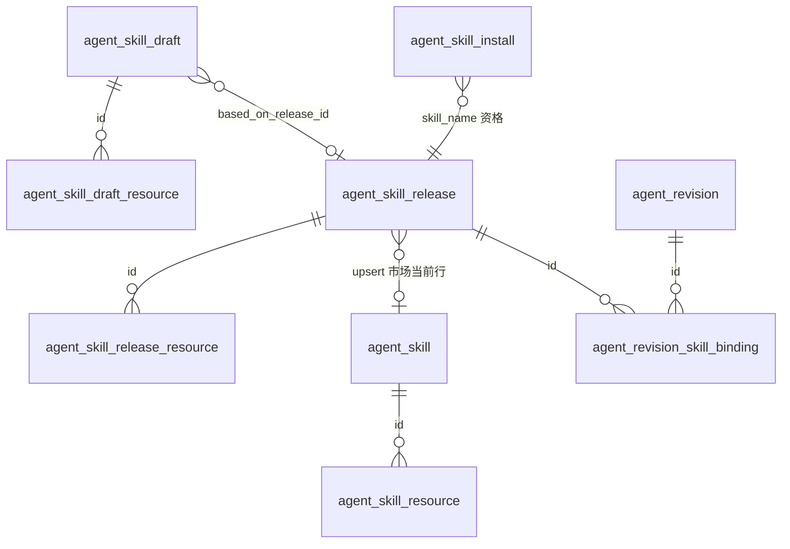
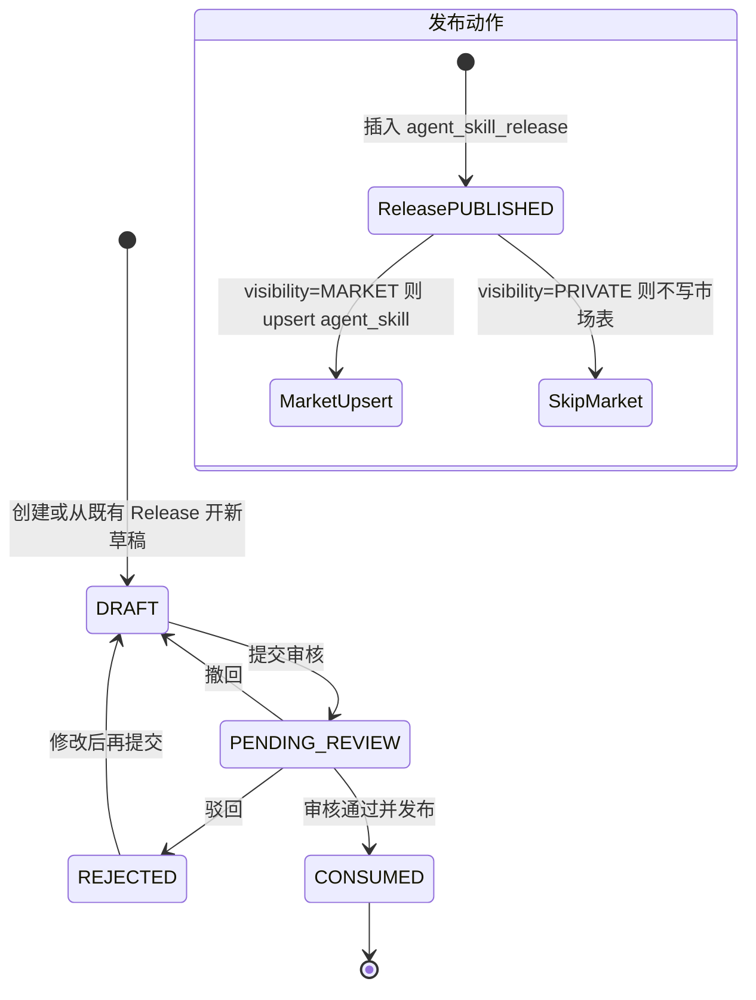
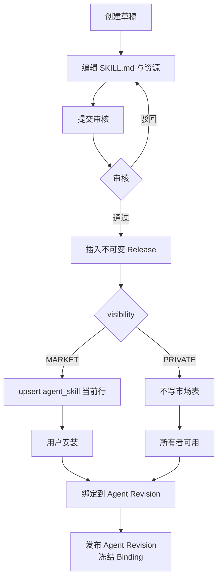
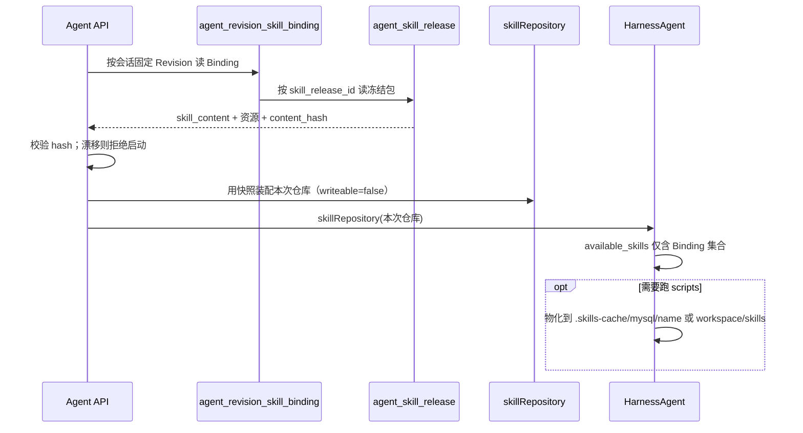

# Agent 模块：Skill 表与流程

> **状态：目标设计（未落地）**
> **读者：** 实施平台的工程师与 agent
> **范围：** Skill 包形态、表结构、控制面生命周期、运行面装配。不修改当前 Java 代码或 Flyway 脚本。
> **上级文档：** [`docs/agent-module-architecture.md`](agent-module-architecture.md)
> **设计基线：** [`docs/agent-module.md`](agent-module.md)、[Harness Skill](https://java.agentscope.io/v2/zh/docs/harness/skill.html)、`backend/db/docs/db-conventions.md`、AgentScope Java `2.0.1`

Skill 是指令和资料包，不是可执行 Tool。运行面只通过 `HarnessAgent.skillRepository(...)` 接入；默认后端为 MySQL `MysqlSkillRepository`。

## 1. 不变量

1. **SDK 原字段不变**：市场两张表可改表名、可追加列，不得删除/改名/改语义 SDK 列。
2. **`name UNIQUE` 只约束市场当前行**：`agent_skill` 每个名称最多一行，且只放 **MARKET 已发布** 包。不可用同名多行存历史或草稿。
3. **发布即冻结**：Skill Release 是不可变快照。Agent Revision Binding 引用 Release，不引用市场“最新行”。
4. **安装 ≠ 绑定**：安装只给使用资格；进入运行必须显式绑定到某个 Revision。
5. **同名覆盖必须明示**：Harness 工作区默认优先级不作授权。私有 Skill 不得静默覆盖市场 Skill。
6. **agent 不写市场表**：`MysqlSkillRepository.writeable(false)`。自学习闭环非首期。

## 2. 包形态

对齐官方 Skill 目录：

```
<code-reviewer>/
├── SKILL.md           # 必需：YAML frontmatter（name + description）+ 指令
├── references/        # 可选
└── scripts/           # 可选；相对路径，禁止绝对路径
```

映射：

| 包内文件                         | 落点                                           |
| -------------------------------- | ---------------------------------------------- |
| `SKILL.md` 全文                  | `skill_content`                                |
| frontmatter `name`               | `name`（必须与列值一致）                       |
| frontmatter `description`        | `description`                                  |
| `references/**`、`scripts/**` 等 | 资源表一行一个文件，`resource_path` 为相对路径 |

`content_hash`：对 `SKILL.md` 与全部资源按 `resource_path` 字典序拼接后的规范化字节做 SHA-256（hex）。发布、绑定、运行前漂移校验都用它。

## 3. 表总览

两层存储：

| 层                     | 表                                     | SDK 是否读取               | 内容                               |
| ---------------------- | -------------------------------------- | -------------------------- | ---------------------------------- |
| 技能市场（当前已发布） | `agent_skill` / `agent_skill_resource` | 是，`MysqlSkillRepository` | 每个 `name` 一行 MARKET 当前包     |
| 控制面（SDK 不读）     | 草稿、Release、安装、Binding           | 否                         | 生命周期、历史快照、资格、装配输入 |



平台表名相对 SDK 默认：

| SDK 默认                     | 平台表名               |
| ---------------------------- | ---------------------- |
| `agentscope_skills`          | `agent_skill`          |
| `agentscope_skill_resources` | `agent_skill_resource` |

`MysqlSkillRepository.skillsTableName("agent_skill")`。资源表名以 2.0.1 实际 API 为准；若无独立配置，必须服从 SDK 派生名，不得改成读不到的名字。

Flyway：全部追加进 `V3__agent_schema.sql`，不新建 `V5`。`createIfNotExist(false)`。

## 4. 市场表（SDK 契约）

原字段不可改。`id` 保持有符号 `BIGINT`，不改为 `UNSIGNED`。`metadata_json` 保持 `LONGTEXT`，不改为 `JSON`。不要给 `name` 套 `(name, deleted_at)`：会破坏 SDK `UNIQUE(name)`。

```sql
CREATE TABLE agent_skill (
    id              BIGINT       NOT NULL AUTO_INCREMENT,
    name            VARCHAR(255) NOT NULL,
    description     TEXT         NOT NULL,
    skill_content   LONGTEXT     NOT NULL,
    source          VARCHAR(255) NOT NULL,
    metadata_json   LONGTEXT     NULL,
    -- 以下为平台扩展，SDK 忽略
    current_release_id BIGINT UNSIGNED NOT NULL,
    owner_user_id   BIGINT UNSIGNED NOT NULL DEFAULT 0,
    visibility      VARCHAR(32)  NOT NULL DEFAULT 'MARKET',
    content_hash    VARCHAR(64)  NOT NULL,
    remark          VARCHAR(512) NOT NULL DEFAULT '',
    is_enabled      TINYINT(1)   NOT NULL DEFAULT 1,
    created_by      BIGINT UNSIGNED NOT NULL DEFAULT 0,
    updated_by      BIGINT UNSIGNED NOT NULL DEFAULT 0,
    created_at      TIMESTAMP    DEFAULT CURRENT_TIMESTAMP,
    updated_at      TIMESTAMP    DEFAULT CURRENT_TIMESTAMP ON UPDATE CURRENT_TIMESTAMP,
    PRIMARY KEY (id),
    UNIQUE KEY uniq_agent_skill_name (name),
    INDEX idx_agent_skill_current_release_id (current_release_id)
) ENGINE=InnoDB DEFAULT CHARSET=utf8mb4 COLLATE=utf8mb4_unicode_ci
  COMMENT='技能市场当前已发布行；MysqlSkillRepository 读取';

CREATE TABLE agent_skill_resource (
    id                BIGINT        NOT NULL,
    resource_path     VARCHAR(500)  NOT NULL,
    resource_content  LONGTEXT      NOT NULL,
    content_hash      VARCHAR(64)   NOT NULL,
    created_at        TIMESTAMP     DEFAULT CURRENT_TIMESTAMP,
    updated_at        TIMESTAMP     DEFAULT CURRENT_TIMESTAMP ON UPDATE CURRENT_TIMESTAMP,
    PRIMARY KEY (id, resource_path),
    CONSTRAINT fk_agent_skill_resource_id
        FOREIGN KEY (id) REFERENCES agent_skill (id) ON DELETE CASCADE
) ENGINE=InnoDB DEFAULT CHARSET=utf8mb4 COLLATE=utf8mb4_unicode_ci
  COMMENT='技能市场当前行的附属文件';
```

| 原字段          | 含义                                                     |
| --------------- | -------------------------------------------------------- |
| `id`            | 市场行主键；资源表 `id` 不是自增，等于市场行 `id`        |
| `name`          | 与 `SKILL.md` frontmatter 一致；全局 UNIQUE              |
| `description`   | agent 是否加载该 Skill 的触发说明                        |
| `skill_content` | 完整 `SKILL.md`                                          |
| `source`        | 平台写入 `mysql`。SDK 用它区分 `.skills-cache/<source>/` |
| `metadata_json` | SDK 元数据；业务状态走扩展列，不塞这里                   |

写入规则：

- **只 upsert `visibility=MARKET` 且已发布的当前包。** 私有 Skill、草稿、审核中、历史 Release 不得出现在这两张表。
- `MysqlSkillRepository` 不理解扩展列。下架市场 = **DELETE** 该 `name` 的市场行（级联资源）。仅靠 `is_enabled=0` 挡不住 SDK 列举。
- 私有 Skill 即使“已发布”，也不进 `agent_skill`。运行只靠 Release 快照。

## 5. 控制面表（SDK 不读）

这些表遵循 `db-conventions.md`：`BIGINT UNSIGNED` 主键、软删感知唯一、枚举 `VARCHAR(32)`。它们不是 `MysqlSkillRepository` 的后端。

### 5.1 草稿

同一所有者、同一 `name` 最多一份活跃草稿（含审核中）。

```sql
CREATE TABLE agent_skill_draft (
    id                   BIGINT UNSIGNED NOT NULL AUTO_INCREMENT,
    name                 VARCHAR(255)    NOT NULL,
    description          TEXT            NOT NULL,
    skill_content        LONGTEXT        NOT NULL,
    visibility           VARCHAR(32)     NOT NULL,
    status               VARCHAR(32)     NOT NULL,
    owner_user_id        BIGINT UNSIGNED NOT NULL,
    based_on_release_id  BIGINT UNSIGNED DEFAULT NULL,
    content_hash         VARCHAR(64)     NOT NULL,
    review_comment       VARCHAR(512)    NOT NULL DEFAULT '',
    reviewed_by          BIGINT UNSIGNED NOT NULL DEFAULT 0,
    reviewed_at          TIMESTAMP       NULL DEFAULT NULL,
    remark               VARCHAR(512)    NOT NULL DEFAULT '',
    is_enabled           TINYINT(1)      NOT NULL DEFAULT 1,
    deleted_at           BIGINT UNSIGNED NOT NULL DEFAULT 0,
    created_at           TIMESTAMP       NOT NULL DEFAULT CURRENT_TIMESTAMP,
    updated_at           TIMESTAMP       NOT NULL DEFAULT CURRENT_TIMESTAMP ON UPDATE CURRENT_TIMESTAMP,
    created_by           BIGINT UNSIGNED NOT NULL DEFAULT 0,
    updated_by           BIGINT UNSIGNED NOT NULL DEFAULT 0,
    PRIMARY KEY (id),
    UNIQUE KEY uniq_agent_skill_draft_owner_name (owner_user_id, name, deleted_at),
    INDEX idx_agent_skill_draft_status (status, deleted_at)
) ENGINE=InnoDB DEFAULT CHARSET=utf8mb4 COLLATE=utf8mb4_unicode_ci
  COMMENT='Skill 草稿与审核中内容';

CREATE TABLE agent_skill_draft_resource (
    id                BIGINT UNSIGNED NOT NULL AUTO_INCREMENT,
    draft_id          BIGINT UNSIGNED NOT NULL,
    resource_path     VARCHAR(500)    NOT NULL,
    resource_content  LONGTEXT        NOT NULL,
    content_hash      VARCHAR(64)     NOT NULL,
    created_at        TIMESTAMP       NOT NULL DEFAULT CURRENT_TIMESTAMP,
    updated_at        TIMESTAMP       NOT NULL DEFAULT CURRENT_TIMESTAMP ON UPDATE CURRENT_TIMESTAMP,
    PRIMARY KEY (id),
    UNIQUE KEY uniq_agent_skill_draft_resource_path (draft_id, resource_path),
    CONSTRAINT fk_agent_skill_draft_resource_draft_id
        FOREIGN KEY (draft_id) REFERENCES agent_skill_draft (id) ON DELETE CASCADE
) ENGINE=InnoDB DEFAULT CHARSET=utf8mb4 COLLATE=utf8mb4_unicode_ci
  COMMENT='Skill 草稿附属文件';
```

`status`：`DRAFT` / `PENDING_REVIEW` / `REJECTED` / `CONSUMED`。

### 5.2 Release（不可变）

```sql
CREATE TABLE agent_skill_release (
    id              BIGINT UNSIGNED NOT NULL AUTO_INCREMENT,
    name            VARCHAR(255)    NOT NULL,
    version         INT UNSIGNED    NOT NULL,
    description     TEXT            NOT NULL,
    skill_content   LONGTEXT        NOT NULL,
    visibility      VARCHAR(32)     NOT NULL,
    status          VARCHAR(32)     NOT NULL,
    owner_user_id   BIGINT UNSIGNED NOT NULL,
    source_draft_id BIGINT UNSIGNED DEFAULT NULL,
    content_hash    VARCHAR(64)     NOT NULL,
    source          VARCHAR(255)    NOT NULL DEFAULT 'mysql',
    remark          VARCHAR(512)    NOT NULL DEFAULT '',
    is_enabled      TINYINT(1)      NOT NULL DEFAULT 1,
    deleted_at      BIGINT UNSIGNED NOT NULL DEFAULT 0,
    created_at      TIMESTAMP       NOT NULL DEFAULT CURRENT_TIMESTAMP,
    updated_at      TIMESTAMP       NOT NULL DEFAULT CURRENT_TIMESTAMP ON UPDATE CURRENT_TIMESTAMP,
    created_by      BIGINT UNSIGNED NOT NULL DEFAULT 0,
    updated_by      BIGINT UNSIGNED NOT NULL DEFAULT 0,
    PRIMARY KEY (id),
    UNIQUE KEY uniq_agent_skill_release_scope_version (owner_user_id, visibility, name, version, deleted_at),
    INDEX idx_agent_skill_release_name_status (name, visibility, status, deleted_at)
) ENGINE=InnoDB DEFAULT CHARSET=utf8mb4 COLLATE=utf8mb4_unicode_ci
  COMMENT='不可变 Skill Release 快照';

CREATE TABLE agent_skill_release_resource (
    id                BIGINT UNSIGNED NOT NULL AUTO_INCREMENT,
    release_id        BIGINT UNSIGNED NOT NULL,
    resource_path     VARCHAR(500)    NOT NULL,
    resource_content  LONGTEXT        NOT NULL,
    content_hash      VARCHAR(64)     NOT NULL,
    created_at        TIMESTAMP       NOT NULL DEFAULT CURRENT_TIMESTAMP,
    PRIMARY KEY (id),
    UNIQUE KEY uniq_agent_skill_release_resource_path (release_id, resource_path),
    CONSTRAINT fk_agent_skill_release_resource_release_id
        FOREIGN KEY (release_id) REFERENCES agent_skill_release (id) ON DELETE CASCADE
) ENGINE=InnoDB DEFAULT CHARSET=utf8mb4 COLLATE=utf8mb4_unicode_ci
  COMMENT='Skill Release 冻结的附属文件';
```

`status`：`PUBLISHED` / `DEPRECATED`。行一旦插入，`skill_content`、资源、`content_hash`、`version` 不得 UPDATE。弃用只改 `status` / `is_enabled`。

`version` 在 `(owner_user_id, visibility, name)` 内从 1 递增。MARKET 的 `owner_user_id` 用 `0` 表示平台。

### 5.3 安装

安装的是 Skill 身份（`name` + `visibility` + 市场/私有归属），不是某一个历史 version。绑定再选具体 Release。

```sql
CREATE TABLE agent_skill_install (
    id              BIGINT UNSIGNED NOT NULL AUTO_INCREMENT,
    user_id         BIGINT UNSIGNED NOT NULL,
    skill_name      VARCHAR(255)    NOT NULL,
    visibility      VARCHAR(32)     NOT NULL,
    owner_user_id   BIGINT UNSIGNED NOT NULL,
    remark          VARCHAR(512)    NOT NULL DEFAULT '',
    is_enabled      TINYINT(1)      NOT NULL DEFAULT 1,
    deleted_at      BIGINT UNSIGNED NOT NULL DEFAULT 0,
    created_at      TIMESTAMP       NOT NULL DEFAULT CURRENT_TIMESTAMP,
    updated_at      TIMESTAMP       NOT NULL DEFAULT CURRENT_TIMESTAMP ON UPDATE CURRENT_TIMESTAMP,
    created_by      BIGINT UNSIGNED NOT NULL DEFAULT 0,
    updated_by      BIGINT UNSIGNED NOT NULL DEFAULT 0,
    PRIMARY KEY (id),
    UNIQUE KEY uniq_agent_skill_install (user_id, skill_name, visibility, owner_user_id, deleted_at)
) ENGINE=InnoDB DEFAULT CHARSET=utf8mb4 COLLATE=utf8mb4_unicode_ci
  COMMENT='用户对 Skill 的安装资格；不自动形成 Binding';
```

私有 Skill：仅所有者可“安装”（创建时即可视为已安装）。MARKET Skill：其他用户必须显式安装。

### 5.4 Revision Binding

```sql
CREATE TABLE agent_revision_skill_binding (
    id                  BIGINT UNSIGNED NOT NULL AUTO_INCREMENT,
    agent_revision_id   BIGINT UNSIGNED NOT NULL,
    skill_release_id    BIGINT UNSIGNED NOT NULL,
    skill_name          VARCHAR(255)    NOT NULL,
    content_hash        VARCHAR(64)     NOT NULL,
    override_winner     TINYINT(1)      NOT NULL DEFAULT 0,
    created_at          TIMESTAMP       NOT NULL DEFAULT CURRENT_TIMESTAMP,
    PRIMARY KEY (id),
    UNIQUE KEY uniq_agent_revision_skill_binding_revision_name (agent_revision_id, skill_name),
    INDEX idx_agent_revision_skill_binding_release_id (skill_release_id),
    CONSTRAINT fk_agent_revision_skill_binding_revision
        FOREIGN KEY (agent_revision_id) REFERENCES agent_revision (id),
    CONSTRAINT fk_agent_revision_skill_binding_release
        FOREIGN KEY (skill_release_id) REFERENCES agent_skill_release (id)
) ENGINE=InnoDB DEFAULT CHARSET=utf8mb4 COLLATE=utf8mb4_unicode_ci
  COMMENT='Agent Revision 绑定的 Skill Release 快照指针';
```

- `skill_name` / `content_hash` 发布 Revision 时从 Release 拷贝，运行时用它们做漂移校验。
- 同一 Revision 内 `skill_name` 唯一。若候选来源有同名（市场 vs 私有），必须且只能有一条 `override_winner=1`；未声明则拒绝发布该 Revision。
- Binding 行随已发布 Revision 只读。改 Skill 组合只能发新 Revision。

## 6. 状态机



MARKET Release：`PUBLISHED` → 下架市场（DELETE `agent_skill` 当前行，Release 改 `DEPRECATED`）→ 不可再被新 Binding 选用；旧 Revision Binding 仍指向该 Release 快照。

## 7. 控制面流程



### 7.1 创建 / 编辑草稿

1. 校验 `SKILL.md` frontmatter 含 `name`、`description`，且 `name` 与请求一致。
2. 资源路径必须相对、可打印、不含 `..`。
3. 计算 `content_hash`，写入 `agent_skill_draft` + `agent_skill_draft_resource`（整包替换资源行）。
4. `status=DRAFT`。从已有 Release 开草稿时填 `based_on_release_id`。

### 7.2 提交审核 / 审核

1. `DRAFT` 或 `REJECTED` → `PENDING_REVIEW`。审核中禁止改内容。
2. 通过：进入 §7.3。驳回：`REJECTED` + `review_comment`，可再改。
3. MARKET 首发与更新都要审核。PRIVATE 是否免审由 RBAC 决定，但发布仍走同一 Release 写入路径。

### 7.3 发布为 Release

同一事务内：

1. 校验草稿完整、hash 一致、frontmatter 与 `name`/`description` 列一致。
2. 取该 `(owner_user_id, visibility, name)` 的 max(version)+1。
3. INSERT `agent_skill_release` 及其资源；内容来自草稿，此后只读。
4. 草稿 `status=CONSUMED`。
5. **仅当 `visibility=MARKET`**：按 `name` upsert `agent_skill`（更新 `skill_content`/`description`/`source='mysql'`/`content_hash`/`current_release_id`），先删后插该 `id` 下的 `agent_skill_resource`。
6. **`visibility=PRIVATE`：禁止写 `agent_skill`。**

MARKET 同名更新会覆盖市场当前行；旧 Release 行保留，已被 Binding 的 Revision 不受影响。

### 7.4 安装

- MARKET：用户对 `(skill_name, MARKET, owner_user_id=0)` INSERT `agent_skill_install`。未安装不得出现在“可绑定”列表。
- PRIVATE：仅 `owner_user_id == 当前用户` 可绑定，无需市场安装行（创建草稿即可视为所有者资格）。
- 卸载：软删安装行。已绑定的已发布 Revision 不回滚；新草稿 Revision 不得再选该 Skill，除非重装。

### 7.5 绑定到 Agent Revision

发布 Agent Revision 前：

1. 每个 Binding 的 Release 必须 `status=PUBLISHED` 且 `is_enabled=1`。
2. 操作者对 MARKET Skill 必须有有效安装；对 PRIVATE Skill 必须是所有者。
3. 拷贝 `skill_name`、`content_hash`、`skill_release_id`。
4. 同名冲突：`override_winner` 必须恰好一个为 1，否则拒绝。
5. 已发布 Revision 的 Binding 不得改。

### 7.6 下架 / 弃用

- 弃用 Release：`status=DEPRECATED`。新 Binding 不可选；已绑定会话继续用快照。
- 下架 MARKET：DELETE `agent_skill` 中该 `name`（及资源）。`MysqlSkillRepository` 立刻看不到。当前指针 Release 同时 `DEPRECATED`。
- 不得 DELETE Release 行：旧 Binding 仍要读快照。

## 8. 运行面流程



装配规则：

1. 源数据是 Binding → Release 快照，**不是** `agent_skill` 当前行。
2. 共享 `MysqlSkillRepository` 可给管理端“浏览市场”用；**会话运行必须另构只含本次 Binding 的仓库**（自定义 `SkillRepository` 或把快照物化后注册）。对共享市场表做动态合并，会把后来发布的同名内容泄漏进旧会话。
3. 未绑定 Skill 不得写入 `workspace/skills/` 或 `<userId>/skills/`。
4. 只读 `SKILL.md` / `references/` 走仓库内存。有 `scripts/` 才物化，`<files-root>` 由 Harness 按文件系统模式生成。
5. 附加 Git/Nacos/classpath 市场是后期扩展；重名仍由 Binding 决定，不靠后注册覆盖。

## 9. 同名覆盖

Harness 默认：全局目录 < 市场（后注册覆盖先注册）< `workspace/skills/` < `<userId>/skills/`。本平台不用它做授权。

| 场景                             | 处理                                            |
| -------------------------------- | ----------------------------------------------- |
| 同一 Revision 绑两个同名 Release | 必须 `override_winner=1` 恰好一条，否则拒绝发布 |
| 私有 vs 市场同名                 | 禁止静默；未声明覆盖则失败                      |
| 市场当前行更新                   | 旧 Revision 仍用 Binding 的 `skill_release_id`  |
| 工作区目录出现未绑定同名包       | 视为配置错误，启动失败                          |

## 10. 运行时配置

```java
MysqlSkillRepository market = MysqlSkillRepository.builder(dataSource)
        .skillsTableName("agent_skill")
        .createIfNotExist(false)
        .writeable(false)
        .build();
```

- 管理端浏览 MARKET 目录：可用上述 `market`。
- `HarnessAgent` 会话：`.skillRepository(bindingSnapshotRepository)`，其中只暴露该 Revision Binding 的 Release。
- `databaseName`、资源表名等以 2.0.1 builder 为准。

## 11. 权限要点

| 动作               | 控制                                         |
| ------------------ | -------------------------------------------- |
| 写草稿 / 提交      | RBAC + 所有者                                |
| 审核 / 发布 MARKET | 发布者或管理员角色                           |
| 安装 MARKET        | 已登录用户；只产生资格                       |
| 绑定               | 草稿 Revision 所有者；且满足安装或私有所有权 |
| 运行可见           | 仅会话固定 Revision 的 Binding               |

Skill 脚本经 shell 时：只跑已绑定包内相对路径；受工作区/沙箱隔离。全局权限策略不能提升脚本能力。

## 12. 验收

- `V3__agent_schema.sql` 含本章表；市场两张表原字段与 SDK 一致。
- 发布 MARKET 后 `MysqlSkillRepository` 能按 `name` 读到 `SKILL.md` 与资源。
- 再发布同名新版本：市场当前行变新，旧 Revision 仍跑旧 Release hash。
- PRIVATE 发布后 `agent_skill` 无该 `name`。
- 下架 DELETE 市场行后 SDK 列举不到；旧会话仍能从 Release 快照装配。
- 同名未声明 `override_winner` 时 Revision 发布失败。
- `writeable(false)` 下运行面不能写回 `agent_skill`。

## 13. 参考

- [`docs/agent-module-architecture.md`](agent-module-architecture.md)
- [`docs/agent-module.md`](agent-module.md)
- [技能（Skill）](https://java.agentscope.io/v2/zh/docs/harness/skill.html)
- [`backend/db/docs/db-conventions.md`](../backend/db/docs/db-conventions.md)
