# Agent 平台 table 流转关联图

> **状态：** 目标架构（已按落地 Flyway V3~V4 校准）
> **读者：** 实施平台的工程师与 agent
> **范围：** 四大模块涉及的全部表、字段职责、状态流转与表间关联。配套架构见 [`docs/agent-module-architecture.md`](agent-module-architecture.md)。

## 1. 表总览

| 模块       | 表                             | 职责                                                          | 是否 SDK 读取 |
| ---------- | ------------------------------ | ------------------------------------------------------------- | ------------- |
| Agent 管理 | `agent_definition`             | 稳定定义 + 当前发布 Revision 指针                             | 否            |
| Agent 管理 | `agent_revision`               | 草稿/不可变发布快照                                           | 否            |
| Agent 对话 | `agent_session`                | 会话控制面元数据 + 固定 Revision                              | 否            |
| Skill      | `agent_skill_draft`            | 草稿/审核中内容                                               | 否            |
| Skill      | `agent_skill_draft_resource`   | 草稿附属文件                                                  | 否            |
| Skill      | `agent_skill_release`          | 不可变 Release 快照，市场列表由此派生                         | 否            |
| Skill      | `agent_skill_release_resource` | Release 冻结附属文件                                          | 否            |
| Skill      | `agent_skill_git_source`       | 受控 Git 来源配置                                             | 否            |
| Skill      | `agent_skill_git_sync`         | Git 幂等同步记录                                              | 否            |
| Skill      | `agent_revision_skill_binding` | Revision 绑定的 Skill Release 快照指针                        | 否            |
| Skill      | `agent_session_skill_binding`  | Session 绑定的 Skill Release 快照指针（用户侧追加/覆盖）      | 否            |
| MCP        | `agent_mcp_draft`              | MCP 连接配置草稿（私有可带密钥，市场草稿应无密钥）            | 否            |
| MCP        | `agent_mcp_release`            | MCP 连接配置 Release 副本（MARKET 无密钥，PRIVATE 带密钥）    | 否            |
| MCP        | `agent_revision_mcp_binding`   | Revision 绑定的 MCP Release 指针 + 补配密钥                   | 否            |
| MCP        | `agent_session_mcp_binding`    | Session 绑定的 MCP Release 指针 + 补配密钥（用户侧追加/覆盖） | 否            |

> Skill 不设 `agent_skill` / `agent_skill_resource` 市场行：Skill 市场列表直接由 `agent_skill_release` 派生，运行面用自定义加载器读取 Binding 快照，不依赖 `MysqlSkillRepository`。

> 运行面状态不落库，全部在 Redis：会话状态（`agent:runtime:state:*`）、事件流（`agent:runtime:request:*`）、执行锁（`agent:runtime:lock:*`）、MCP 目录缓存（`agent:runtime:mcp-catalog:*`）。

## 2. ER 关联总图

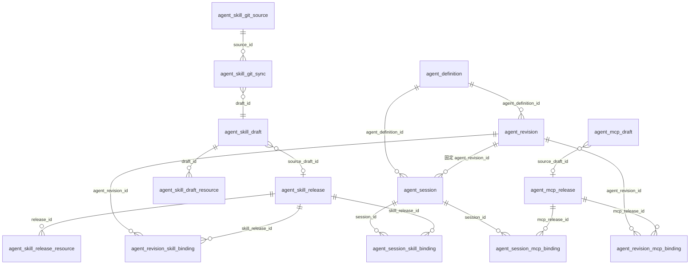

## 3. Agent 管理表流转

### 3.1 `agent_definition`

| 字段                            | 含义                   |
| ------------------------------- | ---------------------- |
| `id`                            | 主键                   |
| `name`                          | 名称，软删感知唯一     |
| `description`                   | 描述                   |
| `owner_user_id`                 | 所有者                 |
| `current_published_revision_id` | 当前发布 Revision 指针 |
| `is_enabled`                    | 启停（紧急禁用用此列） |
| `remark` / 审计字段             | 备注与审计             |

流转：

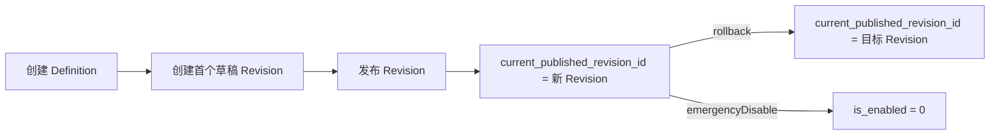

### 3.2 `agent_revision`

| 字段                                                                          | 含义                  |
| ----------------------------------------------------------------------------- | --------------------- |
| `agent_definition_id`                                                         | 归属 Definition       |
| `status`                                                                      | `DRAFT` / `PUBLISHED` |
| `source_draft_revision_id`                                                    | 发布快照来源草稿      |
| `system_prompt`                                                               | 系统提示词            |
| `model_config` / `permission_policy` / `memory_policy` / `compression_policy` | 四项策略 JSON 快照    |

流转：

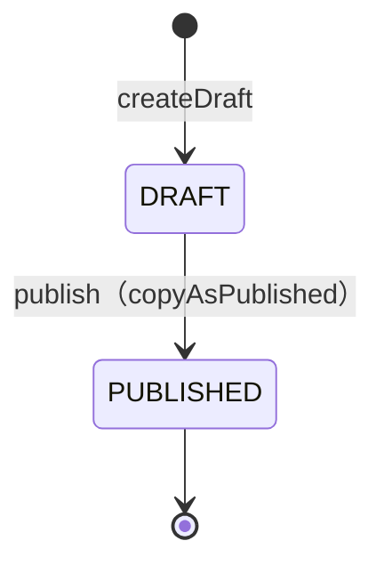

- `publish` 复制草稿为新 `PUBLISHED` 行，不改原草稿；同时复制 Skill/MCP Binding。
- 已发布 Revision 只读；要改组合只能开新草稿再发布。

## 4. Agent 对话表流转

### 4.1 `agent_session`

| 字段                  | 含义                           |
| --------------------- | ------------------------------ |
| `agent_definition_id` | 归属 Definition                |
| `agent_revision_id`   | 固定 Revision（首启前为 NULL） |
| `owner_user_id`       | 会话所有者                     |
| `status`              | `ACTIVE`                       |
| `last_active_at`      | 最近活跃时间                   |

流转：

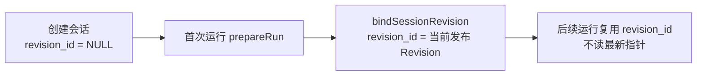

> 运行状态（消息历史、Agent state、事件）全部在 Redis，`agent_session` 不复制。

### 4.2 会话级 Skill/MCP 绑定

用户在自己的会话里可以临时追加/覆盖 Skill 与 MCP，不改 Agent 定义，也不污染其他会话。

| 表                            | 作用                      | 唯一键                     | 关键字段                                                       |
| ----------------------------- | ------------------------- | -------------------------- | -------------------------------------------------------------- |
| `agent_session_skill_binding` | Session 追加/覆盖的 Skill | `(session_id, skill_name)` | `session_id`、`skill_release_id`、`skill_name`、`content_hash` |
| `agent_session_mcp_binding`   | Session 追加/覆盖的 MCP   | `(session_id, mcp_name)`   | `session_id`、`mcp_release_id`、`mcp_name`、`encrypted_secret` |

合并与覆盖规则：

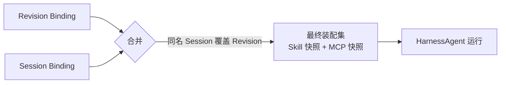

- **最终装配集 = Revision 绑定 ∪ Session 绑定**；同名时 Session 覆盖 Revision（Skill 按 `skill_name`，MCP 按 `mcp_name`）。
- **随时可改**：Session 绑定可增删，下次运行立即生效，不要求会话尚未首启。
- **指向不可变 Release**：绑定存 `skill_release_id` / `mcp_release_id`，不指向市场最新版。
- **权限与 Revision 绑定一致**：MARKET 登录即可绑，PRIVATE 仅所有者可绑；MCP 密钥在 Session 绑定时补配并冻结到 `agent_session_mcp_binding.encrypted_secret`。
- `prepareRun` 在解析 Revision Binding 后合并 Session Binding，生成合并后的快照集进入 `AgentRuntimeService`。

## 5. Skill 表流转

### 5.1 草稿 `agent_skill_draft` + `agent_skill_draft_resource`

| 字段                                             | 含义                                                 |
| ------------------------------------------------ | ---------------------------------------------------- |
| `name`                                           | Skill 名                                             |
| `skill_content`                                  | 完整 `SKILL.md`                                      |
| `visibility`                                     | `MARKET` / `PRIVATE`                                 |
| `status`                                         | `DRAFT` / `PENDING_REVIEW` / `REJECTED` / `CONSUMED` |
| `owner_user_id`                                  | 所有者                                               |
| `based_on_release_id`                            | 从既有 Release 开草稿时的来源                        |
| `content_hash`                                   | 内容 hash                                            |
| `review_comment` / `reviewed_by` / `reviewed_at` | 审核信息                                             |

唯一键：`(owner_user_id, name, visibility, deleted_at)`，允许同一用户同一 name 的 PRIVATE 与 MARKET 草稿并存。

状态流转：

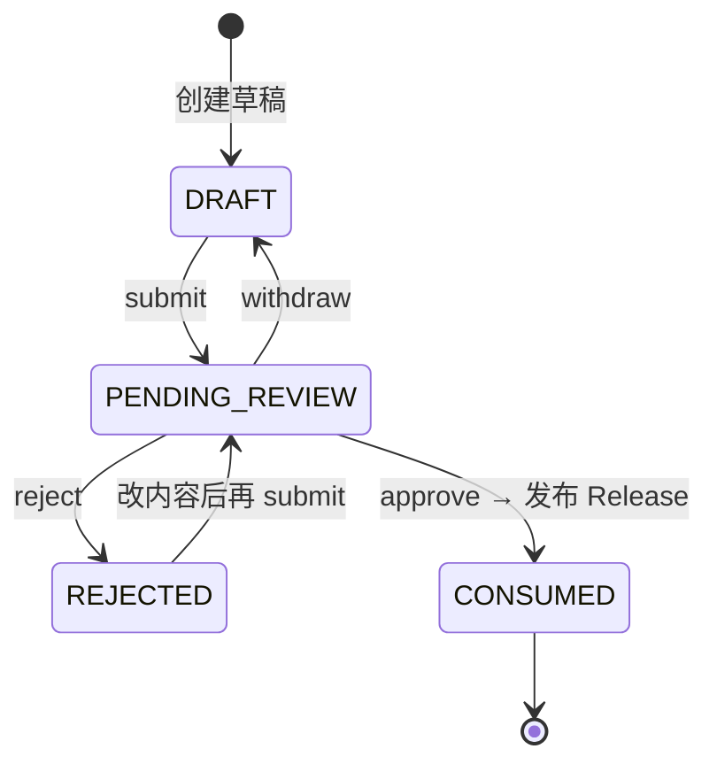

### 5.2 Release `agent_skill_release` + `agent_skill_release_resource`

| 字段              | 含义                                               |
| ----------------- | -------------------------------------------------- |
| `version`         | 在 `(owner_user_id, visibility, name)` 内从 1 递增 |
| `status`          | `PUBLISHED` / `DEPRECATED`                         |
| `source_draft_id` | 来源草稿                                           |
| `content_hash`    | 冻结内容 hash                                      |

发布流转：

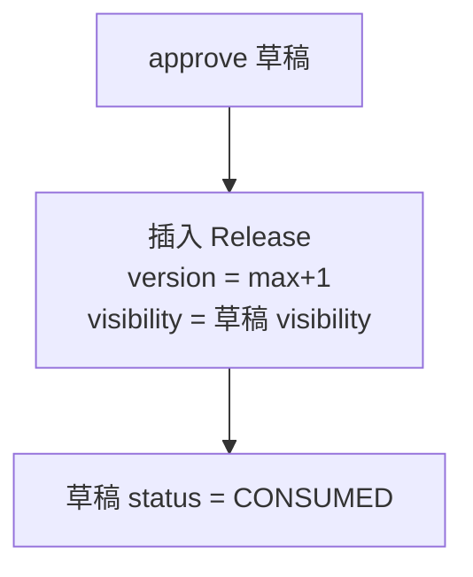

- `visibility` 只决定 Release 是否进入市场列表，不再额外写市场行。
- Release 行一旦插入，`skill_content`、资源、`content_hash`、`version` 不得 UPDATE；弃用只改 `status`。

### 5.3 市场列表（由 Release 派生）

Skill 市场列表不落独立表，直接由 `agent_skill_release` 派生，与 MCP 市场列表同构：

- **市场列表** = `visibility=MARKET` 且 `status=PUBLISHED` 的 Release，按 `name` 取 `version` 最大的一条。
- **下架** = 把该 `name` 的已发布 MARKET Release 置 `DEPRECATED`，退出市场可见集；已固定 Revision/会话不受影响。
- **弃用** = 单个 Release 置 `DEPRECATED`，不可再被新 Binding 选用；旧 Binding 仍指向该快照。

### 5.4 绑定 `agent_revision_skill_binding`

| 字段                | 含义                              |
| ------------------- | --------------------------------- |
| `agent_revision_id` | 归属 Revision                     |
| `skill_release_id`  | 绑定的 Release 快照               |
| `skill_name`        | 从 Release 拷贝                   |
| `content_hash`      | 从 Release 拷贝（运行漂移校验用） |
| `override_winner`   | 同名冲突时的胜者标记              |

唯一键：`(agent_revision_id, skill_name)`。同名候选来源（市场 vs 私有）必须恰好一条 `override_winner=1`，否则拒绝发布 Revision。

## 6. MCP 表流转

### 6.1 草稿 `agent_mcp_draft`

| 字段                 | 含义                   |
| -------------------- | ---------------------- |
| `name`               | server 名              |
| `transport`          | `sse` / `http`         |
| `url`                | 连接地址               |
| `headers_json`       | 静态头（无密）         |
| `encrypted_secret`   | 加密密钥密文，不存明文 |
| `connect_timeout_ms` | 连接超时               |
| `visibility`         | `MARKET` / `PRIVATE`   |
| `status`             | 草稿状态机同 Skill     |

唯一键：`(owner_user_id, name, visibility, deleted_at)`。

状态流转：

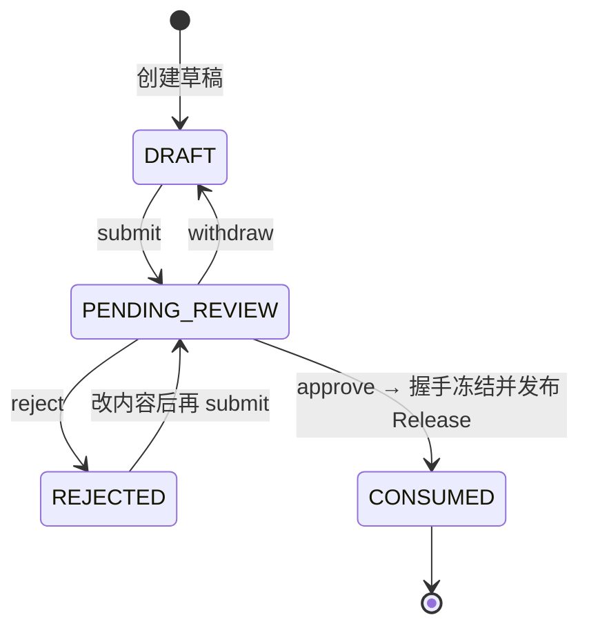

### 6.2 Release `agent_mcp_release`

只保存连接配置副本（`transport`、`url`、`headers_json`、`encrypted_secret`、`connect_timeout_ms`）；**工具目录不落库**。

| 字段              | 含义                                          |
| ----------------- | --------------------------------------------- |
| `version`         | 在 `(owner_user_id, visibility, name)` 内递增 |
| `status`          | `PUBLISHED` / `DEPRECATED`                    |
| `source_draft_id` | 来源草稿                                      |

### 6.3 密钥流转与可见性

MCP 密钥「在哪里配」由可见性决定，核心规则：**市场 MCP 永远无密钥，密钥只落在私有 MCP 与 Agent Binding 上。**

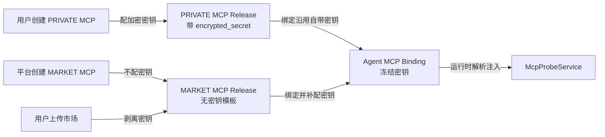

| 场景                    | 可见性    | 密钥 | 落点                                     |
| ----------------------- | --------- | ---- | ---------------------------------------- |
| 平台/管理员上架市场 MCP | `MARKET`  | 否   | 无，仅连接模板                           |
| 用户上传到市场          | `MARKET`  | 否   | 发布时剥离密钥，市场列表不带             |
| 用户自己的 MCP          | `PRIVATE` | 是   | 创建时配好，随私有 Release 冻结          |
| Agent 发布绑定 MCP      | 任意      | 是   | 密钥冻结到 Agent Revision 的 MCP Binding |

密钥流转规则：

1. **私有 MCP 自带密钥**：创建 `PRIVATE` 草稿时填加密密钥，发布后随私有 Release 冻结。
2. **市场 MCP 无密钥**：无论平台创建还是用户上传，进入市场的 Release `encrypted_secret` 必须为空；用户把私有 MCP 发布到市场时剥离密钥，市场只见连接模板。
3. **Agent 发布时补配密钥**：市场 MCP 无密钥，绑定到 Agent 时必须在该 Agent 发布流程补配加密密钥；私有 MCP 可沿用自带密钥或覆盖。密钥冻结到 Agent Revision 的 MCP Binding，成为运行时实际凭据。
4. **运行时解密注入**：`McpProbeService` 按 Binding 冻结的 `encrypted_secret` 解密后注入请求头，明文不进入 MySQL、日志、审计或模型上下文。

### 6.4 绑定 `agent_revision_mcp_binding`

| 字段                | 含义                                               |
| ------------------- | -------------------------------------------------- |
| `agent_revision_id` | 归属 Revision                                      |
| `mcp_release_id`    | 绑定的 Release                                     |
| `mcp_name`          | server 名                                          |
| `encrypted_secret`  | Agent 层补配/覆盖的加密密钥（市场 MCP 在此配密钥） |

唯一键：`(agent_revision_id, mcp_name)`。Binding 只指 Release 指针 + server 名，不携带工具白名单；密钥在 Agent 发布时补配并冻结到该行，成为运行时实际凭据。

### 6.5 工具目录（Redis，非表）

会话首启实时握手后按「会话 + 固定 Revision」写入 Redis：

```
agent:runtime:mcp-catalog:{sessionId}:{revisionId}
```

- `McpSessionCatalogCache.getOrLoad`：首次运行原子 get-or-create；后续消息复用，不重复握手。
- `refresh`：活跃消息续期，非活跃会话随 TTL 过期。
- 内容为 `McpToolEntry[]`（name / description / inputSchema / readOnly）。

## 7. Git Skill 来源表流转

### 7.1 `agent_skill_git_source`

| 字段                                 | 含义                   |
| ------------------------------------ | ---------------------- |
| `scope`                              | `MARKET` / `PRIVATE`   |
| `owner_user_id`                      | 来源所有者             |
| `url`                                | HTTPS 地址（脱敏展示） |
| `ref`                                | 分支/标签/commit       |
| `subdirectory`                       | 仓库子目录             |
| `encrypted_secret`                   | 加密密钥密文           |
| `last_commit_sha` / `last_synced_at` | 最近成功同步           |
| `status`                             | `READY` / `FAILED`     |
| `last_error`                         | 错误摘要               |

唯一键：`(scope, owner_user_id, url(255), deleted_at)`。

### 7.2 `agent_skill_git_sync`

保护人工修改并支持幂等同步。唯一键 `(source_id, skill_path, deleted_at)`。

| 字段           | 含义          |
| -------------- | ------------- |
| `source_id`    | 来源          |
| `commit_sha`   | 同步时 commit |
| `skill_path`   | 包路径        |
| `content_hash` | 导入内容 hash |
| `draft_id`     | 对应草稿      |

同步流转：

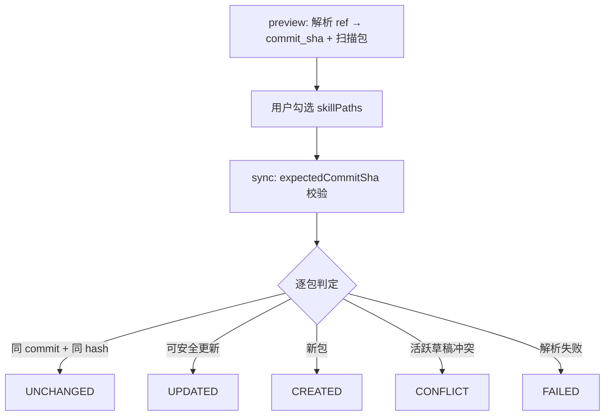

## 8. 跨表关键流转（端到端）

### 8.1 Skill 从导入到运行

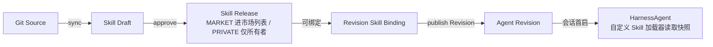

### 8.2 MCP 从创建到运行

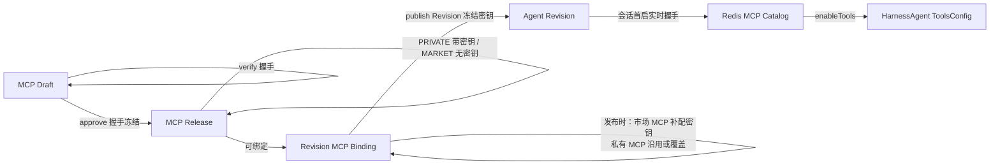

- 市场 MCP（`MARKET` Release）无密钥，绑定到 Agent 时在发布流程补配加密密钥，冻结到 `agent_revision_mcp_binding`。
- 私有 MCP（`PRIVATE` Release）自带密钥，绑定时可沿用或覆盖；最终以 Agent Binding 冻结的密钥为准。
- 运行时 `McpProbeService` 按 Binding 冻结的加密密钥解密后注入请求头。

### 8.3 会话端到端

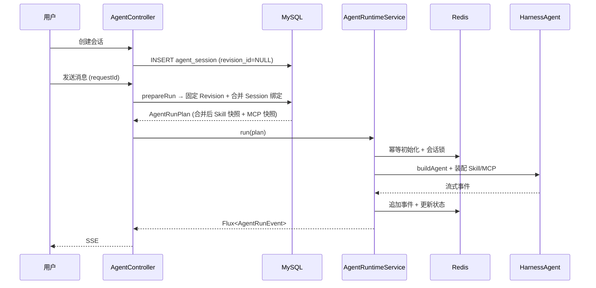

## 9. 状态枚举速查

| 域             | 字段         | 取值                                                        |
| -------------- | ------------ | ----------------------------------------------------------- |
| Agent Revision | `status`     | `DRAFT` / `PUBLISHED`                                       |
| Agent Session  | `status`     | `ACTIVE`                                                    |
| Skill Draft    | `status`     | `DRAFT` / `PENDING_REVIEW` / `REJECTED` / `CONSUMED`        |
| Skill Release  | `status`     | `PUBLISHED` / `DEPRECATED`                                  |
| Skill/MCP      | `visibility` | `MARKET` / `PRIVATE`                                        |
| MCP Draft      | `status`     | `DRAFT` / `PENDING_REVIEW` / `REJECTED` / `CONSUMED`        |
| MCP Release    | `status`     | `PUBLISHED` / `DEPRECATED`                                  |
| MCP            | `transport`  | `sse` / `http`                                              |
| Git Source     | `scope`      | `MARKET` / `PRIVATE`                                        |
| Git Source     | `status`     | `READY` / `FAILED`                                          |
| Git Sync       | 结果         | `CREATED` / `UPDATED` / `UNCHANGED` / `CONFLICT` / `FAILED` |

## 10. 运行面 Redis key 速查

| 用途         | key 模式                                                 |
| ------------ | -------------------------------------------------------- |
| 运行状态     | `agent:runtime:request:{sessionId}:{requestId}`          |
| 幂等标记     | `agent:runtime:request:{sessionId}:{requestId}:consumed` |
| 运行 owner   | `agent:runtime:request:{sessionId}:{requestId}:owner`    |
| 取消信号     | `agent:runtime:request:{sessionId}:{requestId}:cancel`   |
| 会话锁       | `agent:runtime:lock:{sessionId}`                         |
| MCP 目录缓存 | `agent:runtime:mcp-catalog:{sessionId}:{revisionId}`     |
| Agent 状态   | `agent:runtime:state:{userId}/{sessionId}:agent_state`   |
