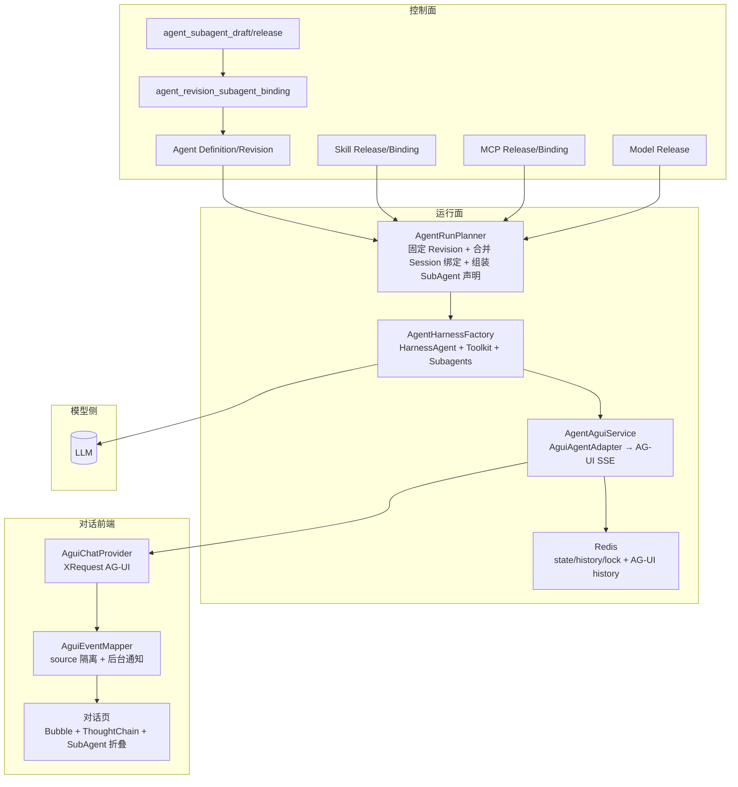
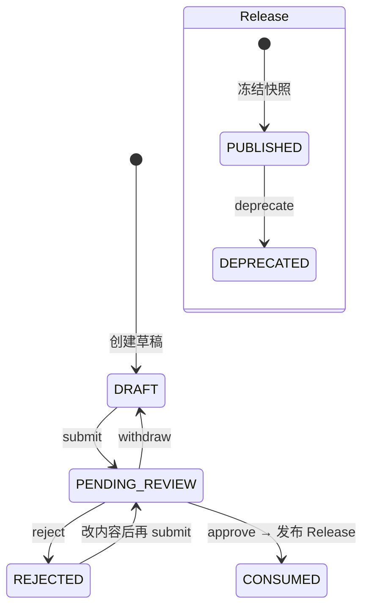
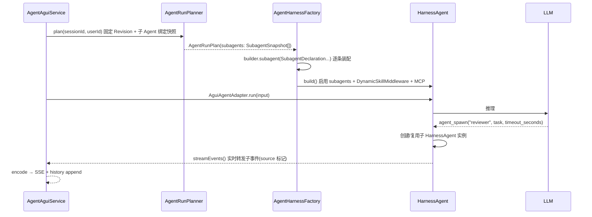
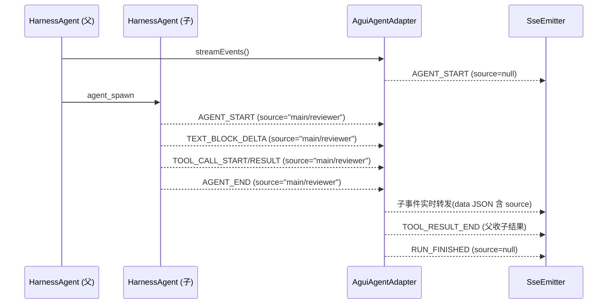
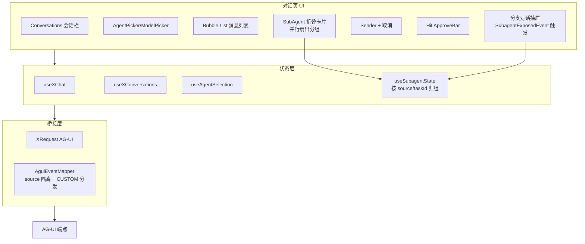
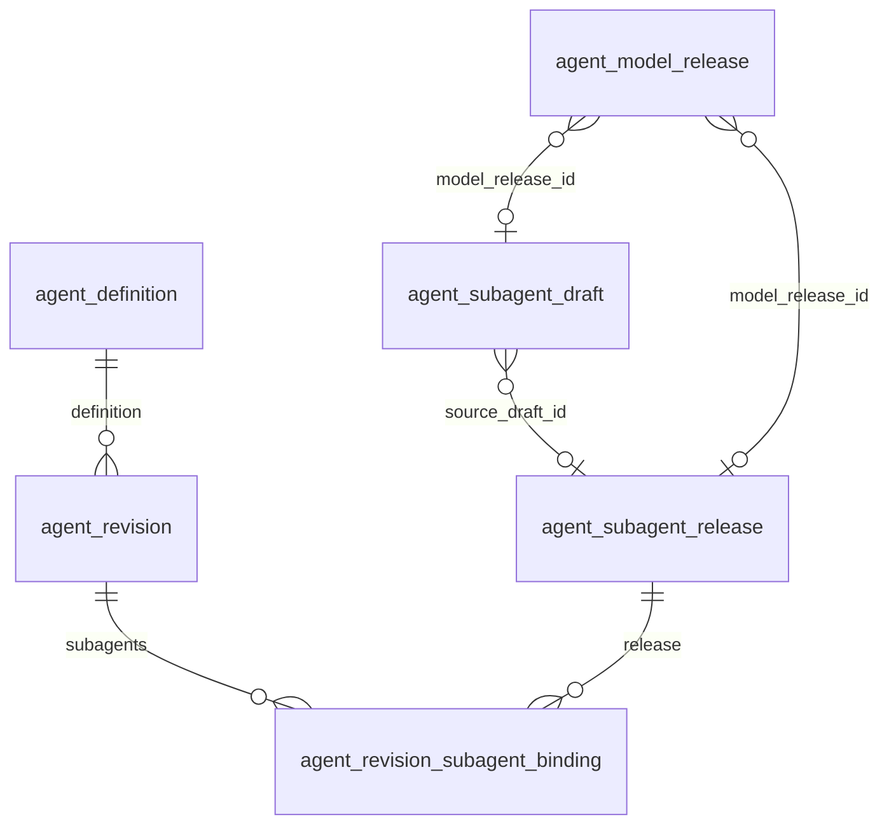
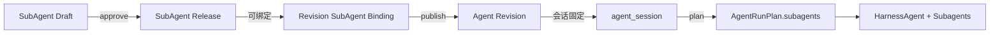

# 子 Agent 前后端架构

> **状态：** 目标架构（待落地，按现网 Agent/MCP/Skill/模型 架构对齐，AgentScope Java `2.0.1`）
> **读者：** 实施子 Agent 的前后端工程师与 agent
> **范围：** 子 Agent（SubAgent）的控制面、运行面、前端对话面——声明/版本/绑定、同步/后台/并行、隔离/权限/流式、暴露给用户的分支对话。
> **配套文档：** [`agent-module-architecture.md`](agent-module-architecture.md)（五大模块总览）、[`agent-conversation-architecture.md`](agent-conversation-architecture.md)（对话运行面前端）、[`agent-module-table-flows.md`](agent-module-table-flows.md)（表流转）、[AgentScope Subagent](https://java.agentscope.io/v2/zh/docs/harness/subagent.html)。
> **协议基线：** AgentScope Harness `SubagentDeclaration` / `AgentSpawnTool`，AG-UI（`source` 透传到前端）。

## 1. 定位与边界

子 Agent 解决“主 Agent 上下文膨胀、单线程串行”问题：把**可独立处理、上下文重、可并行**的任务委派给临时子实例，子实例跑自己的会话，结果以工具结果或后台任务回到父。父通过 `agent_spawn` / `agent_send` 驱动，框架保证并发扇出、权限与隔离。

- **控制面**：子 Agent 的声明、审核、发布、绑定到 Agent Revision。
- **运行面**：按 `AgentRunPlan` 动态装配 `SubagentDeclaration`，决定是否放行 subagents、隔离等级、权限继承、并发与超时。
- **对话前端**：按 `source` 隔离渲染子事件（折叠/并列表现），支持同步扇出观感、后台反向通知、以及 `expose_to_user` 分支对话。

### 1.1 非目标

- 不允许子 Agent 再 spawn 子 Agent 绕过递归保护（叶子约束 + 硬上限 3 层由 SDK 保证）。
- 不把子 Agent 当作可被任意用户单独发起会话的独立 Agent（除非显式 `expose_to_user=true`）。
- 不引入用户可上传 JAR/任意 classpath Tool 来定义子 Agent 能力。
- 本期不做“让 agent 自己写新子 Agent spec”（`agent_generate` 默认关闭）；后续如需，先走人工 review 再写文件。
- 本期不做跨服务的“远程子 Agent”（`url` 远端 Agent Protocol），仅本地 `HarnessAgent` 子实例；远程作为二期扩展。

## 2. 设计原则与不可变量

1. **发布即固定输入**：子 Agent 的声明（`description`、`system_prompt`、`workspaceMode`、`model`、`steps`、`tools`、`expose_to_user` 等）随 `agent_subagent_release` 冻结，运行面只按绑定快照装配，不读最新草稿。
2. **会话固定**：会话首次运行绑定 `agent_revision_id`，该 Revision 的子 Agent 绑定集合即为本会话全生命周期可见的子 Agent 全集；发布/回滚只影响后续新会话。
3. **未知即拒绝**：绑定的 Release 缺失/被弃用、`description` 为空、工具白名单非法、模型不可用时，会话首启拒绝，不降级放行。
4. **权限不放大**：父的 DENY 规则自动透传给子（可按声明 `inheritParentPermissions=false` 关闭）；`allowedTools` 白名单对子同样生效，新增工具不在白名单则不可执行。
5. **隔离不串扰**：默认 `ISOLATED`，子有独立工作区与状态分桶（`parentSessionId × user × agentId`），多副本/重启一致性由 `distributedStore` 保证。
6. **流式可观测**：同步本地子事件必经父 `streamEvents()` 实时转发，`source` 标记来源，远端一致透传 `metadata.taskId / parentSessionId`。
7. **取消必停止**：前端 `abort()` 关 SSE → 后端 `interrupt()` 传播到父及其同步子；后台任务可经 `task_cancel` 取消。
8. **成本可控**：`steps` 单子上限 + `timeout_seconds` 单次超时 + `Toolkit.parallel` 受控扇出，避免无界并发。

## 3. 概念与声明模型

对齐 AgentScope 三种声明来源，平台收敛为两种可控来源（控制面 DB 优先，`general-purpose` 兜底）：

| 声明来源                                       | 本平台形态                         | 说明                                                                         |
| ---------------------------------------------- | ---------------------------------- | ---------------------------------------------------------------------------- |
| `general-purpose` 内置                         | 始终可用，不入库                   | 能力与父一致，`SHARED` 工作区，适合“想隔离上下文但懒得写 spec”的临时拆分     |
| 工作区 spec 文件 `workspace/subagents/<id>.md` | 本期**不采用**（文件分散、难审计） | 文档提及仅作对照，不落地                                                     |
| 编程式声明 `SubagentDeclaration`               | 由 `AgentRunPlan` 动态装配         | 真相来源是 `agent_subagent_release` 快照 + `agent_revision_subagent_binding` |

SDK 内单条声明的关键字段与平台映射：

| SDK 字段                   | 平台字段                                                | 约束                                                                           |
| -------------------------- | ------------------------------------------------------- | ------------------------------------------------------------------------------ |
| `name`                     | `agent_subagent_release.name` / `binding.subagent_name` | `^[a-z0-9-]{2,32}$`，Revision 内唯一                                           |
| `description`              | `agent_subagent_release.description`                    | 必填，10~500 字，模型是否委派的关键依据                                        |
| `systemPrompt`             | `agent_subagent_draft.system_prompt`                    | 子专属提示词，空则继承父                                                       |
| `workspaceMode`            | `workspace_mode`                                        | `ISOLATED`（默认）/ `SHARED`                                                   |
| `workspace.path`           | 不暴露给控制面                                          | `ISOLATED` 时框架自动分配 `session-<id>/subagents/<name>`，`SHARED` 复用父目录 |
| `model`                    | `model_release_id`                                      | 可空，空则继承父模型；非空时指向 `agent_model_release`                         |
| `steps`                    | `max_steps`                                             | 1~32，默认 8                                                                   |
| `temperature/top_p` 等     | `parameters` JSON                                       | 可选覆盖父 `GenerateOptions`                                                   |
| `tools`                    | `allowed_tools` JSON                                    | 空表示继承父白名单；非空为子集白名单                                           |
| `hidden`                   | `is_hidden`                                             | true 时不出现在 LLM 可见列表，仍可 `agent_spawn`                               |
| `mode`                     | `mode`                                                  | `all`（默认）/ `subagent` / `primary`（禁止被 spawn）                          |
| `expose_to_user`           | `expose_to_user` 三态                                   | `TRUE` 总是暴露 / `FALSE` 永不暴露 / `null` 交给 `RuntimeContext` 再交 LLM     |
| `persistSession`           | `persist_session`                                       | 默认 false；true 时按 `(parentSessionId, agentId, label)` 复用实例             |
| `inheritParentPermissions` | `inherit_parent_permissions`                            | 默认 true                                                                      |

> 三选一互斥 `workspace` / `inlineAgentsBody` / `url`：平台仅用 `workspace(...)` 语义，`url` 远端二期再支持。

## 4. 系统上下文与分层



分层职责与既有复用：

| 层                   | 复用模块                                                        | 新增/改动                                                                                                        |
| -------------------- | --------------------------------------------------------------- | ---------------------------------------------------------------------------------------------------------------- |
| `java-admin-service` | `AgentControlService`、`AgentSessionService`、entity/repository | 新增 `SubagentControlService`、子 Agent 实体与仓储、Revision 绑定服务                                            |
| `java-admin-infra`   | `AgentRunPlanner`、`AgentHarnessFactory`、`AgentAguiService`    | `Planner` 增加子 Agent 快照装配；`Factory` 按 binding 动态 `builder.subagent(...)` 并**移除** `disableSubagents` |
| `java-admin-api`     | `AgentController`、SSE 边界                                     | 新增 `AgentSubagentController`（草稿/发布/绑定）、AG-UI 事件透传 `source`                                        |
| 前端                 | `AguiChatProvider`、`AguiEventMapper`、`ChatList/ThoughtChain`  | 事件按 `source` 分流、并行扇出视图、后台 `system-reminder` 提示、`SubagentExposedEvent` 分支对话                 |

## 5. 后端架构

### 5.1 控制面

#### 5.1.1 实体与状态机

子 Agent 复用 Skill/MCP 的“草稿 → 审核 → Release → 绑定”链路，但**无市场、无可见性分级**，仅归属创建者或平台：



关键约束：

- `agent_subagent_draft.name` 在 `(owner_user_id, deleted_at)` 内活动草稿唯一。
- `description` 必填且长度校验，不合格拒绝 `submit`/`approve`。
- `approve` 冻结时校验 `model_release_id`（如非空）指向 `PUBLISHED` Release；`steps` 越界、`allowed_tools` 非白名单子集则拒绝。
- `agent_subagent_release` 行一旦插入，`system_prompt`、`description`、`workspace_mode`、`parameters`、`allowed_tools`、`expose_to_user` 等不得 UPDATE，弃用只改 `status`。
- Revision 绑定 `agent_revision_subagent_binding` 在 `(agent_revision_id, subagent_name)` 内唯一；同 Revision 内重名拒绝发布。

#### 5.1.2 绑定语义

- **Revision 预置**：发布者把已 `PUBLISHED` 的 SubAgent Release 绑定到草稿 Revision 的 `subagent_name`，`publish` 复制为 `PUBLISHED` Revision 快照。
- **Session 侧不追加**：子 Agent 的可见集完全由会话固定的 Revision 决定，不设 `agent_session_subagent_binding`（避免用户会话随意扩大委派面；如需会话级覆盖，后续以白名单方式扩展）。
- **模型继承**：子声明的 `model` 无论继承还是显式，均解析为冻结 `agent_model_release` 快照，密钥解密与 `ModelClientFactory` 同路径。

### 5.2 运行面

#### 5.2.1 装配流程



关键改动点（对齐现网 `AgentHarnessFactory.create`）：

- 移除 `disableSubagents()` / `disableDynamicSubagents()`，改为按 `AgentRunPlan.subagents()` 是否为空决定：为空则保持禁用，非空则逐条 `builder.subagent(decl)` 启用。
- 子声明装配来源：`agent_revision_subagent_binding` → `agent_subagent_release` 快照；`general-purpose` 不入库但总是可用。
- 工作区：`ISOLATED` 子自动落 `java.io.tmpdir/agent-workspace/session-{sessionId}/subagents/{name}`，`SHARED` 复用父 `workspace`。
- 状态与分布式：`stateStoreProvider.stateStore()` 已是 Redis 实现（`RedisAgentStateStore`），补 `distributedStore` 同实例即可满足 `subagentId` 跨重启/多副本可解析与 `agent_state` 按 session 重放。
- 权限：父 DENY 规则透传（`inheritParentPermissions`），`buildPermissionContext` 覆盖父 + 子工具集的显式 ALLOW，放行 `wait_async_results` / `read_skill` / `load_skill_through_path` 等平台技能工具。

#### 5.2.2 同步 / 后台 / 并行

对齐 SDK：`agent_spawn.timeout_seconds` 决定同步或后台。

| 模式     | 触发                                       | 行为                                                              | 前端观感                                                         |
| -------- | ------------------------------------------ | ----------------------------------------------------------------- | ---------------------------------------------------------------- |
| 同步     | `timeout_seconds > 0`（默认 30，最大 600） | 父 block 等结果，工具结果即子输出；超时 `timeout_promoted` 转后台 | 同轮流式内实时看到子思考/工具/文本                               |
| 后台     | `timeout_seconds = 0`                      | 立即返 `task_id`，子在后台跑                                      | 立即收 `task_id` 卡片，后台完成后下一轮前 `system-reminder` 注入 |
| 强制同步 | `RuntimeContext CTX_FORCE_SYNC=true`       | 覆盖 LLM 的异步选择；`CTX_FORCE_SYNC_TIMEOUT_SECONDS` 覆盖超时    | 用于关键路径/短任务，超时返 `timeout` 不 promote                 |

并行扇出：同一轮推理中多条同步 `agent_spawn`，`Toolkit.parallel=true` 时并行推进，主等齐后进入下一轮（同步 fan-out / fan-in）。规划子任务时需先画依赖图，无边节点并行，有边节点串行。

后台任务工具（逃生口）：`agent_send` / `agent_list` / `task_output` / `wait_async_results` / `task_cancel` / `task_list`。其中 `wait_async_results(task_ids=...)` 或 `wait_all=true` 为 barrier（等齐才返，返回值直接含各任务结果），无参 `wait_async_results` 仅等 inbox 任意一条。

后台存储：`workspace/agents/<parentAgentId>/tasks/<sessionId>.json`（Redis 共享存储下任意节点可读），执行粘创建节点，完成结果任意节点可读并经反向通知推回父。

#### 5.2.3 持久会话与复用

声明 `persistSession=true` 时，框架按 `(parentSessionId, agentId, label)` 生成确定性 key，多次 `spawn` 同组合复用实例与历史。适用“笔记累积、上下文连续”的子 Agent；默认不开启，避免跨轮污染。

#### 5.2.4 向用户暴露子 Agent

控制面 `expose_to_user` 三态，最终生效优先级：`RuntimeContext CTX_EXPOSE_TO_USER` > 声明静态策略 > LLM 工具参数 `expose_to_user` > `false`。

运行时：

- 未绑 `Channel` 时，`expose_to_user=true` 静默忽略，子照常工作但不暴露。
- 绑定 `channel()`（`ChatUiChannel` + `distributedStore`）后，`agent_spawn(..., expose_to_user=true)` 在 Gateway 注册可寻址入口并发出 `SubagentExposedEvent(subagentId, agentId, label)`。
- 客户端监听流中该事件后，可 `sendToSubagent(subagentId, message)` 绕过父与子直接对话，形成分支会话。跨重启/多副本依赖 `distributedStore` 的持久化 `subagentId` 与 `AgentStateStore` 重放。

#### 5.2.5 行为细节与硬约束

- `description` 质量直接决定是否委派，写法必须是“何时使用”而非标签式。
- 递归保护：子被强制标为叶子，硬上限 3 层。
- `userId` 自动透传，多租户隔离链不断。
- Plan Mode 下 spawn 的子自动继承只读限制，不可写。
- 错误处理：子内部出错以 `TOOL_RESULT` 回父，不走父流 `onError`；父流自身错误按 Reactor 语义。

### 5.3 AG-UI 与流式

复用 `AgentAguiService` 的 `AguiAgentAdapter` + `SseEmitter` 骨架，新增子事件透传：



行为矩阵：

| 场景                                                  | 是否实时转发                |
| ----------------------------------------------------- | --------------------------- |
| `streamEvents()` + 同步本地子                         | ✔                           |
| `call()` 非流式                                       | ✗（tool_result 字符串回父） |
| `timeout_seconds=0` 后台                              | ✗（终态经反向通知下轮注入） |
| 远端子 + 父 `streamEvents()` + `remoteStreaming=true` | ✔（二期）                   |

SSE 层：事件 JSON 经 `AguiEventEncoder` 编码，含 `source` / `metadata.taskId` / `metadata.parentSessionId`（多实例区分），前端据此做并发扇出归组与历史回放。

## 6. 前端架构

### 6.1 总体

在 `agent-conversation-architecture.md` 的独立式 Playground 之上扩展，新增 SubAgent 渲染与分支对话：



### 6.2 事件 → 消息映射扩展

在既有 `AguiEventMapper.applyAguiEvent` 之上，新增子事件分流：

| AG-UI 事件                                        | `source`                               | 前端动作                                                                                       |
| ------------------------------------------------- | -------------------------------------- | ---------------------------------------------------------------------------------------------- |
| `RUN_STARTED/ TEXT_* / REASONING_* / TOOL_CALL_*` | `null`                                 | 主消息流（`content/thinking/toolCalls`）                                                       |
| 同上                                              | `source != null`（如 `main/reviewer`） | 写入 `subAgents[source]` 折叠状态，不污染主 `content`                                          |
| `CUSTOM subagent.*`                               | —                                      | 子生命周期/分支暴露的兼容降级（SDK 未映射原生事件时）                                          |
| `CUSTOM token_usage`                              | —                                      | 累计用量                                                                                       |
| `RUN_FINISHED` 含 `outcome.interrupts`            | `null`                                 | HITL 审批条                                                                                    |
| `system-reminder` 后台交付                        | —                                      | 后台经下一轮前以 `CUSTOM` 或 `RUN_STARTED` 前置注入，前端渲染“后台任务已交付 task_id=… ”提示条 |

`AguiEventMapper` 扩展要点：

- 按 `source` 归组维护 `SubAgentRunView { label, status, thinking, toolCalls, content, taskId }`。
- 同一轮多子并行时，按 `metadata.taskId` 二级区分同名并发（`source` 相同但 task 不同）。
- 历史回放 `replayEvents` 同样按 `source` 重放，父子轮次不混。

### 6.3 组件划分

建议目录（在 `agent-conversation/` 下新增）：

```
conversation/
├── AguiEventMapper.ts            # 扩展：source 分流
├── AguiChatProvider.ts           # 复用，透传 source/metadata
├── useAgentConversation.ts       # 扩展：暴露 subAgents 状态
├── useSubagentState.ts           # 新增：按 source/taskId 归组
├── components/
│   ├── SubAgentGroup.tsx         # 新增：并行扇出容器（多子一行多卡）
│   ├── SubAgentCard.tsx          # 新增：单子折叠卡片（思考/工具/文本）
│   ├── SubAgentBranchDrawer.tsx  # 新增：expose_to_user 分支对话抽屉
│   ├── ThoughtChainBubble.tsx    # 复用，子卡片内复用
│   ├── ChatList.tsx              # 改动：插入 SubAgentGroup
│   └── HitlApproveBar.tsx        # 复用
```

`SubAgentCard` 交互：

- 默认折叠，标题显示 `label (status)`，展开后复用 `ThoughtChainBubble` 渲染子 `thinking/toolCalls`，子文本用次级气泡或引用块样式与主文本区分。
- 并行：同一父轮的多子以 `SubAgentGroup` 横向或纵向分组，父等齐后高亮完成态。
- 后台：`task_id` 卡片 + “等待中”态，完成时经 `system-reminder` 自动追加一条assistant 提示。

### 6.4 分支对话（expose_to_user）

- 流中监听 `SubagentExposedEvent`（`CUSTOM` 或 AG-UI 扩展事件），解析 `subagentId/agentId/label`，在消息流中插入“已暴露子 Agent”提示条 + “进入分支对话”按钮。
- 抽屉内 `ChatUiChannel.sendToSubagent(subagentId, message)` 直连子实例，消息与主会话隔离展示；子历史按 `AgentStateStore` 按 session 重放，跨刷新可续接。
- 未配置 `distributedStore` 时，图表现“分支对话仅当前会话有效，刷新后失效”提示。

## 7. 数据模型概览

新增表均遵循 `backend/db/docs/db-conventions.md`：`BIGINT UNSIGNED` 主键、`VARCHAR(32)` 枚举、`deleted_at` 软删、`created_at/updated_at/created_by/updated_by` 审计。

### 7.1 新增表

#### `agent_subagent_draft`

| 字段                         | 含义                                                    |
| ---------------------------- | ------------------------------------------------------- |
| `id`                         | 主键                                                    |
| `owner_user_id`              | 所有者（软引用 `sys_user.id`，`0`=平台）                |
| `name`                       | 子 Agent 名（`^[a-z0-9-]{2,32}$`）                      |
| `description`                | 何时委派（必填，10~500）                                |
| `system_prompt`              | 子专属提示词（可空，空则继承父）                        |
| `workspace_mode`             | `ISOLATED` / `SHARED`                                   |
| `model_release_id`           | 可空，空则继承父模型（软引用 `agent_model_release.id`） |
| `max_steps`                  | 1~32                                                    |
| `parameters`                 | JSON：`temperature/top_p/...` 覆盖                      |
| `allowed_tools`              | JSON：白名单，为空表示继承父                            |
| `expose_to_user`             | `NULL`/`0`/`1` 三态                                     |
| `persist_session`            | `TINYINT(1)`                                            |
| `inherit_parent_permissions` | `TINYINT(1)` 默认 1                                     |
| `is_hidden`                  | 是否隐藏于 LLM 可见列表                                 |
| `mode`                       | `all/subagent/primary`                                  |
| `status`                     | `DRAFT/PENDING_REVIEW/REJECTED/CONSUMED`                |
| `review_*`                   | 审核信息                                                |
| `is_enabled/deleted_at/...`  | 7 审计尾                                                |

唯一键 `uniq_agent_subagent_draft_owner_name (owner_user_id, name, deleted_at)`。

#### `agent_subagent_release`

冻结 `draft` 的不可变快照，字段同 `draft` 去除审核态，增加 `version INT UNSIGNED`（在 `(owner_user_id, name)` 内递增）、`status PUBLISHED/DEPRECATED`、`source_draft_id`。

唯一键 `uniq_agent_subagent_release_owner_name_ver (owner_user_id, name, version)`，索引 `idx_agent_subagent_release_status`。

#### `agent_revision_subagent_binding`

| 字段                    | 含义                 |
| ----------------------- | -------------------- |
| `agent_revision_id`     | 归属 Revision（FK）  |
| `subagent_release_id`   | 绑定的 Release（FK） |
| `subagent_name`         | 从 Release 拷贝      |
| `created_at/created_by` | 绑定审计             |

唯一键 `uniq_agent_rev_subagent_binding_name (agent_revision_id, subagent_name)`。解绑为物理删。

### 7.2 ER 增量



> 运行面状态（子实例句柄、后台 `task_id`、事件 `source` 标记）不落 MySQL，经 Redis `AgentStateStore` + `agents/<parentAgentId>/tasks/<sessionId>.json` 管理。

### 7.3 与既有表流转



## 8. 跨端协作与 API 契约

控制面（`POST /api/agent/subagents/...` 风格，对齐既有 `agent-module-table-flows` 命名）：

| 方法     | 路径                                                         | 说明                     |
| -------- | ------------------------------------------------------------ | ------------------------ |
| `POST`   | `/api/agent/subagents/drafts`                                | 创建草稿                 |
| `PUT`    | `/api/agent/subagents/drafts/{id}`                           | 更新草稿                 |
| `POST`   | `/api/agent/subagents/drafts/{id}/submit`                    | 提交审核                 |
| `POST`   | `/api/agent/subagents/drafts/{id}/approve`                   | 审核通过→冻结 Release    |
| `POST`   | `/api/agent/revisions/{revisionId}/subagent-bindings`        | 绑定 Release 到 Revision |
| `DELETE` | `/api/agent/revisions/{revisionId}/subagent-bindings/{name}` | 解绑                     |
| `GET`    | `/api/agent/revisions/{revisionId}/subagent-bindings`        | 列表                     |

运行面沿用 AG-UI 标准端点，无新增 HTTP 契约；子 Agent 事件随 AG-UI SSE 下发，前端凭 `source/metadata` 区分。

## 9. 安全与边界

- **密钥不进入子上下文**：子 `TOOL_RESULT` 与历史不得回显 `plainSecret`；`encrypted_secret` 仅在 `BindingMcpAssembler` 侧解密注入内存。
- **发布前校验**：`description` 空、`allowed_tools` 含未注册工具名、`model_release_id` 不可用、工具与 MCP 同名冲突均拒绝发布。
- **并发与配额**：单父轮同步扇出建议 ≤4，`steps` 与 `timeout_seconds` 上限由 `AgentRuntimeProperties` 统一约束；后台任务超期可 `task_cancel`。
- **审计**：记录子 Agent 的创建/审核/发布/绑定主体、版本、`requestId`、许可决策；`CUSTOM subagent.*` 不入操作日志明文。
- **Markdown 安全**：子文本同样经 `XMarkdown` 渲染，不绕过 XSS 防护。

## 10. 故障处理

| 场景                                         | 预期处理                                                      |
| -------------------------------------------- | ------------------------------------------------------------- |
| 绑定的 SubAgent Release 缺失/被 `DEPRECATED` | 拒绝首启，返回“子 Agent 不可用”可定位错误                     |
| `description` 为空或 `allowed_tools` 非法    | 拒绝发布/拒绝首启，不回落默认                                 |
| 子 `model_release_id` 指向不可用模型         | 拒绝首启，能力不匹配按模型校验路径处理                        |
| 同 `requestId` 重试                          | 幂等 `consumed` 去重，不重复创建子实例                        |
| 同会话并发                                   | Redis 锁串行化，返回冲突语义                                  |
| 子内部失败                                   | 以 `TOOL_RESULT` 回父，不打断父流；父可继续推理或上报         |
| 父流中断/超时                                | `interrupt()` 传播到同步子，后台任务保留可 `task_output` 追查 |
| Redis 不可用                                 | 拒绝启动需一致性的运行，不降级内存                            |

## 11. 实施建议（落地顺序）

1. **DB 与控制面**：新增 `agent_subagent_draft/release/binding` 三表 + Flyway `V9__agent_subagent.sql`，落地 `SubagentControlService` 与 `AgentSubagentController`，发布链路与 Skill/MCP 一致。
2. **运行面**：`AgentRunPlanner` 增加子快照解析，`AgentHarnessFactory` 按 plan 动态 `subagent(...)` 并移除禁用开关；`AgentStateStoreProvider` 补 `distributedStore`（复用 Redis）。
3. **前端对话**：`AguiEventMapper` 按 `source` 分流，`ChatList` 插入 `SubAgentGroup/Card`，支持同步并行观感与后台 `system-reminder` 提示；二期再做 `SubagentBranchDrawer` 的 `expose_to_user`。
4. **验证**：单测覆盖 `description` 校验、绑定唯一性、装配时模型解析；集成验证同步扇出（2 子并行）与超时 promote、取消传播、历史回放隔离。

## 12. 参考

- AgentScope 子 Agent：<https://java.agentscope.io/v2/zh/docs/harness/subagent.html>
- `docs/agent-conversation-architecture.md` §6 AG-UI 协议适配与 §5 前端模块划分
- `docs/agent-module-architecture.md` §5 运行流程与 §5.6 运行面安全开关
- 落地代码：`AgentHarnessFactory`、`AgentAguiService`、`AgentRunPlanner`、`AguiEventMapper`
